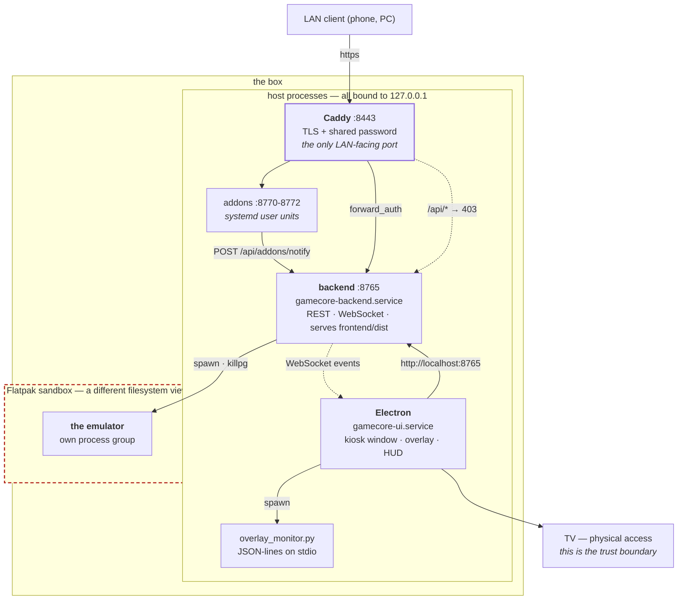
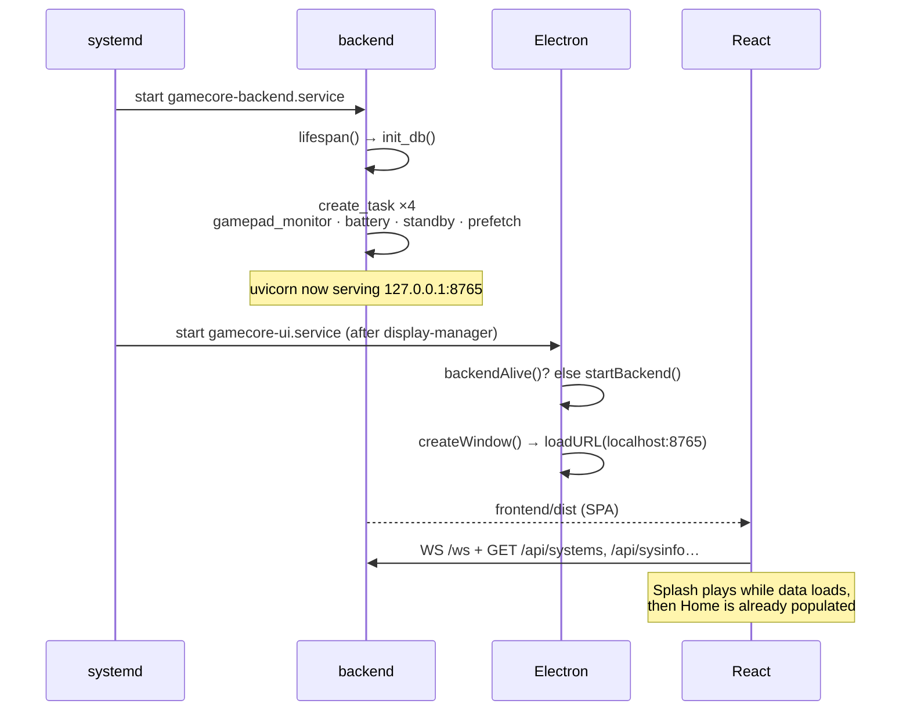
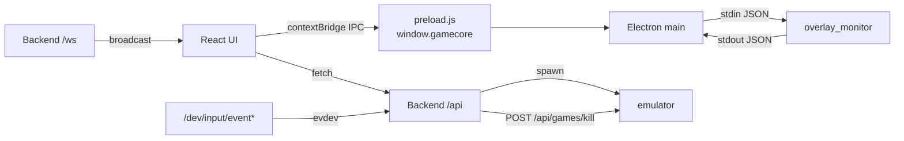

# 1 — Runtime topology

What runs, where it listens, who starts it, and in what order.

## The four processes

| Process | Started by | Listens | Owns |
|---|---|---|---|
| **Backend** | `gamecore-backend.service` (system unit) | `127.0.0.1:8765` | the emulator process, playtime DB, covers, standby, evdev |
| **Electron** | `gamecore-ui.service` (system unit) | — | the kiosk window, the bezel overlay, HUD toasts |
| **overlay_monitor** | Electron, `spawn()` | — | one X11 window watch, JSON-lines on stdio |
| **The emulator** | Backend, `create_subprocess_exec` | — | its own process group |

Plus, out of band:

| Process | Unit | Listens |
|---|---|---|
| rom-manager | `gamecore-addon-rom-manager.service` (**user** unit) | `127.0.0.1:8770` |
| rpcs3-manager | `gamecore-addon-rpcs3-manager.service` | `127.0.0.1:8771` |
| save-manager | `gamecore-addon-save-manager.service` | `127.0.0.1:8772` |
| Caddy | `caddy.service` | `:8443` — **the only LAN-facing port** |

Ports 8770-8799 are reserved for addons. Vite (`:5173`) exists in development
only.

## The shape of it, including the sandbox boundary



**The dashed box is the part that catches people out.** The emulator does not
share the backend's filesystem view: it sees only what its Flatpak permissions
grant. That is why the installer adds `--filesystem` for the ROM directory and
`--device=all` for controllers per app, why a config written to
`~/.var/app/<id>/…` is the emulator's real config and one written elsewhere is
not, and why `flatpak kill <app-id>` has to come before any signal — a signal to
the wrapper never reaches inside.

**Everything except Caddy binds `127.0.0.1`.** The TV reaches the backend over
loopback with no authentication at all: physical access *is* the trust boundary.
The LAN only ever sees Caddy, and `/api/*` is 403 through it. If you add an
endpoint, assume the LAN can never call it — and see [9](09-gotchas.md) for why
"not LAN-exposed" still is not "not reachable" on a box that runs browsers.

## Boot sequence



`backend/main.py:lifespan()` is the single place background tasks are created
and cancelled:

```python
monitor_task  = asyncio.create_task(gamepad_monitor.run())
battery_task  = asyncio.create_task(battery.run())
standby_task  = asyncio.create_task(standby.run())
prefetch_task = asyncio.create_task(prefetch.run())
```

Electron's `startBackend()` (`main.js:334`) is a **fallback for development**:
on a box the systemd unit already owns the backend, and `backendAlive()`
(`main.js:328`) detects it and skips spawning a second one.

## Cold-boot display timing

`splashHoldMs()` (`electron/main.js:36`) reads system uptime. Under
`BOOT_UPTIME_THRESHOLD_S` (180 s) it appends a hold parameter to the URL so
the splash freezes on its first black frame for `SPLASH_BOOT_HOLD_MS` (4 s).
Reason: at cold boot X has just started, `gamecore-xsetup` is switching the
mode to 1080p, and the TV spends seconds re-syncing HDMI — the animation would
otherwise play to nobody. A relaunch from the desktop (high uptime) gets no
delay.

## Who talks to whom



Three separate channels, deliberately:

1. **HTTP `/api`** — request/response, UI-initiated.
2. **WebSocket `/ws`** — backend-initiated push (game started/finished,
   battery, standby, addon notifications).
3. **IPC over `contextBridge`** — UI → Electron only, for things the browser
   cannot do (reboot, show an overlay window). `preload.js` exposes exactly
   ten methods and nothing else; `nodeIntegration` is off.

## Systemd units

`gamecore-backend.service` — system unit, written by `install/arch.sh`:

```ini
Environment=GAMECORE_PATH=/opt/GameCore
ExecStart=/opt/GameCore/.venv/bin/uvicorn backend.main:app --host 127.0.0.1 --port 8765
```

The TheGamesDB key is added as a local drop-in
(`systemctl edit gamecore-backend` → `Environment=THEGAMESDB_API_KEY=…`), never
committed.

On a box with a separate data root — what the ISO produces — the installer adds
a second drop-in, `10-data.conf`, with `Environment=GAMECORE_DATA=/userdata`.
That one variable is the split: `GAMECORE_PATH` is code (root-owned, replaced
wholesale by an OTA), `GAMECORE_DATA` is everything the player accumulates
(`config/`, `emu/`, `assets/overlays/`, `assets/logos/`, `addons/`). When the
drop-in is absent, `backend/services/paths.py` falls back to `GAMECORE_PATH` — the
pre-split single-root layout every older box still runs. The unit drop-in is
the **source of truth** for the data root: `gamecore-ui.service` gets the same
`Environment=` line, and the three consumers that cannot inherit it — the
updater, the `gamecore-addon` CLI, addon units — each read it back from
`systemctl cat gamecore-backend` rather than guessing
([13-release-and-ota.md](13-release-and-ota.md) shows the exact mechanism).
The Flatpak sandbox is the seventh consumer, and the one that fails silently:
each emulator's override must list the data root
(`flatpak override --user --filesystem=/userdata`), or every ROM under it is
"not found" from inside the sandbox while every path check on the host passes
([09-gotchas.md](09-gotchas.md)).

`gamecore-ui.service` — starts `electron/start-ui.sh` after the display
manager. That wrapper is not decoration: it exports `XDG_RUNTIME_DIR` (without
it Chromium has **no audio at all** under a systemd service) and probes
`:1`, `:0`, `:2` with `xdpyinfo` to find the live X display, plus the matching
`XAUTHORITY` cookie under `/run/user/<uid>/`.

Addons are **user** units (`systemctl --user`), so they inherit the graphical
session and stop with it.

## The session the kiosk runs in

SDDM auto-logs the gaming user into **the machine's own X11 desktop session**,
and `gamecore-ui.service` draws the kiosk over it. The whole stack is X11-only —
the bezel overlays, the fullscreen enforcer, `gamecore-xsetup`'s 1080p pin and
the gamepad→keyboard bridge's window detection all speak X11 — so a Wayland
session is not a supported target.

The session name is **not hardcoded anywhere**. `install/bin/gamecore-session-select
pick-desktop --x11` ranks what `/usr/share/xsessions/` offers (Plasma first,
then the other full desktops), `install/arch.sh` writes the winner into
`/etc/sddm.conf.d/zz-gamecore-autologin.conf` and records it in
`/var/lib/gamecore/manifest.env` as `KIOSK_SESSION`. `check-install.sh` reads it
back from there rather than comparing to a literal.

> The kiosk used to get a bare openbox session installed for the purpose. That
> was the wrong half of the requirement: GameCore needs X11, not an empty
> session. Hosting it on the desktop costs nothing and means **closing the kiosk
> reveals a usable desktop** — under openbox it revealed a root window with no
> panel and no menu, reported as a black screen.

`zz-` in that filename is load-bearing. SDDM reads `/etc/sddm.conf.d/*` in name
order and the **last** `[Autologin]` wins; Manjaro Plasma ships
`kde_settings.conf`, and `k` sorts before `z`. The installer also strips the
competing `User`/`Session`/`Relogin` keys out of that file (keeping a backup in
the manifest directory), because the Login Screen KCM rewrites it whenever
someone opens it.

`sudo gamecore-session-select desktop` / `… gamecore` toggles the kiosk. There is
only one session, so it changes **no SDDM configuration at all** — it is
`systemctl enable|disable --now gamecore-ui.service` behind an argument-narrow
sudoers rule. `enable`/`disable`, never `start`/`stop`: the unit is enabled at
install, so merely stopping it brought the kiosk back over the desktop at the
next boot.

## Environment reconstruction

A process started by systemd has no session environment. Two places rebuild it:

- `electron/start-ui.sh` — for the UI itself.
- `backend/services/process_manager.py:_display_env()` — for every emulator:
  `DISPLAY`, `XDG_RUNTIME_DIR`, `DBUS_SESSION_BUS_ADDRESS`, `XAUTHORITY` and
  `SDL_GAMECONTROLLERCONFIG_FILE` → `backend/data/gamecontrollerdb.txt`.
  It also **removes `WAYLAND_DISPLAY`**, or Qt emulators try Wayland and fail
  silently under the unit.

  `DISPLAY` is **probed, not guessed**. `_probe_display()` enumerates the
  sockets in `/tmp/.X11-unix/X*`, and for each one tries every cookie the uid
  owns — `/tmp/xauth_*` (SDDM's X11 session), `/run/user/<uid>/xauth_*`
  (kwin_wayland), `~/.Xauthority` (startx) — plus no cookie at all, running
  `xdpyinfo` until one answers. `:0` is the last-resort fallback if nothing
  does. Hardcoding `:1` was the original bug: a box with both `X0` and `X1`
  has only one that answers, and a wrong `DISPLAY` makes every emulator exit
  instantly with its output on `DEVNULL` — the UI just flashes
  `game:started` → `game:finished`.

  The result is **memoised**: the display does not move during a session, and
  the probe can block for seconds when X is slow to answer. It is recomputed
  only after a failed launch (`invalidate_display_cache()`).

## Development topology

```bash
uvicorn backend.main:app --port 8765 --reload   # backend
cd frontend && npm run dev                      # Vite :5173
cd electron && ELECTRON_DEV=1 npx electron .    # shell → :5173
```

`DEBUG` exists twice — `backend/config.py` and `electron/main.js:16` — and
must be `false` on a device. `DEV` is `DEBUG && ELECTRON_DEV=1`; only then does
Electron load `:5173` instead of `:8765`.
