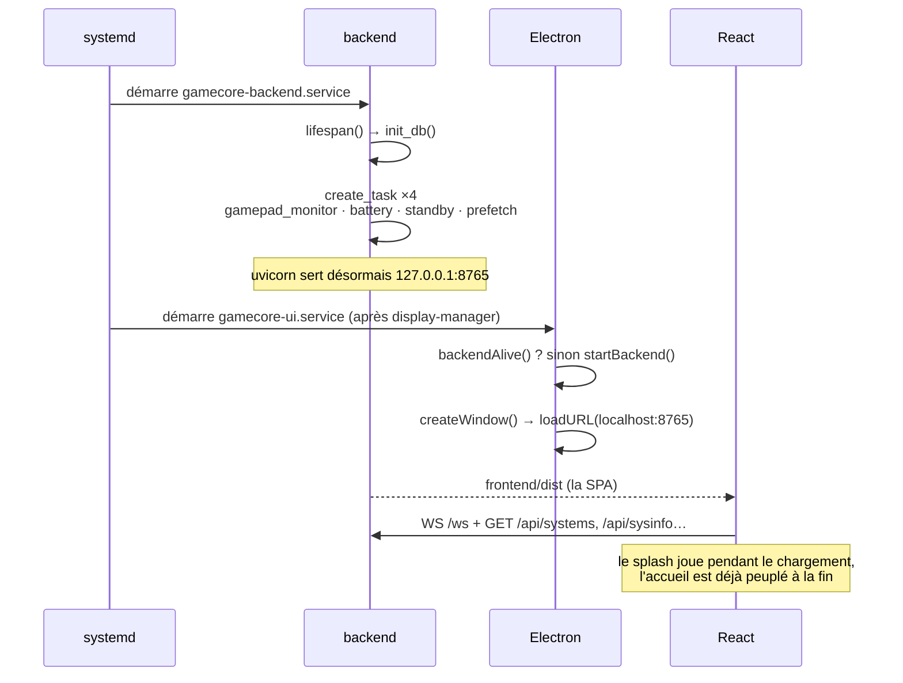
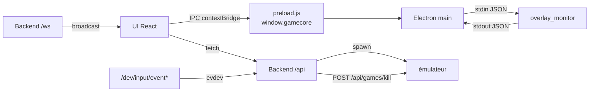

# 1 — Topologie d'exécution

Ce qui tourne, où ça écoute, qui le démarre, et dans quel ordre.

## Les quatre processus

| Processus | Démarré par | Écoute | Responsable de |
|---|---|---|---|
| **Backend** | `gamecore-backend.service` (unit système) | `127.0.0.1:8765` | le processus émulateur, la base de temps de jeu, les jaquettes, la veille, l'evdev |
| **Electron** | `gamecore-ui.service` (unit système) | — | la fenêtre kiosque, l'overlay, les toasts HUD |
| **overlay_monitor** | Electron, `spawn()` | — | la surveillance d'une fenêtre X11, JSON-lines sur stdio |
| **L'émulateur** | Backend, `create_subprocess_exec` | — | son propre groupe de processus |

À côté :

| Processus | Unit | Écoute |
|---|---|---|
| rom-manager | `gamecore-addon-rom-manager.service` (unit **utilisateur**) | `127.0.0.1:8770` |
| rpcs3-manager | `gamecore-addon-rpcs3-manager.service` | `127.0.0.1:8771` |
| save-manager | `gamecore-addon-save-manager.service` | `127.0.0.1:8772` |
| Caddy | `caddy.service` | `:8443` — **le seul port exposé au LAN** |

Les ports 8770-8799 sont réservés aux addons. Vite (`:5173`) n'existe qu'en
développement.

## Séquence de démarrage



`backend/main.py:lifespan()` est le seul endroit où les tâches de fond sont
créées et annulées :

```python
monitor_task  = asyncio.create_task(gamepad_monitor.run())
battery_task  = asyncio.create_task(battery.run())
standby_task  = asyncio.create_task(standby.run())
prefetch_task = asyncio.create_task(prefetch.run())
```

`startBackend()` d'Electron (`main.js:334`) est un **repli pour le
développement** : sur un boîtier, l'unit systemd possède déjà le backend, et
`backendAlive()` (`main.js:328`) le détecte pour éviter d'en lancer un second.

## Temporisation d'affichage au démarrage à froid

`splashHoldMs()` (`electron/main.js:36`) lit l'uptime système. En dessous de
`BOOT_UPTIME_THRESHOLD_S` (180 s), il ajoute un paramètre à l'URL pour que le
splash se fige sur sa première image noire pendant `SPLASH_BOOT_HOLD_MS` (4 s).
Raison : au démarrage à froid, X vient de se lancer, `gamecore-xsetup` bascule
la résolution en 1080p et la TV passe plusieurs secondes à resynchroniser le
HDMI — l'animation se jouerait devant personne. Un relancement depuis le bureau
(uptime élevé) n'a aucun délai.

## Qui parle à qui



Trois canaux distincts, délibérément :

1. **HTTP `/api`** — requête/réponse, à l'initiative de l'UI.
2. **WebSocket `/ws`** — poussé par le backend (jeu démarré/terminé, batterie,
   veille, notifications d'addons).
3. **IPC via `contextBridge`** — UI → Electron uniquement, pour ce que le
   navigateur ne peut pas faire (redémarrer, afficher une fenêtre overlay).
   `preload.js` expose exactement dix méthodes et rien d'autre ;
   `nodeIntegration` est désactivé.

## Units systemd

`gamecore-backend.service` — unit système, écrite par `install/arch.sh` :

```ini
Environment=GAMECORE_PATH=/opt/GameCore
ExecStart=/opt/GameCore/.venv/bin/uvicorn backend.main:app --host 127.0.0.1 --port 8765
```

La clé TheGamesDB est ajoutée en drop-in local
(`systemctl edit gamecore-backend` → `Environment=THEGAMESDB_API_KEY=…`),
jamais commitée.

`gamecore-ui.service` — lance `electron/start-ui.sh` après le gestionnaire
d'affichage. Ce wrapper n'est pas décoratif : il exporte `XDG_RUNTIME_DIR`
(sans lui Chromium n'a **aucun son** sous un service systemd) et sonde `:1`,
`:0`, `:2` avec `xdpyinfo` pour trouver l'affichage X actif, ainsi que le
cookie `XAUTHORITY` correspondant sous `/run/user/<uid>/`.

Les addons sont des units **utilisateur** (`systemctl --user`) : ils héritent
de la session graphique et s'arrêtent avec elle.

## Reconstruction de l'environnement

Un processus démarré par systemd n'a pas d'environnement de session. Deux
endroits le reconstruisent :

- `electron/start-ui.sh` — pour l'UI elle-même.
- `backend/services/process_manager.py:_display_env()` — pour chaque
  émulateur : `DISPLAY` (défaut `:1`), `XDG_RUNTIME_DIR`,
  `DBUS_SESSION_BUS_ADDRESS`, `XAUTHORITY` (trouvé par glob dans
  `/run/user/<uid>/xauth_*`) et `SDL_GAMECONTROLLERCONFIG_FILE` →
  `backend/data/gamecontrollerdb.txt`. Il **retire aussi `WAYLAND_DISPLAY`**,
  sinon les émulateurs Qt tentent Wayland et échouent en silence sous l'unit.

## Topologie de développement

```bash
uvicorn backend.main:app --port 8765 --reload   # backend
cd frontend && npm run dev                      # Vite :5173
cd electron && ELECTRON_DEV=1 npx electron .    # shell → :5173
```

`DEBUG` existe deux fois — `backend/config.py` et `electron/main.js:16` — et
doit valoir `false` sur un boîtier. `DEV` vaut `DEBUG && ELECTRON_DEV=1` ; ce
n'est qu'alors qu'Electron charge `:5173` au lieu de `:8765`.
