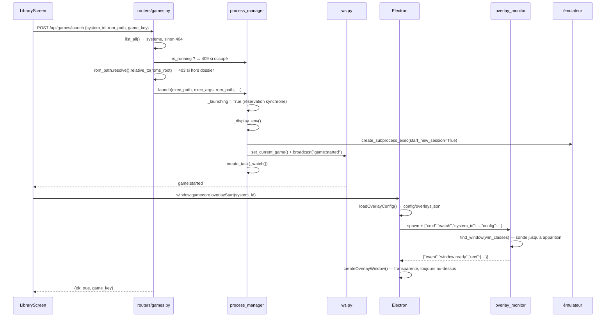
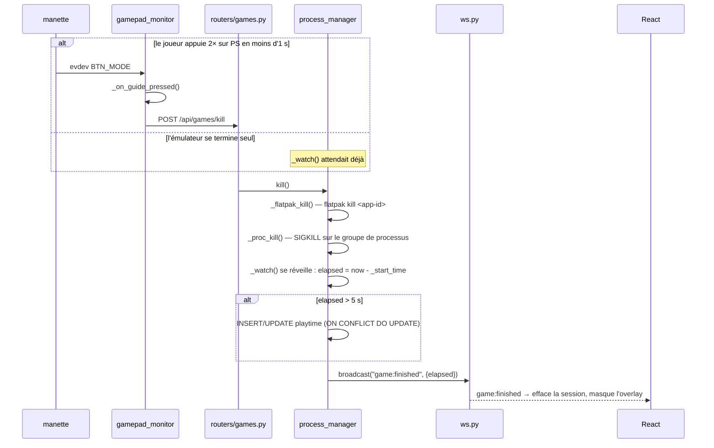
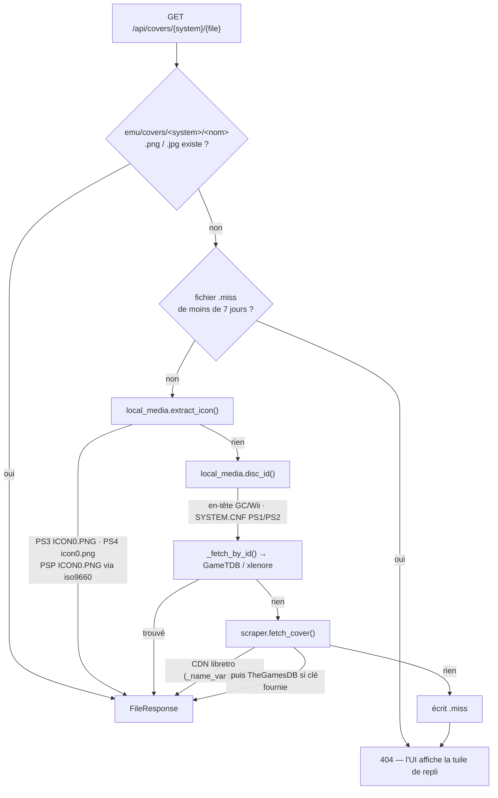
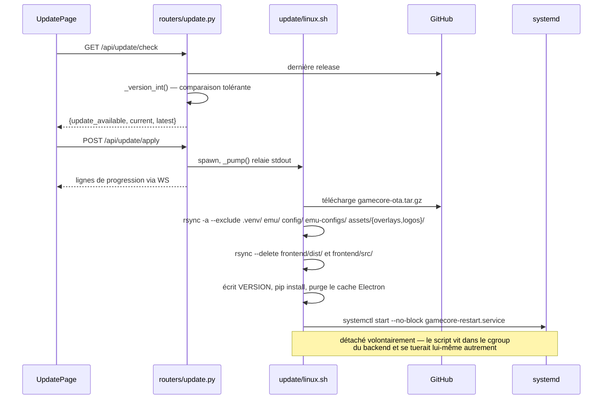
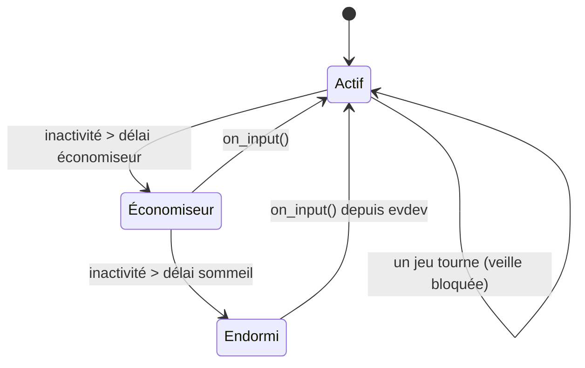
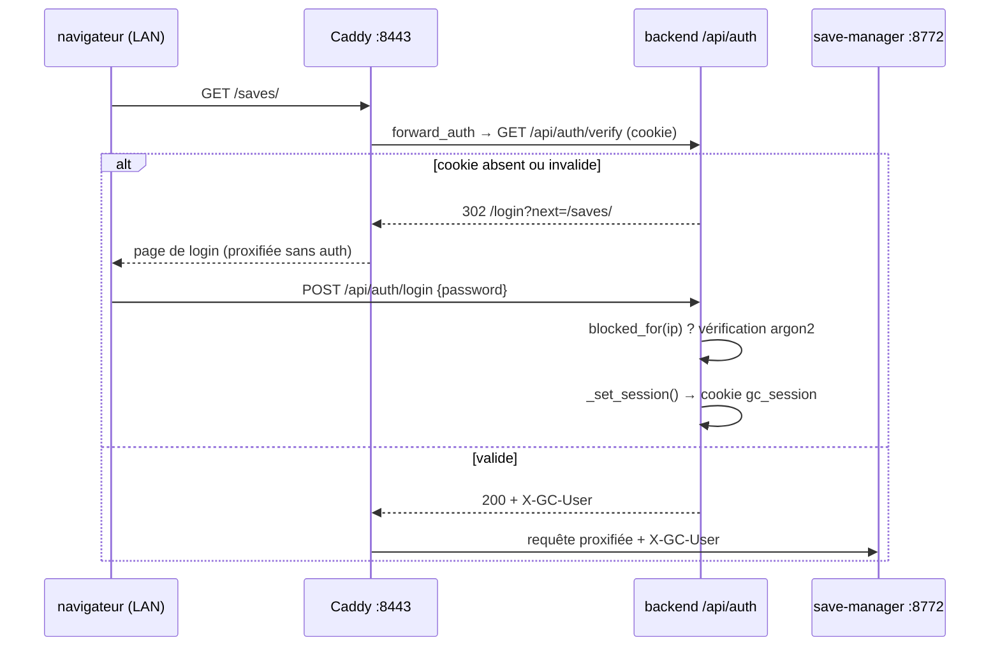
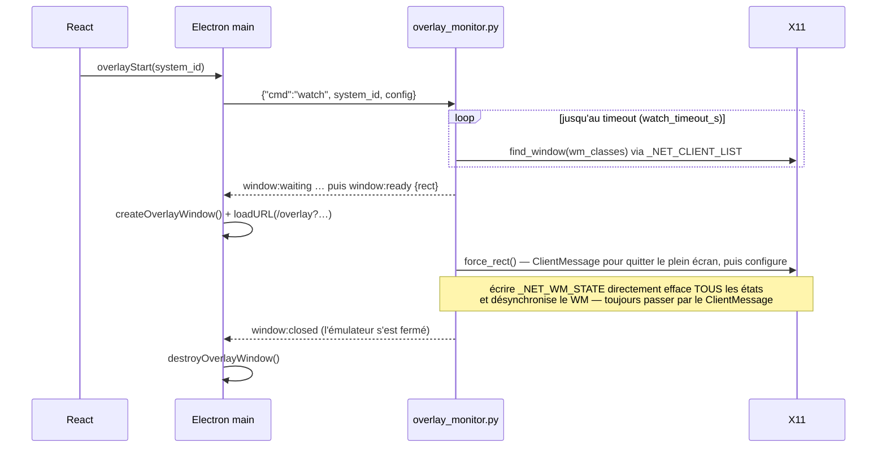

# 2 — Flux détaillés

Les chemins qui valent la peine d'être connus de bout en bout. Chaque flèche
nomme la fonction qui s'exécute.

## 1. Lancer un jeu

Après la réponse, `launch_game()` peut aussi programmer deux tâches
« lancer et oublier », pilotées par des clés optionnelles du système :

- `"gamepadTrigger": true` → `_gamepad_trigger()` exécute
  `sudo udevadm trigger` 3× à 3 s d'intervalle, pour que les applications
  Flatpak voient la manette.
- `"fullscreen": {…}` → `fullscreen_enforcer.enforce()`.

## 2. Terminer un jeu

Deux entrées, une seule sortie.

Pourquoi c'est construit ainsi :

- **evdev, pas le navigateur.** Chromium masque souvent le bouton Guide, et
  l'UI est de toute façon enfouie sous un émulateur plein écran.
- **Double appui.** Un seul appui sur Guide ne doit jamais tuer un jeu par
  accident (`GUIDE_DOUBLE_PRESS_MS`, dupliqué dans le hook frontend).
- **`flatpak kill` d'abord.** Un SIGTERM au wrapper `flatpak` n'atteint jamais
  l'application dans le bac à sable.
- **SIGKILL, jamais SIGTERM.** Plusieurs émulateurs répondent au SIGTERM par
  une boîte de dialogue de confirmation, impossible à cliquer à la manette.
- **Le plancher de 5 s.** Un émulateur qui meurt aussitôt n'est pas une
  session de jeu.

## 3. Résoudre une jaquette

Point d'entrée : `services/cover_pipeline.py:resolve(system, filename, refresh)`.
`?refresh=1` ignore le cache et le `.miss`.

Les niveaux 2 et 3 sont **hors-ligne et exacts** — ils lisent le jeu lui-même,
donc ne se trompent jamais d'identification. Le niveau 4 est de la
correspondance floue par nom, atteint seulement quand le jeu ne porte aucune
identité.

## 4. Mise à jour OTA

## 5. Veille, et réveil

`services/standby.py:run()` sonde. `_enter(stage)` pilote les transitions,
`_screen(False)` coupe l'écran via DPMS, `_governor("powersave")` abaisse le
CPU (optionnel, nécessite une règle sudoers). `on_input()` est appelée depuis
la boucle evdev de `gamepad_monitor` — c'est pour cela qu'une manette réveille
le boîtier alors même que l'UI dort et que le navigateur n'écoute pas.

## 6. Authentification LAN

Le `/api/*` du cœur est **403 depuis le LAN, toujours**. Les addons ne
contiennent aucun code d'authentification — Caddy est le point d'application.
La TV contourne tout cela en loopback.

## 7. Cycle de vie d'un overlay

Toute la fonctionnalité est désactivée quand `WAYLAND_DISPLAY` est défini
(`_WAYLAND_SESSION`), silencieusement. Une machine de dev sous Wayland ne
reproduira jamais un bug d'overlay.
