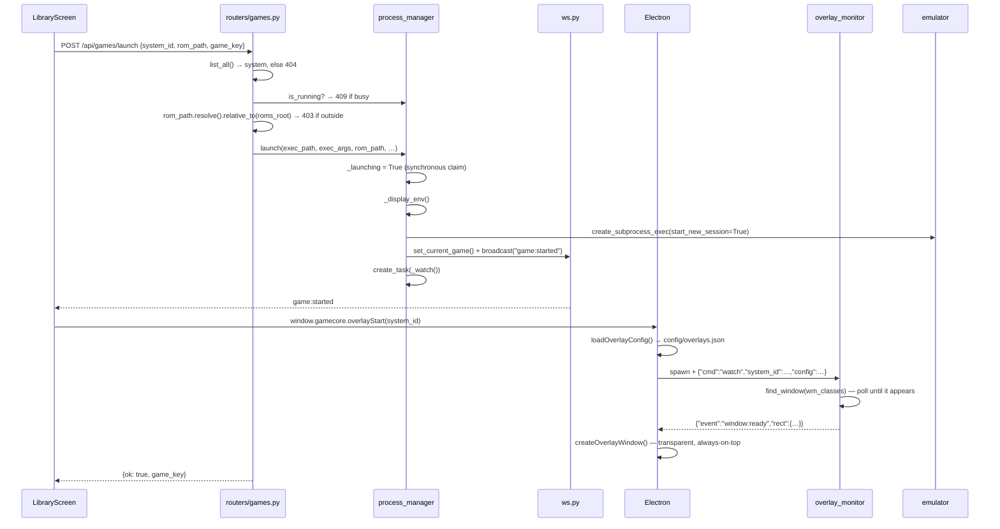
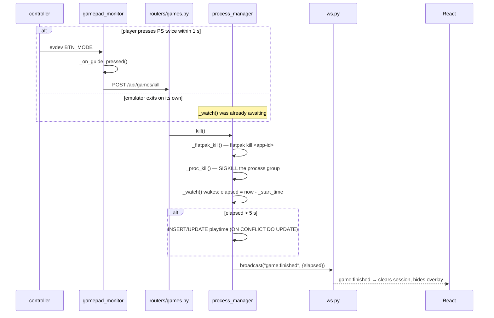
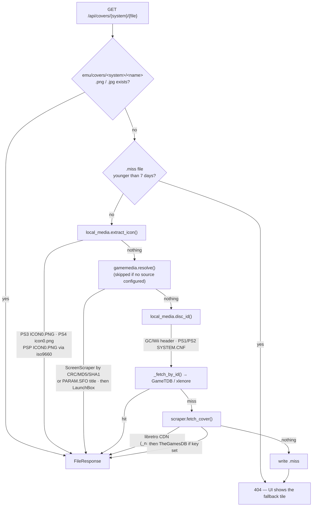
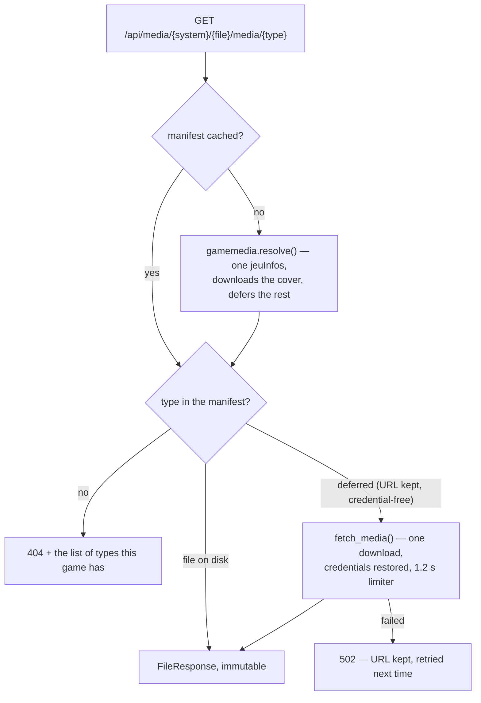
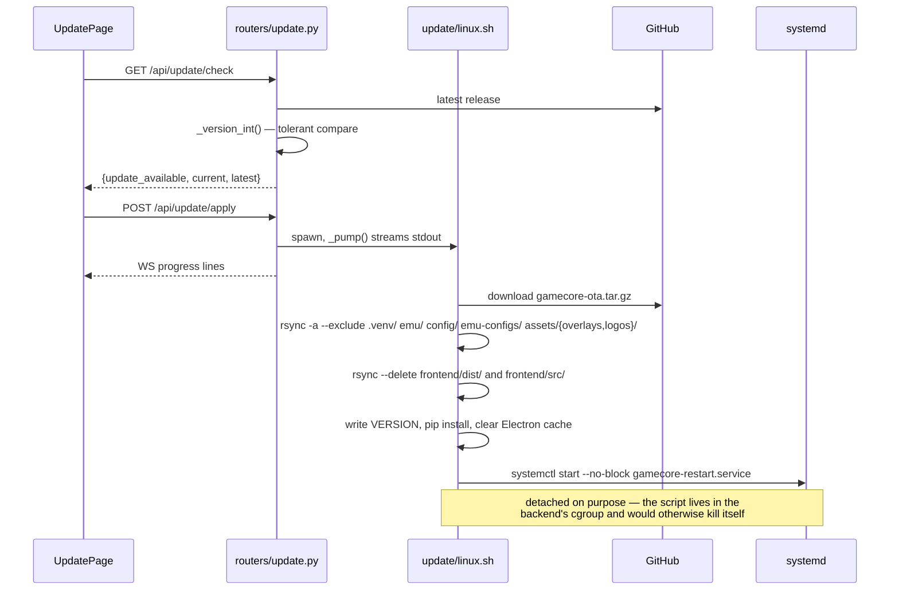
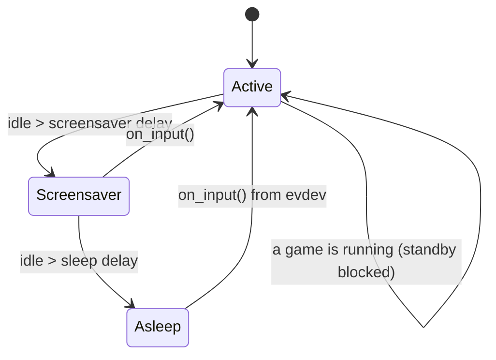
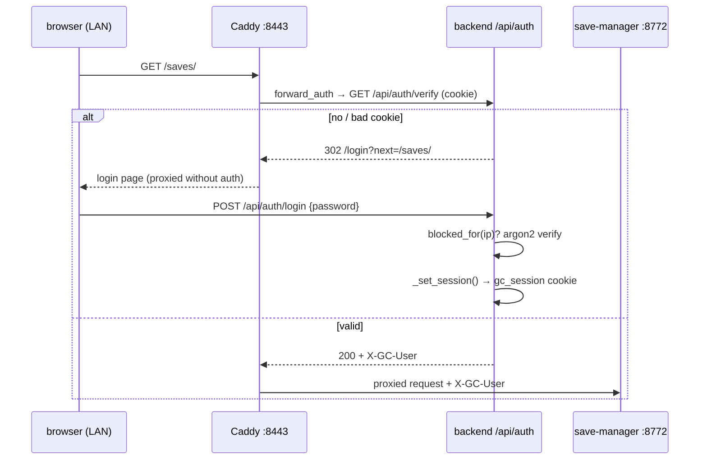
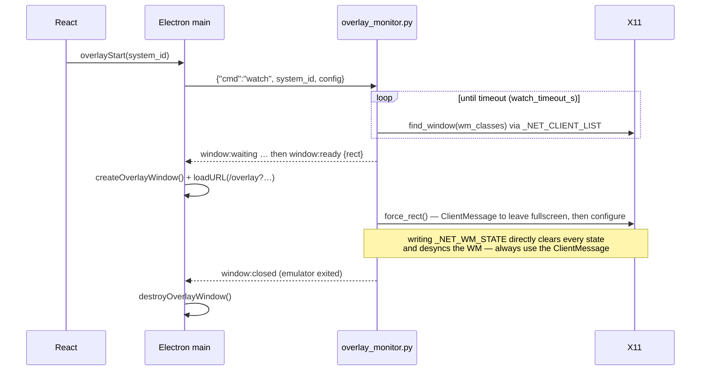

# 2 — Request flows

The paths worth knowing end to end. Every arrow names the function that runs.

## 1. Launching a game

After the response, `launch_game()` may also schedule two fire-and-forget
tasks, both driven by optional keys on the system entry:

- `"gamepadTrigger": true` → `_gamepad_trigger()` runs `sudo udevadm trigger`
  3× at 3 s intervals so Flatpak apps notice the pad.
- `"fullscreen": {…}` → `fullscreen_enforcer.enforce()`.

## 2. Ending a game

Two ways in, one way out.

Why it is built this way:

- **evdev, not the browser.** Chromium often hides the Guide button, and the
  UI is buried under a fullscreen emulator anyway.
- **Double press.** A single Guide press must never kill a game by accident
  (`GUIDE_DOUBLE_PRESS_MS`, mirrored in the frontend hook).
- **`flatpak kill` first.** SIGTERM to the `flatpak` wrapper never reaches the
  sandboxed app.
- **SIGKILL, never SIGTERM.** Several emulators answer SIGTERM with a
  confirmation dialog nobody can click from a gamepad.
- **The 5 s floor.** An emulator that dies instantly is not a play session.

## 3. Resolving a cover

Entry point: `services/cover_pipeline.py:resolve(system, filename, refresh)`.
`?refresh=1` skips the cache and the `.miss` check.

Tiers 2 and 4 are **offline and exact** — they read the game itself, so they
never mis-identify. Tier 3 is exact too when the ROM is a real file: a
CRC32 the ScreenScraper database recognises identifies the game outright, which
is the only exact method available on a cartridge (no embedded icon, no serial
to read). Tier 5 is fuzzy name matching and is only reached when the game
carries no identity anywhere.

Tier 3 is also the one that can be **absent**: with no ScreenScraper account
and no LaunchBox index, `gamemedia.available()` is False and the flow is the
one that ran before it existed.

## 3b. Resolving any other media

The manifest is scraped once per game and holds every media the sources have.
Only what is displayed is downloaded: a first request for `box-3d` costs one
HTTP call and **no ScreenScraper quota**, because the URL was already recorded.

## 4. OTA update

## 5. Standby, and waking up

`services/standby.py:run()` polls. `_enter(stage)` drives the transitions,
`_screen(False)` cuts the display over DPMS, `_governor("powersave")` drops the
CPU (optional, needs a sudoers rule). `on_input()` is called from
`gamepad_monitor`'s evdev loop — which is why a controller wakes the box even
though the UI is asleep and the browser is not listening.

## 6. LAN authentication

The core's own `/api/*` is **403 from the LAN, always**. Addons contain no
auth code — Caddy is the enforcement point. The TV bypasses all of this over
loopback.

## 7. Overlay lifecycle

The whole feature is disabled when `WAYLAND_DISPLAY` is set
(`_WAYLAND_SESSION`), silently. A dev machine on Wayland will never reproduce
an overlay bug.
