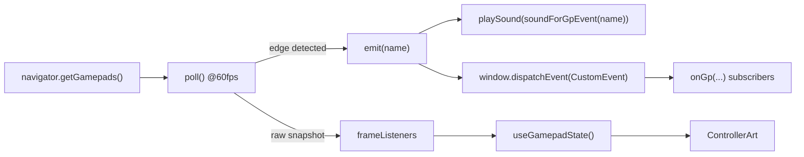

# 5 — Frontend

React 18 + Vite + Zustand + Framer Motion. **No CSS files** — styling is
inline style objects next to the markup, which is why components look long.
(A *theme* is the exception: it owns its markup, so it ships a stylesheet.
See `docs/themes/README.md`.)

```
src/
  main.tsx                  createRoot
  App.tsx           108 l.  the kernel — see below
  store/index.ts     57 l.  Zustand store
  api/index.ts      119 l.  typed fetch wrappers, BASE = "/api"
  hooks/
    useGamepad.ts   215 l.  Gamepad API → CustomEvents + live state
    useWebSocket.ts  73 l.  backend push → handler registry
    useTheme.ts     178 l.  loads the active theme, crash counting, L1+R1 rescue
  lib/
    themeLoader.ts  140 l.  imports a theme module, validates its surfaces
    themeSdk.ts     138 l.  the object a theme receives — the whole contract
  components/…
```

## Kernel, shell, views

Picking a theme swaps the frontend. Three layers, and the boundaries are what
keep a theme from breaking the launcher:

| Layer | File | What lives there |
|---|---|---|
| **Kernel** | `App.tsx` | the input bus, the WebSocket, `gp:guide`, the Electron overlay handshake, the splash slot and its watchdog, the error boundaries. A theme cannot take any of it. |
| **Shell** | `components/DefaultShell.tsx` | the whole frontend body: stacking, the modal stack, which button opens which screen. A theme renders *one* of these — the default one with parts overridden, or its own tree. |
| **Views** | `HomeScreen/DefaultHomeView.tsx`, `LibraryScreen/DefaultLibraryView.tsx` | markup only. |

The view seam is the important one. `HomeScreen` and `LibraryScreen` keep every
decision — paging, focus, sorting, search, launching, the d-pad bindings — and
hand a plain props object to a view component (`HomeScreen/types.ts`,
`LibraryScreen/types.ts`). A theme supplies `homeView` / `libraryView` and
nothing else, so **a themed screen cannot behave differently from the default
one**: it has no code that could. Every navigation bug in the first version of
the theme system came from a theme reimplementing this logic slightly wrong.

`ThemeSurface.tsx` mounts the theme's shell behind an error boundary; if it
throws, the default shell takes over and the crash is recorded (three strikes
and the theme is refused at boot — `useTheme.ts`).

## Store — `store/index.ts`

One Zustand store, no context providers.

| Slice | Fields | Actions |
|---|---|---|
| Navigation | `screen`, `selectedSystemId`, `selectedGameIdx`, `gridFocusIdx`, `gridPage` | `goHome()`, `goLibrary(id)`, `setGridFocus`, `setGridPage`, `setSelectedGameIdx` |
| Focus lock | `modalDepth` | `openModal()`, `closeModal()` |
| Power | `powerPending` | `setPowerPending(action)` |
| Session | `sessionGameKey`, `sessionSystemId` | `setSession(gameKey, systemId)` |

`modalDepth` is the mechanism that keeps gamepad handlers from firing twice.
Every modal increments it on mount and decrements on unmount
(`closeModal` clamps at 0). Screens bail out when it is non-zero:

```ts
const blocked = () => screenRef.current !== 'home' || modalDepthRef.current > 0
```

`powerPending` freezes the UI while the OS is shutting down, so nothing pops
back on screen mid-poweroff.

## The gamepad event bus — `hooks/useGamepad.ts`

`useGamepad()` runs one `requestAnimationFrame` poll loop and dispatches
`CustomEvent`s on `window`. Anything in the tree subscribes with
`onGp(event, handler)` and gets a cleanup function back.



### Events

```
gp:dpad-up   gp:dpad-down   gp:dpad-left   gp:dpad-right
gp:confirm (A/✕)   gp:back (B/○)   gp:y (Y/△)   gp:x (X/□)
gp:menu (Start/Options)   gp:power (Select/Share)   gp:guide (PS/Home)
gp:l1   gp:r1   gp:l2   gp:r2
gp:connected(name)   gp:disconnected
```

### The three invariants

1. **While a game runs, every event is suppressed except `gp:guide`.**
   `isPlaying()` reads Zustand synchronously. Otherwise emulator input would
   drive the launcher behind the game. Mirrors the old C++ behaviour.
2. **`gp:guide` requires a double press within `GUIDE_DOUBLE_PRESS_MS` (1 s).**
   One press must never kill a running game by accident.
3. **The left stick is edge-triggered into d-pad events** with `DEAD_ZONE = 0.5`,
   so a held stick emits once, not 60 times a second.

### Two APIs, on purpose

| API | Nature | Use for |
|---|---|---|
| `onGp(event, handler)` | edge-triggered | navigation, actions — "□ was pressed" |
| `useGamepadState()` / `onGamepadFrame(cb)` | continuous | drawing — "□ is held", "the stick is at 40 %" |

`GamepadState` = `{connected, pressed[], values[], axes[]}`, indexed by
`GP_BTN` (the standard mapping). Values are quantised to 1/50th so a resting
stick re-renders nothing. The only consumer is the controller screen.

### Button indices — `BTN`

```
A 0   B 1   X 2   Y 3   L1 4   R1 5   L2 6   R2 7
SHARE 8   OPTIONS 9   L3 10   R3 11
DPAD ↑12 ↓13 ←14 →15   GUIDE 16
```

## WebSocket — `hooks/useWebSocket.ts`

Module-level singleton socket at `ws://<host>/ws`, reconnecting every 3 s on
close. `onWsEvent(event, handler)` registers into a `Map<string, Set<Handler>>`
and returns an unsubscribe.

### The WebSocket event table

| Event | Emitted by | Payload | UI effect |
|---|---|---|---|
| `game:started` | `process_manager.launch()` | `game_key`, `system_id` | Electron shows the bezel overlay |
| `game:finished` | `process_manager._watch()` | + `elapsed` | clears the session, hides the overlay |
| `game:running` | `ws.connect()` | current game | late-joining client catches up |
| `gp:battery` | `battery.run()` | `name`, `level`, `threshold` | toast, or native HUD in-game |
| `gp:guide` | `gamepad_monitor` | — | relayed kill request |
| standby events | `standby._enter()` | stage | drives `Screensaver` |
| addon events | `POST /api/addons/notify` | free-form | e.g. refresh after a ROM upload |

## Components

| File | Lines | Role |
|---|---|---|
| `App.tsx` | 108 | the kernel: splash slot + `SPLASH_WATCHDOG_MS`, `gp:guide`, overlay handshake |
| `components/DefaultShell.tsx` | 190 | the default frontend as one component; `ShellParts`, `ModalScope`, `CONTROLLER_CLOSE_MS` |
| `components/ThemeSurface.tsx` | 44 | `ThemeProvider` + `Shell` — one themed tree, behind a boundary |
| `components/defaults.tsx` | 89 | what a theme may reuse: `Shell`, `DefaultSettingsPages`, `launchApp`, … |
| `components/Splash.tsx` | 374 | rAF boot animation; `T_IMPACT`, `HOLD_MS` and `FRAGMENTS` drive the timeline |
| `components/HomeScreen/index.tsx` | 197 | **behaviour**: 4×2 grid (`COLS`, `ROWS`, `PER_PAGE`), paging, focus, launching |
| `components/HomeScreen/DefaultHomeView.tsx` | 120 | **markup** of the default dashboard |
| `components/HomeScreen/types.ts` | 32 | `HomeViewProps` — the seam a theme plugs into |
| `components/HomeScreen/SystemCard.tsx` | 96 | one tile; `getColor(system)` falls back to `SYSTEM_COLORS` |
| `components/LibraryScreen/index.tsx` | 212 | **behaviour**: sorting, search, selection, launching, the keyboard modal |
| `components/LibraryScreen/DefaultLibraryView.tsx` | 244 | **markup** of the default library |
| `components/LibraryScreen/types.ts` | 58 | `LibraryViewProps`, `SORT_KEYS`, `SORT_LABELS` |
| `components/LibraryScreen/CoverImage.tsx` | 31 | cover art + missing-art fallback; handed to the view |
| `components/LibraryScreen/GameMetaPanel.tsx` | 40 | year/genres/players; handed to the view |
| `components/TopBar/index.tsx` | 134 | clock, IP, storage, `ControllerBattery`, `TBtn` |
| `components/Screensaver.tsx` | 136 | standby slideshow, `ROTATE_MS = 9000` |
| `components/OverlayScreen/index.tsx` | 109 | what the transparent Electron overlay window renders |
| `components/modals/SettingsModal.tsx` | 85 | menu; pages live in `settings/`. **Every id in `ITEMS` needs a matching `page === …` line** — `themes` was missing one and the button was silently dead. |
| `components/modals/PowerModal.tsx` | 86 | **flow**: Scan mapping · Restart · Shutdown, two-press confirm, `POWER_FAILSAFE_MS = 10000` |
| `components/modals/power/DefaultPowerView.tsx` | 68 | **markup** of the default power menu |
| `components/modals/power/types.ts` | 32 | `PowerViewProps` |
| `components/modals/GamepadModal.tsx` | 85 | **flow**: pad detection, glyphs, live state |
| `components/modals/gamepad/DefaultGamepadView.tsx` | 56 | **markup** of the default controller screen |
| `components/modals/gamepad/types.ts` | 37 | `GamepadViewProps`; hands the view a bound `Art` |
| `components/modals/gamepad/ControllerArt.tsx` | 323 | the pad drawing — see below |
| `components/ui/index.tsx` | 144 | `Overlay`, `OverlayLabel`, `BackHeader`, `Toggle`, `SliderRow`, `Chip`, `Bars`, `hexToRgb`, `fmtTime`, `fmtDate` |
| `components/ui/VirtualKeyboard.tsx` | 205 | on-screen keyboard (WiFi passwords, library search) |
| `components/ui/Toasts.tsx` | 117 | top-right stack, `TOAST_MS = 10000` |

### Settings pages — `components/modals/settings/`

`WifiPage` (218), `AudioPage` (233), `BluetoothPage` (189), `StandbyPage`
(102), `ThemesPage` (156), `UpdatePage` (143), `DesktopPage` (33). All share
`useSubPageGamepad(onBack, onClose, enabled)` (18 l.), which binds ○ → back
and □ → close consistently, so no page reimplements it.

**Each page wraps itself in `<Overlay>`.** They are not fragments: a page *is* a
full-screen fixed layer. Putting one inside another box nests a `position:
fixed` layer in a flex container and shatters its layout — which is exactly what
happened when a theme tried to give them its own panel. A theme reuses them bare
and restyles them through CSS variables instead (below).

### Themable tokens

The settings surface is drawn with inline styles, so a stylesheet cannot reach
it. These variables are the hook, and every one falls back to the value the dark
UI has always used — nothing changes unless a theme defines them:

| Variable | Default | Used by |
|---|---|---|
| `--gc-overlay-scrim` | `rgba(5,5,12,0.88)` | the full-screen backdrop behind a settings page |
| `--gc-overlay-blur` | `blur(24px)` | same |
| `--gc-overlay-panel` | `rgba(255,255,255,0.035)` | the card itself |
| `--gc-overlay-border` | `rgba(255,255,255,0.09)` | its hairline |
| `--gc-overlay-radius` | `20px` | its corners |
| `--gc-accent` | `#7c3aed` | focus rings, toggles, sliders, the keyboard, the theme picker's marker |
| `--gc-accent-soft` | `#a78bfa` | secondary accent text |
| `--gc-accent-bright` | `#c4b5fd` | figures and emphasis |

Write `var(--gc-accent, #7c3aed)` — never a bare `var(--gc-accent)` inside
`color-mix()`. Without the fallback the whole function is invalid when no theme
is active, the declaration is dropped, and the *default* UI loses its accent.

`AudioPage` names its rows (`ROW_VOLUME`, `ROW_OUTPUT`, `ROW_UI_TOGGLE`,
`ROW_UI_VOLUME`, `ROW_COUNT`) rather than indexing by number — worth copying
when adding a page.

### `ControllerArt.tsx` — the pad drawing

Ported from a design mock: absolutely positioned layers in the mock's own
**372×238** space, scaled as a block via the `scale` prop (default 1.35).

| Symbol | Role |
|---|---|
| `at(cx, cy, w, h)` | absolute box positioned **by its centre** — how every control is placed |
| `DPAD_HOME` / `STICK_HOME` | the two anchor points that **swap** for the Xbox layout |
| `RSTICK`, `FACE` | fixed anchors |
| `STICK_TRAVEL = 13` | px of stick deflection at full axis — the calibration knob |
| `Trigger` | analog: sinks by `values[L2/R2]`, brightness follows |
| `Bumper`, `Pill`, `DpadArm`, `FaceButton`, `Socket`, `Stick` | the parts |
| `glyph(seat, isXbox, pressed)` | PlayStation shapes or Xbox letters |

The socket is drawn separately from the stick so the deflection has a fixed
rim to move against — without it the cap looks like it is floating.

## `lib/`

| File | Exports |
|---|---|
| `sounds.ts` | `playSound(name)`, `soundForGpEvent(event)`, `soundSettings`, `getAudioContext`. Sounds are **synthesised** with `note()` on a shared `AudioContext` — no audio assets. Settings persist in `localStorage` (`gc:uiSounds`, `gc:uiSoundsVolume`) |
| `systemColors.ts` | `SYSTEM_COLORS` fallback palette per system id |
| `formatGameName.ts` | `formatGameName(raw)` — strips trailing region and language-sequence noise (`REGION_RE`, `LANG_SEQ_RE`) |

## `api/index.ts`

`BASE = '/api'`, generic `get<T>` / `post<T>`, and the `api` object grouping
`systems`, `games`, `playtime`, `sysinfo`, `update`, `wifi`, `audio`,
`bluetooth`, `addons`, `standby`. Types exported for the UI: `SystemEntry`,
`GameEntry`, `GameMeta`, `PlaytimeEntry`, `SysInfo`.

Same-origin by construction — the SPA is served by the backend, so no base URL
and no CORS.
