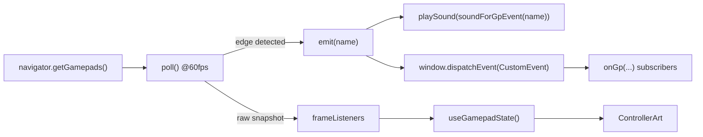

# 5 — Frontend

React 18 + Vite + Zustand + Framer Motion. **No CSS files** — styling is
inline style objects next to the markup, which is why components look long.
(A *theme* is the exception: it owns its markup, so it ships a stylesheet.
See `docs/themes/README.md`.)

```
src/
  main.tsx                  createRoot
  App.tsx           108 l.  the kernel — see below
  store/index.ts     57 l.  Zustand store
  api/index.ts      119 l.  typed fetch wrappers, BASE = "/api"
  hooks/
    useGamepad.ts   215 l.  Gamepad API → CustomEvents + live state
    useWebSocket.ts  73 l.  backend push → handler registry
    useTheme.ts     178 l.  loads the active theme, crash counting, L1+R1 rescue
  lib/
    themeLoader.ts  140 l.  imports a theme module, validates its surfaces
    themeSdk.ts     138 l.  the object a theme receives — the whole contract
  components/…
```

## Kernel, shell, views

Picking a theme swaps the frontend. Three layers, and the boundaries are what
keep a theme from breaking the launcher:

| Layer | File | What lives there |
|---|---|---|
| **Kernel** | `App.tsx` | the input bus, the WebSocket, `gp:guide`, the Electron overlay handshake, the splash slot and its watchdog, the error boundaries. A theme cannot take any of it. |
| **Shell** | `components/DefaultShell.tsx` | the whole frontend body: stacking, the modal stack, which button opens which screen. A theme renders *one* of these — the default one with parts overridden, or its own tree. |
| **Views** | `HomeScreen/DefaultHomeView.tsx`, `LibraryScreen/DefaultLibraryView.tsx`, `StoreScreen/DefaultStoreView.tsx` | markup only. |

The view seam is the important one. `HomeScreen`, `LibraryScreen` and
`StoreScreen` keep every decision — paging, focus, sorting, search, tabs, the
download queue, launching, the d-pad bindings — and hand a plain props object
to a view
component (`HomeScreen/types.ts`, `LibraryScreen/types.ts`,
`StoreScreen/types.ts`). A theme supplies `homeView` / `libraryView` /
`storeView` and nothing else, so **a themed screen cannot behave differently
from the default one**: it has no code that could. Every navigation bug in the
first version of the theme system came from a theme reimplementing this logic
slightly wrong.

`ThemeSurface.tsx` mounts the theme's shell behind an error boundary; if it
throws, the default shell takes over and the crash is recorded (three strikes
and the theme is refused at boot — `useTheme.ts`).

## Store — `store/index.ts`

One Zustand store, no context providers.

| Slice | Fields | Actions |
|---|---|---|
| Navigation | `screen` (`'home'` \| `'library'` \| `'store'`), `selectedSystemId`, `selectedGameIdx`, `gridFocusIdx`, `gridPage` | `goHome()`, `goLibrary(id)`, `goStore()`, `setGridFocus`, `setGridPage`, `setSelectedGameIdx` |
| Focus lock | `modalDepth` | `openModal()`, `closeModal()` |
| Power | `powerPending` | `setPowerPending(action)` |
| Session | `sessionGameKey`, `sessionSystemId` | `setSession(gameKey, systemId)` |

`modalDepth` is the mechanism that keeps gamepad handlers from firing twice.
Every modal increments it on mount and decrements on unmount
(`closeModal` clamps at 0). Screens bail out when it is non-zero:

```ts
const blocked = () => screenRef.current !== 'home' || modalDepthRef.current > 0
```

`powerPending` freezes the UI while the OS is shutting down, so nothing pops
back on screen mid-poweroff.

## The Store destination — `components/StoreScreen/`

**Two different things are called "store" in this frontend, and it is worth
saying so once.** The section above is `store/index.ts`, the Zustand state. This
one is the *shop*: the screen where the player installs a console and, in time,
downloads a game. They share a word and nothing else.

The Store is a **destination**, not a settings page. `screen === 'store'` sits
beside `'home'` and `'library'`, `goStore()` is how you get there, and ○ leaves
the way it leaves the library. Settings is where the player changes what the box
already does; the Store is where they change what it *has*.

That is a shape decision and not a placement one, and it has a concrete
consequence: it reaches themes as a shell part (`storeView`) with a working
default, so all three shipped themes got the Store without a line of any of them
changing. A settings page would have needed an entry in each theme's own menu —
the failure mode `DefaultSettingsPages` already carries three comments about,
where `catalog`, `bios` and `storage` each existed, had a route, and could not be
opened from a themed box.

| | |
|---|---|
| **route in** | △ on the dashboard, bound in `DefaultShell` beside ⚙ and ⏻ — a destination's route belongs with the other destinations'. Plus a Store button on the default top bar, and `sdk.nav.goStore()` for a theme's own way in |
| **route out** | ○, owned by `StoreScreen` and never droppable. It steps back through the Games tab first: the queue, then an asked-about result, then the console, then home |
| **tabs** | L1/R1. The dashboard spends those on paging and this screen cannot: the two tabs are its whole shape. Paging is the d-pad's edges, which already turn the page on the dashboard too |
| **data** | `GET /api/catalog`, filtered to `kind: 'emulator'` and ordered A–Z by label. One catalogue, one endpoint — see [`10-catalog-and-install.md`](10-catalog-and-install.md). The Games tab adds `GET /api/store/search` and the three `/api/store/jobs` routes, plus the `store:jobs` socket event |
| **actions** | ✕ installs, ✕ again removes (armed first), △ reconfigures. All three through `useCatalog`, never through this screen's own code. On the Games tab the same buttons mean that tab's own steps — ✕ picks a console then asks about a result, △ opens the keyboard — and none of them goes near `useCatalog` |

**Mounted only while it is open**, which is the one place the shell departs from
the two screens beside it. Those stay mounted so that going home does not
re-fetch a library. The Store has the opposite need: its list is what the box
*could* have, which changes the moment a pack is installed, so arriving on a
freshly read catalogue is the correct answer rather than a cached one — and
keeping it mounted would put a `/api/catalog` request on every boot for a screen
most sessions never open. It also listens for `catalog:done` while it is up, so
a run finished anywhere is reflected underneath.

### One catalogue logic — `frontend/src/lib/catalog.ts`

`useCatalog({ kind, onDone })` is the whole of it: read the list, post the verb,
hold the screen until `catalog:done`, re-read after. **Three screens consume it
and none of them reimplements any of it** — the Consoles tab here, and the two
applications pages (`settings/apps.js` on the rail, `modals/settings/AppsPage.tsx`
in the fallback modal).

It exists because there *were* three copies, and they had already drifted:

| | the rail page | the modal page | the Store |
|---|---|---|---|
| removing asks twice | no — one ✕ | yes | n/a |
| asks `GET /catalog/busy` | yes | no | no |
| where an application is filed | `family` → "Other" | `kind` → "Applications" | n/a |

The split the hook takes is `kind`, which is the pack's own word for what it is.
No `app` pack declares a `family`, which is why filing them by family put Steam
and YouTube under "Other".

What deliberately stays **out** of it is the ordering: which pack follows which
is what a cursor walks, so it lives with the screen that owns the cursor.

**On failure, it re-reads too.** `_run_cli` kills the CLI at `_CLI_TIMEOUT` and
reports `success: false` after however much of the work it had already done, and
`installed` is read from the `systems.json` that work writes — so skipping the
re-read leaves a screen saying "not installed" about a half-installed pack.

### The Games tab — system first

Two steps, in this order: **pick a console, then search inside it.** The order is
the decision the whole tab is built on, and it is not a preference about menus.

| why | |
|---|---|
| the target directory | `<DATA>/emu/<roms.dir>/` is a property of the system and of nothing else ([§1.3](14-store-ingestion-matrix.md)). With the console known it is known; without it, a download has nowhere to go |
| the ingestion class | is a property of the **pair** (system, incoming format) — the same `.zip` is the ROM on `mame` and packaging on `snes9x` ([§0](14-store-ingestion-matrix.md), §2). A result with no console attached cannot be classified at all |
| the indexers | none of them labels its own results by console reliably enough for the box to attach one afterwards |

**Only installed consoles are searchable.** A game for a console that is not on
the box lands in a directory nothing scans, for a tile that is not on the grid.
The list is `consoles` filtered to `installed` — the same list the Consoles tab
already holds, not a second read of the catalogue.

### One search logic — `frontend/src/lib/storeSearch.ts`

`useStoreSearch()` owns the chosen console, the query, the request, what came
back and the result the player has asked about. Written as a module for the
same reason `useCatalog` was: the second screen that wants a game search must
not be able to start a second copy. What stays out of it is the cursor, which is
navigation and belongs to the screen that owns it.

Two things it does *differently* from `useCatalog`, both deliberate:

- **A failed search drops its rows**, where a failed catalogue re-read keeps
  them. The catalogue is a list the box maintains; results are the answer to one
  request, and keeping them would leave the last query's rows under the new
  query's heading.
- **No results is not an error.** `error` and `answered` are separate, because
  blaming the query for a provider that did not answer sends the player off to
  retype a title that was fine.

### Where the search runs, and why not here

In the backend, behind `GET /api/store/search`
([`backend/routers/store.py`](../../backend/routers/store.py)). A provider is
configured with an indexer's URL and its API key, and a key that reaches the
browser is a key in the page source and in the devtools of a television nobody
logs out of. The frontend never learns how an answer was obtained.

### One queue logic — `frontend/src/lib/storeJobs.ts`

`useStoreJobs()` owns the list of what the player has already asked for, the
two things that can be done to it, and the five words a state goes by. Third
module beside `useCatalog` and `useStoreSearch`, and a module for the same
reason: a theme may draw the rows and may not decide what a state means, which
row can still be stopped, or what happens when one is.

A job is a **row in the box's database**, not a variable. It outlives this
screen, the tab, and the box being switched off — and a job the backend was
killed in the middle of comes back saying so rather than saying it is still
running. See
[7 — `store_jobs`](07-config-and-data.md#store_jobs--the-stores-download-queue)
for the table and what living under `config/` means the day somebody uninstalls
GameCore.

| it decides | so that a view cannot |
|---|---|
| `TERMINAL_STATES` / `isLive(job)` | offer ✕ on a finished row — the backend would answer 409, and ✕ lands wherever the cursor happens to be |
| `JOB_STATE_LABELS` | draw `cancelled` and `failed` as the same thing. They are two different things that happened |
| `actionError` | swallow the box's own sentence. "already in the queue", "the queue is full", "not an installed console" — `api.store.queue` uses the POST that keeps FastAPI's `detail`, because "409 Conflict" on a television is a dead end |
| re-reading on `store:jobs` | assemble the list from socket events, which is a second source of truth and wrong for as long as the socket was down |
| persisted `downloadedBytes` / `downloadTotal` | hide a multi-gigabyte transfer behind a frozen-looking `WORKING…` label |

**There is no retry.** A finished job is a record of what happened; asking again
queues the result again — a new row. No endpoint restarts a job, and adding one
would be a second way to change a state the backend owns exactly one way of
changing.

### Where the search runs, and why not here

In the backend, behind `GET /api/store/search`
([`backend/routers/store.py`](../../backend/routers/store.py)). A provider is
configured with an indexer's URL and its API key, and a key that reaches the
browser is a key in the page source and in the devtools of a television nobody
logs out of. The frontend never learns how an answer was obtained.

### Asking queues. Materializing is not importing.

Two promises, and the screen has to keep them apart — this is where a player
learns which one they are getting.

- ✕ on the asked-about panel writes a **real, persistent row** and a worker
  really picks it up. The screen steps to the queue so the press that created
  it shows it.
- `gamesMaterializerReady` says the worker can download into the job-owned work
  area, and running rows show percentage and received bytes. The values come
  from the database; `store:jobs` merely triggers a re-read.
- **`gamesDownloadReady` remains `false`** because it promises bytes imported
  into a ROM directory and therefore a playable tile. A job now gets as far as
  the final shape its ingestion class requires, in its own staging directory,
  and still ends failed — with the explicit transformed-not-validated reason —
  until validation and import exist. The row carries `transformedBytes` /
  `transformTotal` for that stage; nothing draws them yet, because the screen
  stops at the download.

`gamesDownloadReady` is read from the backend rather than written in the screen,
so a view built today is already right the day it turns true. What a downloaded
game has to *become* — six ingestion classes wide, see
[`14-store-ingestion-matrix.md`](14-store-ingestion-matrix.md) §5 — and the
importer that places it arrives in its own step.

### The Games tab's third place

`StoreGamesPhase` is `'systems' | 'results' | 'queue'`. The first two are the
steps of a search, in that order and for the reasons above. The third is not a
step of that sequence but somewhere the player goes: △ from the console list
opens it — the only free button left on the tab, since ✕ picks and asks, ○
leaves, L1/R1 walk the tabs and □ is the shell's controller screen, bound with
no guard at all. It is its own flag rather than a state of the search, which is
what lets a player check the queue mid-search and come back to their results.

## The gamepad event bus — `hooks/useGamepad.ts`

`useGamepad()` runs one `requestAnimationFrame` poll loop and dispatches
`CustomEvent`s on `window`. Anything in the tree subscribes with
`onGp(event, handler)` and gets a cleanup function back.



### Events

```
gp:dpad-up   gp:dpad-down   gp:dpad-left   gp:dpad-right
gp:confirm (A/✕)   gp:back (B/○)   gp:y (Y/△)   gp:x (X/□)
gp:menu (Start/Options)   gp:power (Select/Share)   gp:guide (PS/Home)
gp:l1   gp:r1   gp:l2   gp:r2
gp:connected(name)   gp:disconnected
```

### The three invariants

1. **While a game runs, every event is suppressed except `gp:guide`.**
   `isPlaying()` reads Zustand synchronously. Otherwise emulator input would
   drive the launcher behind the game. Mirrors the old C++ behaviour.
2. **`gp:guide` requires a double press within `GUIDE_DOUBLE_PRESS_MS` (1 s).**
   One press must never kill a running game by accident.
3. **The left stick is edge-triggered into d-pad events** with `DEAD_ZONE = 0.5`,
   so a held stick emits once, not 60 times a second.

### Two APIs, on purpose

| API | Nature | Use for |
|---|---|---|
| `onGp(event, handler)` | edge-triggered | navigation, actions — "□ was pressed" |
| `useGamepadState()` / `onGamepadFrame(cb)` | continuous | drawing — "□ is held", "the stick is at 40 %" |

`GamepadState` = `{connected, pressed[], values[], axes[]}`, indexed by
`GP_BTN` (the standard mapping). Values are quantised to 1/50th so a resting
stick re-renders nothing. The only consumer is the controller screen.

### Button indices — `BTN`

```
A 0   B 1   X 2   Y 3   L1 4   R1 5   L2 6   R2 7
SHARE 8   OPTIONS 9   L3 10   R3 11
DPAD ↑12 ↓13 ←14 →15   GUIDE 16
```

## WebSocket — `hooks/useWebSocket.ts`

Module-level singleton socket at `ws://<host>/ws`, reconnecting every 3 s on
close. `onWsEvent(event, handler)` registers into a `Map<string, Set<Handler>>`
and returns an unsubscribe.

### The WebSocket event table

| Event | Emitted by | Payload | UI effect |
|---|---|---|---|
| `game:started` | `process_manager.launch()` | `game_key`, `system_id` | Electron shows the bezel overlay |
| `game:finished` | `process_manager._watch()` | + `elapsed` | clears the session, hides the overlay |
| `game:running` | `ws.connect()` | current game | late-joining client catches up |
| `gp:battery` | `battery.run()` | `name`, `level`, `threshold` | toast, or native HUD in-game |
| `gp:guide` | `gamepad_monitor` | — | relayed kill request |
| standby events | `standby._enter()` | stage | drives `Screensaver` |
| addon events | `POST /api/addons/notify` | free-form | e.g. refresh after a ROM upload |

## Components

| File | Lines | Role |
|---|---|---|
| `App.tsx` | 108 | the kernel: splash slot + `SPLASH_WATCHDOG_MS`, `gp:guide`, overlay handshake |
| `components/DefaultShell.tsx` | 190 | the default frontend as one component; `ShellParts`, `ModalScope`, `CONTROLLER_CLOSE_MS` |
| `components/ThemeSurface.tsx` | 44 | `ThemeProvider` + `Shell` — one themed tree, behind a boundary |
| `components/defaults.tsx` | 89 | what a theme may reuse: `Shell`, `DefaultSettingsPages`, `launchApp`, … |
| `components/Splash.tsx` | 374 | rAF boot animation; `T_IMPACT`, `HOLD_MS` and `FRAGMENTS` drive the timeline |
| `components/HomeScreen/index.tsx` | 197 | **behaviour**: 4×2 grid (`COLS`, `ROWS`, `PER_PAGE`), paging, focus, launching |
| `components/HomeScreen/DefaultHomeView.tsx` | 120 | **markup** of the default dashboard |
| `components/HomeScreen/types.ts` | 32 | `HomeViewProps` — the seam a theme plugs into |
| `components/HomeScreen/SystemCard.tsx` | 96 | one tile; `getColor(system)` falls back to `SYSTEM_COLORS` |
| `components/LibraryScreen/index.tsx` | 212 | **behaviour**: sorting, search, selection, launching, the keyboard modal |
| `components/LibraryScreen/DefaultLibraryView.tsx` | 244 | **markup** of the default library |
| `components/LibraryScreen/types.ts` | 66 | `LibraryViewProps`, `SORT_KEYS`, `SORT_LABELS` |
| `components/LibraryScreen/CoverImage.tsx` | 57 | cover art + missing-art fallback; handed to the view. Optional `type` prop draws any media type (`box-3d`, `clear-logo`, `screenshot-gameplay`…) — omitted, it is the jacket from `/api/covers`, byte for byte what it always was |
| `components/LibraryScreen/GameMetaPanel.tsx` | 40 | year/genres/players; handed to the view |
| `components/StoreScreen/index.tsx` | ~640 | **behaviour**: the two tabs, the 4×3 grid (`COLS`, `ROWS`), the 1-column results and queue pages (`RESULT_ROWS`), paging, focus, the Games tab's three phases, the search keyboard, the bindings |
| `components/StoreScreen/DefaultStoreView.tsx` | ~800 | **markup** of the default Store; `PackMark` falls back to the pack's colour, `Nothing` draws the tab's several different empty states, `JobRow`/`QueueView` draw the queue |
| `components/StoreScreen/types.ts` | ~290 | `StoreViewProps`, `STORE_TABS`, `STORE_TAB_LABELS`, `StoreGamesPhase` |
| `components/TopBar/index.tsx` | 134 | clock, IP, storage, `ControllerBattery`, `TBtn` |
| `components/Screensaver.tsx` | 136 | standby slideshow, `ROTATE_MS = 9000` |
| `components/OverlayScreen/index.tsx` | 109 | what the transparent Electron overlay window renders |
| `components/modals/SettingsModal.tsx` | 85 | menu; pages live in `settings/`. **Every id in `ITEMS` needs a matching `page === …` line** — `themes` was missing one and the button was silently dead. |
| `components/modals/PowerModal.tsx` | 86 | **flow**: Scan mapping · Forget mapping · Restart · Shutdown, two-press confirm, `POWER_FAILSAFE_MS = 10000` |
| `components/modals/power/DefaultPowerView.tsx` | 68 | **markup** of the default power menu |
| `components/modals/power/types.ts` | 32 | `PowerViewProps` |
| `components/modals/GamepadModal.tsx` | 85 | **flow**: pad detection, glyphs, live state |
| `components/modals/gamepad/DefaultGamepadView.tsx` | 56 | **markup** of the default controller screen |
| `components/modals/gamepad/types.ts` | 37 | `GamepadViewProps`; hands the view a bound `Art` |
| `components/modals/gamepad/ControllerArt.tsx` | 323 | the pad drawing — see below |
| `components/ui/index.tsx` | 144 | `Overlay`, `OverlayLabel`, `BackHeader`, `Toggle`, `SliderRow`, `Chip`, `Bars`, `hexToRgb`, `fmtTime`, `fmtDate` |
| `components/ui/VirtualKeyboard.tsx` | 205 | on-screen keyboard (WiFi passwords, library search) |
| `components/ui/Toasts.tsx` | 117 | top-right stack, `TOAST_MS = 10000` |

### Settings pages — `components/modals/settings/`

`WifiPage` (218), `AudioPage` (233), `BluetoothPage` (189), `StandbyPage`
(102), `ThemesPage` (156), `UpdatePage` (143), `DesktopPage` (33). All share
`useSubPageGamepad(onBack, onClose, enabled)` (18 l.), which binds ○ → back
and □ → close consistently, so no page reimplements it.

**Each page wraps itself in `<Overlay>`.** They are not fragments: a page *is* a
full-screen fixed layer. Putting one inside another box nests a `position:
fixed` layer in a flex container and shatters its layout — which is exactly what
happened when a theme tried to give them its own panel. A theme reuses them bare
and restyles them through CSS variables instead (below).

### Themable tokens

The settings surface is drawn with inline styles, so a stylesheet cannot reach
it. These variables are the hook, and every one falls back to the value the dark
UI has always used — nothing changes unless a theme defines them:

| Variable | Default | Used by |
|---|---|---|
| `--gc-overlay-scrim` | `rgba(5,5,12,0.88)` | the full-screen backdrop behind a settings page |
| `--gc-overlay-blur` | `blur(24px)` | same |
| `--gc-overlay-panel` | `rgba(255,255,255,0.035)` | the card itself |
| `--gc-overlay-border` | `rgba(255,255,255,0.09)` | its hairline |
| `--gc-overlay-radius` | `20px` | its corners |
| `--gc-accent` | `#7c3aed` | focus rings, toggles, sliders, the keyboard, the theme picker's marker |
| `--gc-accent-soft` | `#a78bfa` | secondary accent text |
| `--gc-accent-bright` | `#c4b5fd` | figures and emphasis |

Write `var(--gc-accent, #7c3aed)` — never a bare `var(--gc-accent)` inside
`color-mix()`. Without the fallback the whole function is invalid when no theme
is active, the declaration is dropped, and the *default* UI loses its accent.

`AudioPage` names its rows (`ROW_VOLUME`, `ROW_OUTPUT`, `ROW_UI_TOGGLE`,
`ROW_UI_VOLUME`, `ROW_COUNT`) rather than indexing by number — worth copying
when adding a page.

### `ControllerArt.tsx` — the pad drawing

Ported from a design mock: absolutely positioned layers in the mock's own
**372×238** space, scaled as a block via the `scale` prop (default 1.35).

| Symbol | Role |
|---|---|
| `at(cx, cy, w, h)` | absolute box positioned **by its centre** — how every control is placed |
| `DPAD_HOME` / `STICK_HOME` | the two anchor points that **swap** for the Xbox layout |
| `RSTICK`, `FACE` | fixed anchors |
| `STICK_TRAVEL = 13` | px of stick deflection at full axis — the calibration knob |
| `Trigger` | analog: sinks by `values[L2/R2]`, brightness follows |
| `Bumper`, `Pill`, `DpadArm`, `FaceButton`, `Socket`, `Stick` | the parts |
| `glyph(seat, isXbox, pressed)` | PlayStation shapes or Xbox letters |

The socket is drawn separately from the stick so the deflection has a fixed
rim to move against — without it the cap looks like it is floating.

## `lib/`

| File | Exports |
|---|---|
| `sounds.ts` | `playSound(name)`, `soundForGpEvent(event)`, `soundSettings`, `getAudioContext`. Sounds are **synthesised** with `note()` on a shared `AudioContext` — no audio assets. Settings persist in `localStorage` (`gc:uiSounds`, `gc:uiSoundsVolume`) |
| `systemColors.ts` | `SYSTEM_COLORS` fallback palette per system id |
| `formatGameName.ts` | `formatGameName(raw)` — strips trailing region and language-sequence noise (`REGION_RE`, `LANG_SEQ_RE`) |
| `catalog.ts` | `useCatalog({ kind, onDone })`, `CATALOG_FAILED` — the one catalogue logic, consumed by the Store's Consoles tab and both applications pages |
| `storeSearch.ts` | `useStoreSearch()`, `SEARCH_FAILED`, `formatSize(bytes)` — the one game-search logic: the chosen console, the query, the request, the asked-about result. `formatSize` is here and not in `format.ts` because that file is `sdk.format`, and growing it is an SDK version bump |
| `storeJobs.ts` | `useStoreJobs()`, `isLive(job)`, `JOB_STATE_LABELS`, `TERMINAL_STATES`, `QUEUE_FAILED` — the one download-queue logic: the list, queueing, cancelling, and what a state is called. Queueing is not downloading; see above |

## `api/index.ts`

`BASE = '/api'`, generic `get<T>` / `post<T>`, and the `api` object grouping
`systems`, `games`, `metadata`, `media`, `playtime`, `sysinfo`, `update`,
`wifi`, `audio`, `bluetooth`, `addons`, `standby`, `catalog`, `store`. Types
exported for the UI: `SystemEntry`, `GameEntry`, `GameMeta`, `MediaEntry`,
`GameMediaIndex`, `PlaytimeEntry`, `SysInfo`, `CatalogEntry`,
`StoreSearchResult`, `StoreSearchAnswer`, `StoreProviderInfo`.

`api.media` is the one to read before drawing artwork that is not a jacket:

| Call | Returns |
|---|---|
| `api.media.list(systemId, filename)` | `GameMediaIndex` — what this game actually has, each entry with `category`, `kind`, `region`, `cached` |
| `api.media.url(systemId, filename, type)` | a plain string, for an `` or a `<video src>` |

`list()` first, always: what a game carries depends on the game — a PS3 dump
has 28 media, an obscure cartridge three. `found: false` with
`available: false` means no source is configured on this box, which is not the
same as an unknown game; `unreachable: true` means the question could not be
asked and a retry later is worth something.

`GameMeta` gained optional fields on the same call — `developer`, `publisher`,
`released`, `score` (0–1), `classifications`. They are optional because a box
answering from TheGamesDB has none of them. The seven original keys did not
move.

Same-origin by construction — the SPA is served by the backend, so no base URL
and no CORS.
