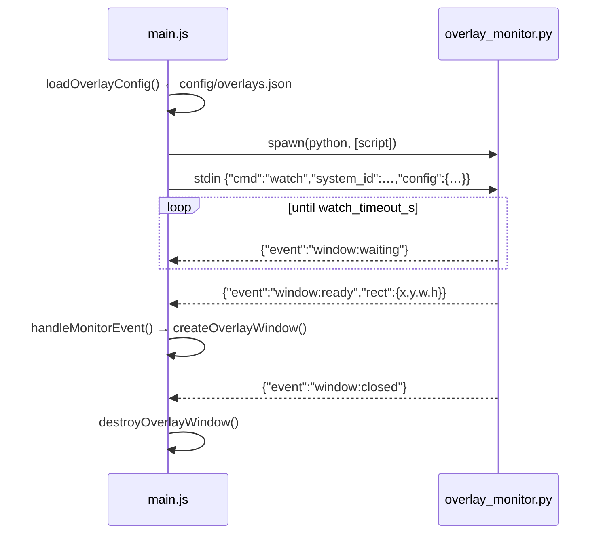

# 6 — Electron shell & overlays

`electron/` is 447 lines total: `main.js` (390), `preload.js` (23),
`start-ui.sh`. It owns three windows and one subprocess.


## The bezel must outrank the emulator

`alwaysOnTop: true` on its own is Electron's "floating" level, and KWin puts a
window that asked for `_NET_WM_STATE_FULLSCREEN` above it — which is every
emulator launched with `-f`. The bezel then draws *under* the game and only
shows where the emulator happens not to paint.

Measured with Rosalie's Mupen GUI: two 1920x1080 RMG windows on top, and the
bezel visible only in the two vertical strips RMG left untouched — black
everywhere else, which reads as "the overlay is the wrong size" and is not.

`overlayWindow.setAlwaysOnTop(true, 'screen-saver')` is the fix. The same
window still must not use `fullscreen: true` itself, for the reason already
noted above it: a fullscreen window lands in a compositor layer that breaks
per-pixel transparency. Explicit geometry plus the top level gives both.


## Chromium switches, set before anything

```js
app.commandLine.appendSwitch('enable-transparent-visuals')          // X11 per-pixel alpha
app.commandLine.appendSwitch('autoplay-policy', 'no-user-gesture-required')
```

The second one is not cosmetic. Chromium keeps WebAudio suspended until a
"user gesture", and **gamepad buttons do not count** — only mouse and
keyboard. On a controller-only kiosk the UI sounds would stay silent forever.

## The three windows

| Window | Created by | Nature |
|---|---|---|
| main | `createWindow()` (L41) | kiosk, loads `BACKEND_URL` (or `DEV_URL` when `DEV`) |
| overlay | `createOverlayWindow()` (L75) | transparent, frameless, always-on-top, loads `/overlay` |
| HUD toast | `showHudToast()` (L142) | transparent, always-on-top, `data:` URL, auto-closes after `HUD_TOAST_MS` (10 s) |

All three use `nodeIntegration: false`, `contextIsolation: true`. The renderer
reaches Electron only through `preload.js`.

### Splash hold at cold boot

`splashHoldMs()` (L36) reads uptime: under `BOOT_UPTIME_THRESHOLD_S` (180 s) it
adds a hold parameter so the splash freezes on its first black frame for
`SPLASH_BOOT_HOLD_MS` (4 s), while X finishes switching the mode and the TV
re-syncs HDMI. A relaunch from the desktop gets no delay.

## The preload bridge — `preload.js`

Exactly ten methods on `window.gamecore`, nothing else:

```js
reboot()  shutdown()  quit()
overlayStart(system_id)  overlayStop(system_id)
batteryToast(data)  controllerToast(data)
onOverlayShow(cb)  onOverlayHide(cb)  onOverlayWaiting(cb)
```

Typed for the UI in `frontend/src/gamecore.d.ts` (`GamecoreAPI`, `OverlayData`).
Every call is a one-way `ipcRenderer.send` except the three `on*` listeners.

## IPC handlers in `main.js`

| Channel | Handler |
|---|---|
| `system:reboot` | `exec('sudo systemctl reboot')` |
| `system:shutdown` | `exec('sudo systemctl poweroff')` |
| `system:quit` | `app.quit()` |
| `overlay:start` | `loadOverlayConfig()` → `startOverlayMonitor()` |
| `overlay:stop` | `stopOverlayMonitor()` + `destroyOverlayWindow()` |
| `notify:battery` | `showBatteryToast(data)` |
| `notify:controller` | `showHudToast(...)` |

## HUD toasts and untrusted text

`showHudToast({icon, title, body, accent})` builds an HTML string for a
`data:` URL. Its inputs come from the renderer, which got them from WebSocket
broadcasts — including `POST /api/addons/notify` (reachable by any addon) and
**Bluetooth device names**. Two guards exist for that reason:

| Function | Guard |
|---|---|
| `escHtml(s)` (L131) | escapes anything interpolated into markup |
| `safeColor(c)` (L138) | the accent lands inside `style=""`, so it is only ever accepted as a plain colour token |

Never interpolate a broadcast string raw into that template.

## The overlay monitor subprocess



| Function | Role |
|---|---|
| `loadOverlayConfig()` (L212) | reads `config/overlays.json` |
| `startOverlayMonitor()` (L222) | `spawn(python, [script])`, wires stdout |
| `stopOverlayMonitor()` (L255) | sends `{"cmd":"stop"}` and reaps |
| `handleMonitorEvent(msg)` (L265) | dispatches `window:ready` / `waiting` / `closed` / `error` to the windows |

A subprocess rather than a module because the watcher blocks on X11 and must
not be able to wedge the Electron main thread. One JSON object per line, both
directions.

## Backend fallback

| Function | Role |
|---|---|
| `backendAlive()` (L328) | probes `BACKEND_URL` |
| `startBackend()` (L334) | spawns uvicorn **only if nothing answers** |

On a real box the systemd unit owns the backend and this never fires. It
exists so `npx electron .` works on a dev machine with nothing else running.

## `start-ui.sh`

Run by `gamecore-ui.service` before Electron. It:

1. exports `XDG_RUNTIME_DIR` — without it Chromium has **no audio at all**
   under a systemd service (emulators are unaffected, Flatpak sets it);
2. probes `:1`, `:0`, `:2` with `xdpyinfo` to find the live X display;
3. locates the matching `XAUTHORITY` cookie under `/run/user/<uid>/xauth_*`,
   falling back to `~/.Xauthority`.

## Overlay geometry

`config/overlays.json` per system — `wm_class` (the match list),
`window_rect`, `overlay_asset`, `hole`, `watch_timeout_s`. Full schema in
[7](07-config-and-data.md#configoverlaysjson). Recipes for cutting the hole
are in the main `README.md`.

The JSON `hole` is no longer what gets drawn. It is the fallback for a system
whose PNG is missing, and nothing else — see below.

## Which bezel, and where its hole is

`services/bezels.py` resolves a cascade, Batocera-style:

| level | source |
|---|---|
| `game` | `<DATA>/assets/overlays/<system_id>/<rom>.png` |
| `system` | `<DATA>/assets/overlays/<system_id>.png` |
| `declared` | the `hole` of `config/overlays.json`, no artwork |
| `none` | nothing is drawn — **not** a frame |

`chosen` and `off` sit in front of all of it: the player's own answer, set from
the library with R2 and stored in `<DATA>/config/bezel-choices.json`.

Matching a ROM to a pack filename goes through `bezels.rom_key`, which is
`parse_rom` + `normalize` from `services/gamemedia/parser.py` — the scraper's
vocabulary, not a second regex. `Final Fantasy VII (USA) (Disc 1).chd` has to
reach `Final Fantasy VII (USA).png`, and roughly a third of a real library does
not without it. `backend/tests/test_overlay_naming.py` holds 50 real filenames.

### The hole is measured, not read

Out of the PNG's own alpha channel, by a decoder in `bezels._alpha_bbox`.

`config/` **and** `assets/overlays/` are both excluded from the OTA rsync, so a
wrong `hole` in the shipped JSON can never be corrected on an existing box —
the release carries the fix and the rsync drops it. There was one: `gopher64`
declared `1407x888+258+90` against a PNG transparent over `1440x1080+240+0`.
The PNG is the copy that is actually on the box, so it is the one believed.

Not ImageMagick, though the README's recipe is the right thing to type at a
shell: no install script puts it on a box. All five PNG row filters reference
bytes exactly one pixel away and therefore never cross a channel, so only the
alpha byte is unfiltered — 1.6 s → 0.4 s for a 1920x1080 bezel, cached in
`<DATA>/config/bezel-holes.json` by mtime and size.

### When the emulator disagrees with the hole

`services/bezel_capture.py`. A frame is captured a second into the game, the
drawn region measured out of it, and the hole corrected if the two disagree —
cached per system and announced ratio in `<DATA>/config/bezel-corrections.json`,
so a box looks once and then stops.

Most of that module is about refusing to believe the measurement, because a
false correction moves a hole that was right. Two samples 1.5 s apart must
agree; the result must look like letterboxing (centred, even bars); a drift
under 6 px is not written down. **A measurement filling the whole window is
refused even though a stretched emulator really does draw that way** — a bright
splash screen is indistinguishable from one, and believing it would retire a
good bezel permanently.

The X11 capture itself is not covered by any test and cannot be without a
screen and a running emulator.

### Wiring

```
game:started (game_key = the ROM filename)
  → App.tsx → overlayStart(system_id, game_key)
  → main.js  GET /api/overlays/resolve/<system_id>?rom=<game_key>   ← awaited
  → monitor  {"cmd":"watch", config:{…, hole, measure, announced}}
  → monitor  {"event":"window:ready", rect: hole}
  → monitor  {"event":"window:measured", …}  (only when measure)
  → main.js  POST /api/overlays/measured/<system_id>
```

The resolve call is **awaited before the monitor starts**: `window:ready`
arrives as soon as the emulator's window does, and a choice landing after that
draws the previous game's bezel.

Electron asks the backend rather than deciding for itself because the hole
comes out of a PNG's alpha channel — a second decoder in JavaScript would be a
second set of numbers to keep in agreement.

### Packs

`POST /api/overlays/packs/<system_id>` files a downloaded pack into the bezel
directory. The **download is an addon's job** (`p4v1c/gamecore-addons`), never
core's: a Bezel Project pack is gigabytes of other people's box art, and
GameCore does not host it, ship it in the ISO, or fetch it unasked — the same
posture as BIOS files and keys. The source must resolve inside `<DATA>/addons/`,
only `.png` files are copied, and symlinks are skipped rather than followed.

Coverage is uneven and worth checking per repository before promising anything:
strong on PSX, N64, GBA and arcade, weak to absent on PS2, GameCube and 3DS.
The five 16:9 systems (PS3, PS4, Switch, Wii U, Xbox 360) have no black bars
and want no overlay at all.
