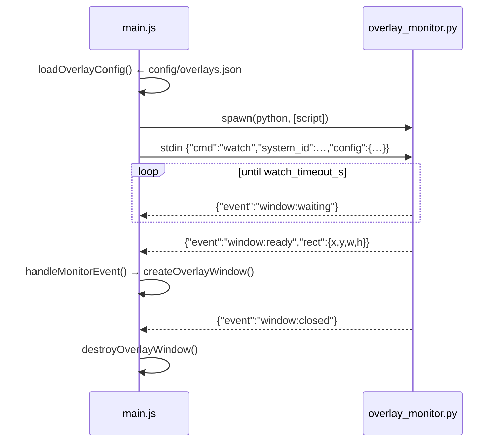

# 6 — Electron shell & overlays

`electron/` is 447 lines total: `main.js` (390), `preload.js` (23),
`start-ui.sh`. It owns three windows and one subprocess.

## Chromium switches, set before anything

```js
app.commandLine.appendSwitch('enable-transparent-visuals')          // X11 per-pixel alpha
app.commandLine.appendSwitch('autoplay-policy', 'no-user-gesture-required')
```

The second one is not cosmetic. Chromium keeps WebAudio suspended until a
"user gesture", and **gamepad buttons do not count** — only mouse and
keyboard. On a controller-only kiosk the UI sounds would stay silent forever.

## The three windows

| Window | Created by | Nature |
|---|---|---|
| main | `createWindow()` (L41) | kiosk, loads `BACKEND_URL` (or `DEV_URL` when `DEV`) |
| overlay | `createOverlayWindow()` (L75) | transparent, frameless, always-on-top, loads `/overlay` |
| HUD toast | `showHudToast()` (L142) | transparent, always-on-top, `data:` URL, auto-closes after `HUD_TOAST_MS` (10 s) |

All three use `nodeIntegration: false`, `contextIsolation: true`. The renderer
reaches Electron only through `preload.js`.

### Splash hold at cold boot

`splashHoldMs()` (L36) reads uptime: under `BOOT_UPTIME_THRESHOLD_S` (180 s) it
adds a hold parameter so the splash freezes on its first black frame for
`SPLASH_BOOT_HOLD_MS` (4 s), while X finishes switching the mode and the TV
re-syncs HDMI. A relaunch from the desktop gets no delay.

## The preload bridge — `preload.js`

Exactly ten methods on `window.gamecore`, nothing else:

```js
reboot()  shutdown()  quit()
overlayStart(system_id)  overlayStop(system_id)
batteryToast(data)  controllerToast(data)
onOverlayShow(cb)  onOverlayHide(cb)  onOverlayWaiting(cb)
```

Typed for the UI in `frontend/src/gamecore.d.ts` (`GamecoreAPI`, `OverlayData`).
Every call is a one-way `ipcRenderer.send` except the three `on*` listeners.

## IPC handlers in `main.js`

| Channel | Handler |
|---|---|
| `system:reboot` | `exec('sudo systemctl reboot')` |
| `system:shutdown` | `exec('sudo systemctl poweroff')` |
| `system:quit` | `app.quit()` |
| `overlay:start` | `loadOverlayConfig()` → `startOverlayMonitor()` |
| `overlay:stop` | `stopOverlayMonitor()` + `destroyOverlayWindow()` |
| `notify:battery` | `showBatteryToast(data)` |
| `notify:controller` | `showHudToast(...)` |

## HUD toasts and untrusted text

`showHudToast({icon, title, body, accent})` builds an HTML string for a
`data:` URL. Its inputs come from the renderer, which got them from WebSocket
broadcasts — including `POST /api/addons/notify` (reachable by any addon) and
**Bluetooth device names**. Two guards exist for that reason:

| Function | Guard |
|---|---|
| `escHtml(s)` (L131) | escapes anything interpolated into markup |
| `safeColor(c)` (L138) | the accent lands inside `style=""`, so it is only ever accepted as a plain colour token |

Never interpolate a broadcast string raw into that template.

## The overlay monitor subprocess



| Function | Role |
|---|---|
| `loadOverlayConfig()` (L212) | reads `config/overlays.json` |
| `startOverlayMonitor()` (L222) | `spawn(python, [script])`, wires stdout |
| `stopOverlayMonitor()` (L255) | sends `{"cmd":"stop"}` and reaps |
| `handleMonitorEvent(msg)` (L265) | dispatches `window:ready` / `waiting` / `closed` / `error` to the windows |

A subprocess rather than a module because the watcher blocks on X11 and must
not be able to wedge the Electron main thread. One JSON object per line, both
directions.

## Backend fallback

| Function | Role |
|---|---|
| `backendAlive()` (L328) | probes `BACKEND_URL` |
| `startBackend()` (L334) | spawns uvicorn **only if nothing answers** |

On a real box the systemd unit owns the backend and this never fires. It
exists so `npx electron .` works on a dev machine with nothing else running.

## `start-ui.sh`

Run by `gamecore-ui.service` before Electron. It:

1. exports `XDG_RUNTIME_DIR` — without it Chromium has **no audio at all**
   under a systemd service (emulators are unaffected, Flatpak sets it);
2. probes `:1`, `:0`, `:2` with `xdpyinfo` to find the live X display;
3. locates the matching `XAUTHORITY` cookie under `/run/user/<uid>/xauth_*`,
   falling back to `~/.Xauthority`.

## Overlay geometry

`config/overlays.json` per system — `wm_class` (the match list),
`window_rect`, `overlay_asset`, `hole`, `watch_timeout_s`. Full schema in
[7](07-config-and-data.md#configoverlaysjson). The PNG's transparent hole and
the JSON `hole` must agree: the JSON is the fallback frame drawn when the PNG
is missing. Recipes for cutting the hole are in the main `README.md`.
