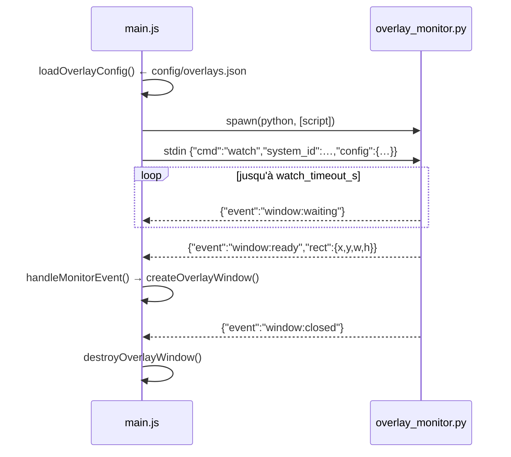

# 6 — Coquille Electron & overlays

`electron/` fait 447 lignes au total : `main.js` (390), `preload.js` (23),
`start-ui.sh`. Il gère trois fenêtres et un sous-processus.

## Options Chromium, posées avant tout le reste

```js
app.commandLine.appendSwitch('enable-transparent-visuals')          // alpha par pixel sous X11
app.commandLine.appendSwitch('autoplay-policy', 'no-user-gesture-required')
```

La seconde n'est pas cosmétique. Chromium garde WebAudio suspendu jusqu'à un
« geste utilisateur », et **les boutons de manette n'en sont pas** — seuls la
souris et le clavier comptent. Sur un kiosque piloté uniquement à la manette,
les sons de l'interface resteraient muets à jamais.

## Les trois fenêtres

| Fenêtre | Créée par | Nature |
|---|---|---|
| principale | `createWindow()` (L41) | kiosque, charge `BACKEND_URL` (ou `DEV_URL` si `DEV`) |
| overlay | `createOverlayWindow()` (L75) | transparente, sans cadre, toujours au-dessus, charge `/overlay` |
| toast HUD | `showHudToast()` (L142) | transparente, toujours au-dessus, URL `data:`, se ferme après `HUD_TOAST_MS` (10 s) |

Les trois utilisent `nodeIntegration: false` et `contextIsolation: true`. Le
moteur de rendu n'atteint Electron que via `preload.js`.

### Temporisation du splash au démarrage à froid

`splashHoldMs()` (L36) lit l'uptime : en dessous de
`BOOT_UPTIME_THRESHOLD_S` (180 s), il ajoute un paramètre pour que le splash se
fige sur sa première image noire pendant `SPLASH_BOOT_HOLD_MS` (4 s), le temps
que X finisse de changer de mode et que la TV resynchronise le HDMI. Un
relancement depuis le bureau n'a aucun délai.

## Le pont preload — `preload.js`

Exactement dix méthodes sur `window.gamecore`, rien d'autre :

```js
reboot()  shutdown()  quit()
overlayStart(system_id)  overlayStop(system_id)
batteryToast(data)  controllerToast(data)
onOverlayShow(cb)  onOverlayHide(cb)  onOverlayWaiting(cb)
```

Typé pour l'UI dans `frontend/src/gamecore.d.ts` (`GamecoreAPI`, `OverlayData`).
Chaque appel est un `ipcRenderer.send` unidirectionnel, sauf les trois
écouteurs `on*`.

## Handlers IPC dans `main.js`

| Canal | Handler |
|---|---|
| `system:reboot` | `exec('sudo systemctl reboot')` |
| `system:shutdown` | `exec('sudo systemctl poweroff')` |
| `system:quit` | `app.quit()` |
| `overlay:start` | `loadOverlayConfig()` → `startOverlayMonitor()` |
| `overlay:stop` | `stopOverlayMonitor()` + `destroyOverlayWindow()` |
| `notify:battery` | `showBatteryToast(data)` |
| `notify:controller` | `showHudToast(...)` |

## Toasts HUD et texte non fiable

`showHudToast({icon, title, body, accent})` construit une chaîne HTML pour une
URL `data:`. Ses entrées viennent du moteur de rendu, qui les tient de
diffusions WebSocket — dont `POST /api/addons/notify` (joignable par n'importe
quel addon) et les **noms d'appareils Bluetooth**. Deux garde-fous existent
pour cela :

| Fonction | Garde-fou |
|---|---|
| `escHtml(s)` (L131) | échappe tout ce qui est interpolé dans le balisage |
| `safeColor(c)` (L138) | l'accent atterrit dans un `style=""`, il n'est donc accepté que comme simple jeton de couleur |

Ne jamais interpoler une chaîne de diffusion brute dans ce gabarit.

## Le sous-processus overlay monitor



| Fonction | Rôle |
|---|---|
| `loadOverlayConfig()` (L212) | lit `config/overlays.json` |
| `startOverlayMonitor()` (L222) | `spawn(python, [script])`, branche stdout |
| `stopOverlayMonitor()` (L255) | envoie `{"cmd":"stop"}` et récupère le processus |
| `handleMonitorEvent(msg)` (L265) | distribue `window:ready` / `waiting` / `closed` / `error` aux fenêtres |

Un sous-processus plutôt qu'un module, parce que le veilleur bloque sur X11 et
ne doit surtout pas pouvoir coincer le thread principal d'Electron. Un objet
JSON par ligne, dans les deux sens.

## Repli backend

| Fonction | Rôle |
|---|---|
| `backendAlive()` (L328) | sonde `BACKEND_URL` |
| `startBackend()` (L334) | lance uvicorn **seulement si personne ne répond** |

Sur un vrai boîtier, l'unit systemd possède le backend et cela ne se déclenche
jamais. C'est là pour que `npx electron .` fonctionne sur une machine de dev
sans rien d'autre.

## `start-ui.sh`

Exécuté par `gamecore-ui.service` avant Electron. Il :

1. exporte `XDG_RUNTIME_DIR` — sans lui Chromium n'a **aucun son** sous un
   service systemd (les émulateurs ne sont pas concernés, Flatpak le pose) ;
2. sonde `:1`, `:0`, `:2` avec `xdpyinfo` pour trouver l'affichage X actif ;
3. localise le cookie `XAUTHORITY` correspondant sous
   `/run/user/<uid>/xauth_*`, avec repli sur `~/.Xauthority`.

## Géométrie des overlays

`config/overlays.json`, par système — `wm_class` (la liste de correspondance),
`window_rect`, `overlay_asset`, `hole`, `watch_timeout_s`. Schéma complet en
[7](07-config-et-donnees.md#configoverlaysjson). Le trou transparent du PNG et
le `hole` du JSON doivent concorder : le JSON est le cadre de repli dessiné
quand le PNG manque. Les recettes de découpe sont dans le `README.md` principal.
