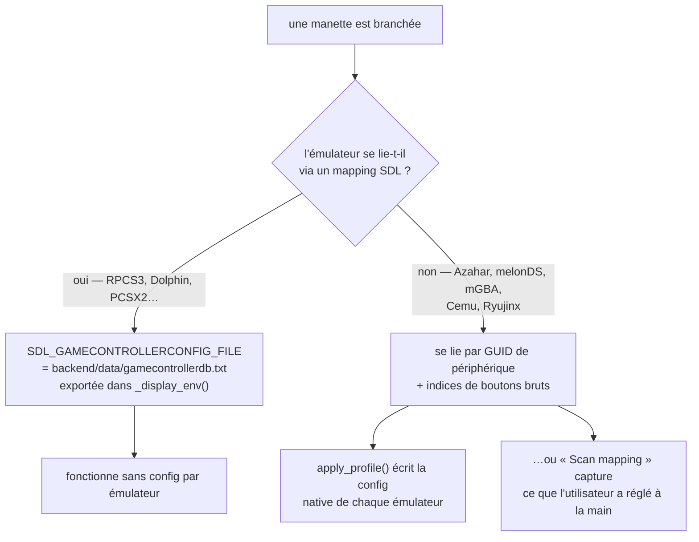
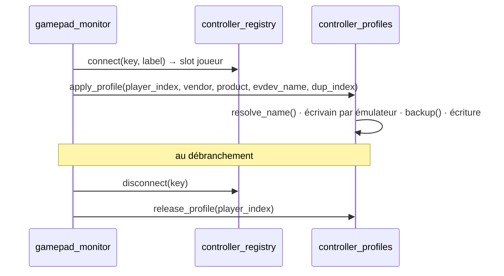

# 8 — Chaîne manettes

`backend/services/controller_profiles.py`, 1034 lignes. La partie la plus
difficile du projet, et celle qu'un refactoring bien intentionné casse le plus
facilement.

Complément : `docs/CONTROLLER_MODELS.md` pour les notes de format par émulateur.

## Le problème

« Branchez n'importe quelle manette et jouez » signifie que chaque émulateur
doit reconnaître une manette que personne n'a configurée. Les émulateurs se
répartissent en deux camps :

Le camp 1 se règle avec une variable d'environnement. Les 1000 lignes sont pour
le camp 2 : ces émulateurs stockent le GUID *de cette manette* et les numéros
de boutons bruts *de cette manette*, et aucune API ne permet de le leur
demander poliment.

## Les GUID SDL

Un GUID SDL empaquette le type de bus, le vendeur et le produit en mots
16 bits petit-boutistes à des positions fixes. C'est ce qui permet de repointer
un profil capturé vers une autre manette.

| Fonction | Rôle |
|---|---|
| `vidpid_of(guid)` | `(vendor, product)` — SDL les empaquette à une position fixe |
| `swap_vidpid(guid, vendor, product)` | même GUID, nouveaux octets vendeur/produit ; tous les autres (type de bus, version) sont préservés |
| `_sdl_guid_vidpid(guid)` | la forme 32 hex (vendeur LE `[8:12]`, produit LE `[16:20]`) |
| `_ryu_guid_vidpid(dashed_guid)` | le dialecte à tirets de Ryujinx |
| `_ryu_swap_vidpid(...)` | GUID au mieux pour une manette que Ryujinx n'a jamais liée ici |

## Nommer un périphérique

Les émulateurs basés sur SDL3 (RPCS3, Dolphin) enregistrent la *chaîne du nom
de périphérique* : elle doit donc correspondre exactement.

| Fonction | Rôle |
|---|---|
| `db_name_for(vendor, product)` | nom produit SDL canonique depuis la base embarquée |
| `_sdl3_live_names()` | `vendor:product → nom` pour chaque manette connectée, depuis SDL3 en direct |
| `sdl3_names()` | le précédent derrière un cache court — deux manettes prenant leur slot coup sur coup paieraient sinon deux énumérations |
| `resolve_name(vendor, product, evdev_name)` | la chaîne que ces émulateurs écriront réellement |
| `detect_pads(max_n)` | `[(vendor, product, evdev_name)]`, un par périphérique physique (dédoublonné) |

## Éditer les fichiers de config sans dégâts

Chaque émulateur a son propre format, donc chacun a sa paire
extraction/remplacement.

| Fonction | Rôle |
|---|---|
| `backup(p)` | copie avant **chaque** écriture |
| `section(text, header)` / `set_section(text, header, body)` | remplacement chirurgical d'une section INI |
| `_sect_bounds(lines, header)` | bornes de section |
| `_az_extract` / `_az_replace` | Azahar |
| `_mgba_extract` / `_mgba_replace` | mGBA |
| `_sect_extract(header)` / `_sect_replace(header)` | fabriques pour les émulateurs à sections INI |
| `_whole_extract` / `_whole_replace` | formats à fichier entier |
| `_flatpak_or_native(emu_id, flatpak, native)` | choisit la config de l'installation que le boîtier lance réellement — `systems.json` dit laquelle |
| `_sys_path(emu_id)` | le `path` déclaré par un émulateur (`''` si illisible) |
| `rpcs3_default()`, `pcsx2_ini()` | emplacements de config connus |

## Écrivains par émulateur

Chacun renvoie le bloc à écrire pour le joueur `i`.

| Fonction | Émulateur | Notes |
|---|---|---|
| `_ryujinx(i, dup, vendor, product, name)` | Switch | lie les slots par position dans la liste `input_config` de `Config.json` |
| `_cemu(i, dup, …)` | Wii U | `controller<idx>.xml` est le slot de manette *émulée* |
| `_dolphin(i, dup, …)` | GC/Wii | repointe **les deux** configs d'entrée de Dolphin pour ce joueur |
| `_rpcs3(i, dup, …)` | PS3 | nomme les périphériques `"<nom> <k>"`, `k` commençant à 1 par modèle identique |
| `_melonds(i, …)` | DS | mono-joueur ; lie des **valeurs de joystick SDL2 brutes** |
| `_mgba(i, …)` | GBA | |
| `_tier0_ini(path, label, i)` | INI générique | |
| `_single_player_guid(path, label, line_prefix, i, …)` | utilitaire partagé | pour les émulateurs à une seule ligne de GUID |

Deux aides existent uniquement parce que melonDS stocke des numéros de joystick
bruts :

- `_sdl2_live_mapping(vendor, product)` — le mapping GameController SDL2 en
  direct (nom SDL du bouton → jeton brut comme `b6` ou `h0.1`).
- `_melon_encode(token)` — ce jeton vers l'encodage entier propre à melonDS.
- `_pad_has_hat(vendor, product)` — si la manette expose sa croix comme un hat
  evdev (`ABS_HAT0*`) ou comme des boutons. **La DualShock 4 rapporte des
  boutons là où SDL annonce un hat**, c'est exactement le bug corrigé par
  `fix/melonds-ds4-dpad`.

## Les deux points d'entrée

### Automatique — à la connexion/déconnexion

- `apply_profile(player_index, vendor, product, evdev_name, dup_index)` — écrit
  ou repointe la config native de **chaque** émulateur pour ce slot.
- `release_profile(player_index)` — défait l'état « joueur connecté » que
  laisse une manette débranchée, pour qu'un slot périmé ne mange pas le joueur 1.

### Manuel — « Scan mapping »

Pour les émulateurs à GUID, quand la génération automatique ne peut pas
connaître les numéros de boutons : l'utilisateur configure la manette **une
fois** dans l'interface de l'émulateur, puis appuie sur *Scan mapping* dans le
menu d'alimentation.

| Fonction | Rôle |
|---|---|
| `scan_mapping()` | `POST /api/controllers/scan-mapping` — mémorise la config actuelle de l'unique manette connectée pour chaque émulateur à GUID |
| `snapshot_capture(vendor, product)` | sauvegarde la config d'entrée actuelle de chaque émulateur à GUID pour cette manette |
| `snapshot_restore(emu_id, vendor, product)` | réinjecte cette config sauvegardée à la connexion |
| `_snap_path(emu_id, vendor, product)` | où vit un instantané |

La réponse indique à l'UI quels émulateurs ont été capturés — `PowerModal`
l'affiche en ligne (`Saved for <manette> : …`).

`_main()` rend le module exécutable seul, pour déboguer sur un boîtier.

## Si vous touchez à ce fichier

- **Toujours `backup()` avant d'écrire.** Une mauvaise écriture coûte à
  l'utilisateur son mapping manuel.
- **Ne jamais reformater une config en entier.** Les émulateurs tolèrent leur
  propre formatage et guère plus ; c'est pourquoi l'extraction/remplacement est
  chirurgicale.
- **Tester avec deux manettes identiques.** `dup_index` existe parce que RPCS3
  nomme les périphériques `"<nom> 1"`, `"<nom> 2"` — la plupart des bugs ici
  sont des bugs de seconde manette.
- **La croix directionnelle n'est pas une question réglée.** Vérifier
  `_pad_has_hat()` avant de supposer.
