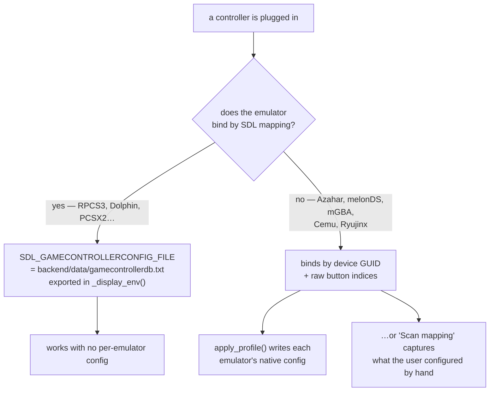
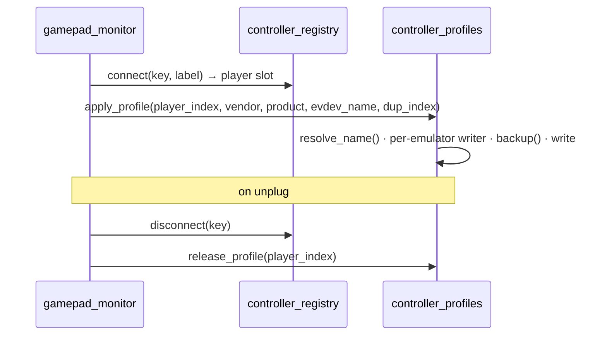

# 8 — Controller pipeline

`backend/services/controller_profiles.py`, 1034 lines. The hardest part of the
project, and the one most likely to be broken by a well-meaning refactor.

Companion: `docs/CONTROLLER_MODELS.md` for per-emulator format notes.

## The problem

"Plug in any controller and play" means every emulator must recognise a pad
nobody configured. Emulators fall into two camps:

Camp 1 is solved by one environment variable. Camp 2 is what the 1000 lines
are for: those emulators store *this pad's* GUID and *this pad's* raw button
numbers, and there is no API to ask them nicely.

## SDL GUIDs

An SDL GUID packs bus type, vendor and product as little-endian 16-bit words at
fixed offsets. That is what lets one captured profile be re-pointed at a
different pad.

| Function | Role |
|---|---|
| `vidpid_of(guid)` | `(vendor, product)` — SDL packs them at a fixed offset |
| `swap_vidpid(guid, vendor, product)` | same GUID, new vendor/product bytes; every other byte (bus type, version) is preserved |
| `_sdl_guid_vidpid(guid)` | the 32-hex form (vendor LE `[8:12]`, product LE `[16:20]`) |
| `_ryu_guid_vidpid(dashed_guid)` | Ryujinx's dashed dialect |
| `_ryu_swap_vidpid(...)` | best-effort GUID for a pad Ryujinx has never bound here |

## Naming a device

SDL3-based emulators (RPCS3, Dolphin) record the *device name string*, so it has
to match exactly.

| Function | Role |
|---|---|
| `db_name_for(vendor, product)` | canonical SDL product name from the vendored DB |
| `_sdl3_live_names()` | `vendor:product → name` for every currently connected pad, from live SDL3 |
| `sdl3_names()` | the above behind a short cache — two pads taking slots in quick succession would otherwise pay for two enumerations |
| `resolve_name(vendor, product, evdev_name)` | the string those emulators will actually write |
| `detect_pads(max_n)` | `[(vendor, product, evdev_name)]`, one per physical device (deduplicated) |

## Editing config files safely

Every emulator has its own format, so each gets an extract/replace pair.

| Function | Role |
|---|---|
| `backup(p)` | copy before **every** write |
| `section(text, header)` / `set_section(text, header, body)` | surgical INI section replacement |
| `_sect_bounds(lines, header)` | section boundaries |
| `_az_extract` / `_az_replace` | Azahar |
| `_mgba_extract` / `_mgba_replace` | mGBA |
| `_sect_extract(header)` / `_sect_replace(header)` | factories for INI-section emulators |
| `_whole_extract` / `_whole_replace` | whole-file formats |
| `_flatpak_or_native(emu_id, flatpak, native)` | picks the config of the install the box actually runs — `systems.json` says which |
| `_sys_path(emu_id)` | the `path` an emulator declares (`''` when unreadable) |
| `rpcs3_default()`, `pcsx2_ini()` | well-known config locations |

## Per-emulator writers

Each returns the block to write for player `i`.

| Function | Emulator | Notes |
|---|---|---|
| `_ryujinx(i, dup, vendor, product, name)` | Switch | binds slots by position in `Config.json`'s `input_config` list |
| `_cemu(i, dup, …)` | Wii U | `controller<idx>.xml` is the *emulated* controller slot |
| `_dolphin(i, dup, …)` | GC/Wii | retargets **both** of Dolphin's input configs for that player |
| `_rpcs3(i, dup, …)` | PS3 | names devices `"<name> <k>"`, `k` 1-based per identical model |
| `_melonds(i, …)` | DS | single-player only; binds **raw SDL2 joystick values** |
| `_mgba(i, …)` | GBA | |
| `_tier0_ini(path, label, i)` | generic INI | |
| `_single_player_guid(path, label, line_prefix, i, …)` | shared helper | for emulators with one GUID line |

Two helpers exist purely because melonDS stores raw joystick numbers:

- `_sdl2_live_mapping(vendor, product)` — the live SDL2 GameController mapping
  (SDL button name → raw token such as `b6` or `h0.1`).
- `_melon_encode(token)` — that token → melonDS's own integer encoding.
- `_pad_has_hat(vendor, product)` — whether the pad exposes its D-pad as an
  evdev hat (`ABS_HAT0*`) or as buttons. **DualShock 4 reports buttons where
  SDL claims a hat**, which is exactly the bug `fix/melonds-ds4-dpad` fixed.

## The two entry points

### Automatic — on connect/disconnect

- `apply_profile(player_index, vendor, product, evdev_name, dup_index)` —
  writes/retargets **every** emulator's native config for that slot.
- `release_profile(player_index)` — undoes the "connected player" state a
  disconnected pad leaves behind, so a stale slot does not eat player 1.

### Manual — "Scan mapping"

For the GUID emulators, when automatic generation cannot know the button
numbers: the user configures the pad **once** in the emulator's own UI, then
presses *Scan mapping* in the Power menu.

| Function | Role |
|---|---|
| `scan_mapping()` | `POST /api/controllers/scan-mapping` — remembers the one connected controller's current config across every GUID emulator |
| `snapshot_capture(vendor, product)` | saves each GUID-emulator's current input config for this controller |
| `snapshot_restore(emu_id, vendor, product)` | swaps that saved config back in on connect |
| `_snap_path(emu_id, vendor, product)` | where a snapshot lives |

The response tells the UI which emulators were captured — `PowerModal` renders
it inline (`Saved for <pad>: …`).

`_main()` makes the module runnable standalone for debugging on a box.

## If you touch this file

- **Always `backup()` before writing.** A wrong write costs the user their
  manual mapping.
- **Never reformat a config wholesale.** Emulators tolerate their own
  formatting and little else; that is why extract/replace is surgical.
- **Test with two identical pads.** `dup_index` exists because RPCS3 names
  devices `"<name> 1"`, `"<name> 2"` — most bugs here are second-controller
  bugs.
- **A pad's D-pad is not a settled question.** Check `_pad_has_hat()` before
  assuming.
