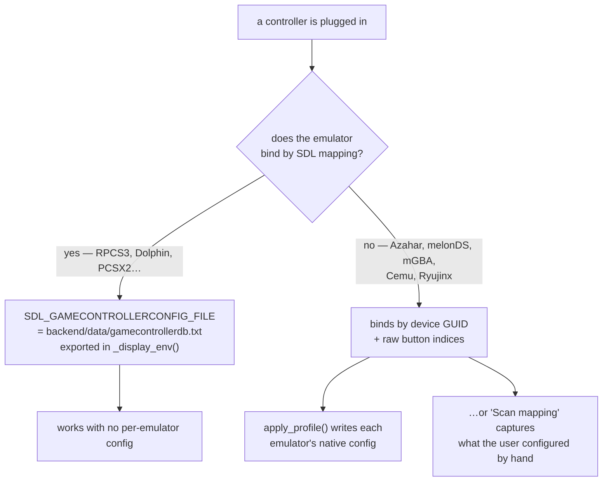
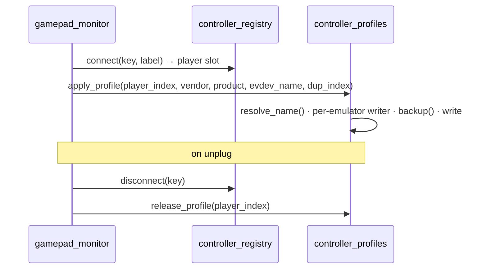

# 8 — Controller pipeline

`backend/services/controller_profiles.py`, ~1465 lines. The hardest part of the
project, and the one most likely to be broken by a well-meaning refactor.

Companion: `docs/CONTROLLER_MODELS.md` for per-emulator format notes.

## The problem

"Plug in any controller and play" means every emulator must recognise a pad
nobody configured. Emulators fall into two camps:



Camp 1 is solved by one environment variable. Camp 2 is what the 1000 lines
are for: those emulators store *this pad's* GUID and *this pad's* raw button
numbers, and there is no API to ask them nicely.

## SDL GUIDs

An SDL GUID packs bus type, vendor and product as little-endian 16-bit words at
fixed offsets. That is what lets one captured profile be re-pointed at a
different pad.

| Function | Role |
|---|---|
| `vidpid_of(guid)` | `(vendor, product)` — SDL packs them at a fixed offset |
| `ryu_guid_vidpid(dashed_guid)` | the same, for Ryujinx's dashed dialect. For **reading** a config, never for deciding what to write |
| `ryu_guid_from_sdl2(sdl_hex)` | the exact GUID Ryujinx will compute, from the one SDL2 reports — .NET `System.Guid` byte order, **name CRC (bytes 2-3) zeroed** |
| `_sdl2_probe(vendor, product, lib)` | what SDL2 itself says about a connected pad: raw GUID **and** GameController mapping, from a subprocess. `lib` picks *which* SDL2 answers |
| `bundled_sdl2(app_id)` | the SDL2 a flatpak'd emulator ships, or `""`. Its answer, not the host's, is what goes in that emulator's config |

> A GUID carries bus type, version and driver signature as well as
> vendor/product, so two pads with the same vendor:product can have different
> GUIDs — the same DualShock 4 over USB and over Bluetooth, for instance.
> Substituting vendor/product bytes into someone else's GUID therefore yields a
> device that does not exist. Two functions used to do exactly that
> (`swap_vidpid`, `_ryu_swap_vidpid`); both are gone. Ask SDL.

**Ask the emulator's SDL, not the host's.** They can disagree. Measured on
the reference box, same DualShock 4, same instant:

| library | GUID | bus |
|---|---|---|
| host `libSDL2-2.0.so.0` — sdl2-compat 2.32.70 over SDL3 | `05008fe5…` | `0x0005` Bluetooth |
| Ryujinx's bundled `libSDL2.so` — real SDL 2.30.0 | `03008fe5…` | `0x0003` USB |

One byte. SDL3 reports the transport; SDL2 2.30 reports USB for anything
HIDAPI drives, Bluetooth included. Writing the host's answer made Ryujinx's
`IndexOf(id)` return -1 and dispose the slot in silence — `Hid Remap: No
matching controllers found` in its log, the controller applet on screen.

Only Ryujinx is affected today: RPCS3 and PCSX2 ship SDL3, which agrees with
the host, and Dolphin uses the runtime's.

**Ryujinx zeroes the name CRC.** SDL 2.26+ packs a CRC16 of the device name
into bytes 2-3 to tell apart pads sharing a vendor:product. Ryujinx clears it
before building its id, so it must not survive into what we write.

Established by binding the pad by hand in Ryujinx's own Input settings and
reading back what it wrote — the only source of truth here, since every backup
in that directory was written by GameCore:

| | |
|---|---|
| Ryujinx wrote for itself | `0-00000003-054c-0000-cc09-000000006800` |
| its own SDL reports | `03008fe54c050000cc09000000006800` |
| host SDL3 reports | `05008fe54c050000cc09000000006800` |

Bus byte and CRC are two independent corrections and both are required: zeroing
the CRC on the host's answer still yields bus `0x05`, an id Ryujinx never
computes.

**Ryujinx: no two slots may carry the same `id`.** It resolves every entry in
`input_config` with `_gamepadsIds.IndexOf(id)`, by value — so two slots holding
one id both resolve to the same physical pad, and the game sees two controllers
connected. A right GUID is not enough on its own.

The duplicate is not created by a bad write; it is created by a *good* one
landing in a new slot. Profile a pad into Player 2 in one session and Player 1
in the next — a Bluetooth reconnection is enough — and Player 2 keeps the id.
Found on the reference box with a DualShock 4 held by both. `release_profile`
cannot help: no disconnect ever happens for the surviving slot. So `_ryujinx`
clears its own id from every other slot before writing, and its early "already
correct, don't rewrite 11 KB" return is conditional on there being no duplicate
— otherwise the slot that is right is exactly the one that hides the phantom.

## Naming a device

SDL3-based emulators (RPCS3, Dolphin) record the *device name string*, so it has
to match exactly.

| Function | Role |
|---|---|
| `db_name_for(vendor, product)` | canonical SDL product name from the vendored DB |
| `_sdl3_live_names()` | `vendor:product → name` for every currently connected pad, from live SDL3 |
| `sdl3_names()` | the above behind a short cache — two pads taking slots in quick succession would otherwise pay for two enumerations |
| `resolve_name(vendor, product, evdev_name)` | the string those emulators will actually write |
| `detect_pads(max_n)` | `[(vendor, product, evdev_name)]`, one per physical device (deduplicated) |

## Editing config files safely

Every emulator has its own format, so each gets an extract/replace pair.

| Function | Role |
|---|---|
| `backup(p)` | copy before **every** write |
| `section(text, header)` / `set_section(text, header, body)` | surgical INI section replacement |
| `_sect_bounds(lines, header)` | section boundaries |
| `_az_extract` / `_az_replace` | Azahar |
| `_mgba_extract` / `_mgba_replace` | mGBA |
| `_sect_extract(header)` / `_sect_replace(header)` | factories for INI-section emulators |
| `_whole_extract` / `_whole_replace` | whole-file formats |
| `_flatpak_or_native(emu_id, flatpak, native)` | picks the config of the install the box actually runs — `systems.json` says which |
| `_sys_path(emu_id)` | the `path` an emulator declares (`''` when unreadable) |
| `rpcs3_default()`, `pcsx2_ini()` | well-known config locations |

## Per-emulator writers

Each returns the block to write for player `i`.

| Function | Emulator | Notes |
|---|---|---|
| `_ryujinx(i, dup, vendor, product, name)` | Switch | `input_config` entries keyed by `player_index`; the `id` is `<dup>-<GUID>` and must match a connected device exactly |
| `_dolphin(i, dup, …)` | GC/Wii | retargets **both** of Dolphin's input configs; `_GCPAD_BODY` / `_WIIMOTE_BODY` are the canonical bodies |
| `_gcpad_is_real(body)` | GC | is every action binding an SDL role, or is this a config captured next to a keyboard |
| `_rpcs3(i, dup, …)` | PS3 | names devices `"<name> <k>"`, `k` 1-based per identical model; rebuilds a `Handler: "Null"` slot from a bound one |
| `_melonds(i, …)` | DS | single-player only; binds **raw SDL2 joystick values** |
| `_tier0_ini(path, label, i)` | PCSX2 / DuckStation | clones `[Pad1]`'s role bindings onto an SDL index, normalises `Type`, and turns the multitap on for slots 3+ |

azahar, mgba and Cemu have no writer: they go through the snapshot mechanism
below. GUID-substituting versions of `_mgba()`, `_cemu()` and
`_single_player_guid()` used to sit here; none was ever called by
`apply_profile()`, and this page described the box on the strength of them.

Two helpers exist purely because melonDS stores raw joystick numbers:

- `_sdl2_live_mapping(vendor, product)` — the live SDL2 GameController mapping
  (SDL button name → raw token such as `b6` or `h0.1`).
- `_melon_encode(token)` — that token → melonDS's own integer encoding.
- `_pad_has_hat(vendor, product)` — whether the pad exposes its D-pad as an
  evdev hat (`ABS_HAT0*`) or as buttons. **DualShock 4 reports buttons where
  SDL claims a hat**, which is exactly the bug `fix/melonds-ds4-dpad` fixed.

## A failed pass is not a finished pass

`apply_profile` returns a `ProfileResult` — a `list` of what was written, plus
`.complete`, false when any emulator gave up. Every caller still treats it as
the list; only the monitor reads the extra bit.

`gamepad_monitor._reconcile` used to mark a pad done *before* attempting it:

```python
applied[key] = (vendor, product, name, dup)   # then apply_profile(...)
```

so a give-up was remembered exactly like a success and the pad was never
revisited. Measured: a DualShock 4 and an Xbox pad were plugged in together;
Dolphin, RPCS3, PCSX2 and DuckStation got both players, and Ryujinx got no
Player 2 at all. Replaying the same call afterwards created the slot correctly,
so the failure had been transient — SDL had not yet caught up with a Bluetooth
pad that had just connected, and `_ryujinx` rightly refused to invent an id.

Now the footprint carries a retry budget (`PROFILE_RETRIES`, 5 passes ≈ 15 s):
an incomplete pass is retried on the next scan, a clean one settles
immediately, and a reconnection restores a full budget. Bounded on purpose —
some give-ups are permanent (an emulator with no gamepad slot to clone from
will never succeed) and each retry pays for SDL probes with an 8 s timeout
apiece. `run()` also had to stop gating `_reconcile` on `was != live`: nothing
about the pad changes while SDL is simply behind.

## The two entry points

### Automatic — on connect/disconnect



- `apply_profile(player_index, vendor, product, evdev_name, dup_index)` —
  writes/retargets **every** emulator's native config for that slot.
- `release_profile(player_index)` — undoes the "connected player" state a
  disconnected pad leaves behind, so a stale slot does not eat player 1.

### Manual — "Scan mapping"

For the GUID emulators, when automatic generation cannot know the button
numbers: the user configures the pad **once** in the emulator's own UI, then
presses *Scan mapping* in the Power menu.

| Function | Role |
|---|---|
| `scan_mapping()` | `POST /api/controllers/scan-mapping` — remembers the one connected controller's current config across every GUID emulator |
| `snapshot_capture(vendor, product)` | saves each GUID-emulator's current input config for this controller |
| `snapshot_restore(emu_id, vendor, product)` | swaps that saved config back in on connect |
| `_snap_path(emu_id, vendor, product)` | where a snapshot lives |

The response tells the UI which emulators were captured — `PowerModal` renders
it inline (`Saved for <pad>: …`).

`_main()` makes the module runnable standalone for debugging on a box.

## If you touch this file

- **Always `backup()` before writing, and write through `_atomic_write()`.**
  A wrong write costs the user their manual mapping; a truncated one costs them
  the whole config, and this pipeline runs at backend startup — the moment
  someone can still cut the power at the wall.
- **Return a `Skip`, never a bare `None`, when you give up.** `None` means
  "nothing to do". A give-up that returns `None` is invisible: that is how
  RPCS3's players 2-4 stayed dead for a week.
- **Never reformat a config wholesale.** Emulators tolerate their own
  formatting and little else; that is why extract/replace is surgical.
- **Test with two identical pads, and unplug one.** `dup_index` exists because
  RPCS3 names devices `"<name> 1"`, `"<name> 2"` — most bugs here are
  second-controller bugs, and the rest appear when a pad leaves. `_reconcile()`
  re-profiles the survivors precisely because their `dup` describes the roster.
- **Run the profiler twice and diff.** Every writer must be a no-op the second
  time. `_ryujinx` was not, and rewrote 11 KB on every connection.
- **A pad's D-pad is not a settled question.** Check `_pad_has_hat()` before
  assuming.
