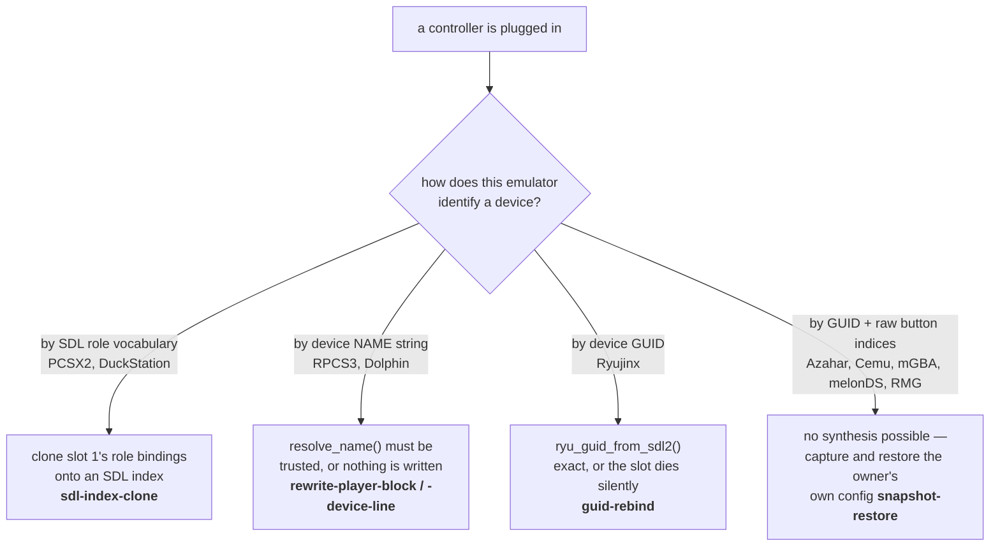

# 8 — Controller pipeline

The hardest part of the project, and the one most likely to be broken by a
well-meaning refactor.

Companion: `docs/CONTROLLER_MODELS.md` for per-emulator format notes.

## Where the code is

`backend/services/controller_profiles.py` used to be ~1700 lines. It is now a
**121-line facade** that re-exports names; the logic lives in two places, split
along one line:

| | |
|---|---|
| `backend/services/configgen/` | everything common to all emulators — SDL resolution, the give-up type, snapshots, the mapping database, the write primitives |
| `catalog/<id>/generator.py` | one emulator's own format. Nothing else knows it |

The facade survives because `gamepad_monitor` and `routers/` import from it, and
that hotplug path must keep working unchanged. **The move was a move, not a
rewrite**: `backend/tests/test_controller_characterisation.py` replays fourteen
pad × slot scenarios against the real generators and compares byte for byte to
recorded output. That harness is also the only proof this repository has for two,
three and four pads — the development box has exactly one DualShock 4.

The declarative half lives in `catalog/<id>/pack.json` under `controllers`
(`strategy`, `maxPlayers`, `order`, `target`, `padType`, `multitap`). **The
`what` is data, the `how` is the generator.** A new emulator is a directory, not
an edit to a dispatch table — see [10](10-catalog-and-install.md).

## The problem

"Plug in any controller and play" means every emulator must recognise a pad
nobody configured. They do not agree on how to be told.



The strategy names in bold are the literal `controllers.strategy` values in each
pack. `scripts/catalog-query.py` will print the current map; do not retype it
here, it moves.

## SDL GUIDs

An SDL GUID packs bus type, vendor and product as little-endian 16-bit words at
fixed offsets.

| Function | Role |
|---|---|
| `vidpid_of(guid)` | `(vendor, product)` — SDL packs them at a fixed offset |
| `ryu_guid_vidpid(dashed_guid)` | the same, for Ryujinx's dashed dialect. For **reading** a config, never for deciding what to write |
| `ryu_guid_from_sdl2(sdl_hex)` | the exact GUID Ryujinx will compute, from the one SDL2 reports — .NET `System.Guid` byte order, **name CRC (bytes 2-3) zeroed** |
| `sdl2_probe(vendor, product, lib)` | what SDL2 itself says about a connected pad: raw GUID **and** GameController mapping, from a subprocess. `lib` picks *which* SDL2 answers |
| `bundled_sdl2(app_id)` | the SDL2 a flatpak'd emulator ships, or `""`. Its answer, not the host's, is what goes in that emulator's config |

> A GUID carries bus type, version and driver signature as well as
> vendor/product, so two pads with the same vendor:product can have different
> GUIDs — the same DualShock 4 over USB and over Bluetooth, for instance.
> Substituting vendor/product bytes into someone else's GUID therefore yields a
> device that does not exist. Two functions used to do exactly that
> (`swap_vidpid`, `_ryu_swap_vidpid`); both are gone. Ask SDL.

**Ask the emulator's SDL, not the host's.** They can disagree. Measured on the
reference box, same DualShock 4, same instant:

| library | GUID | bus |
|---|---|---|
| host `libSDL2-2.0.so.0` — sdl2-compat 2.32.70 over SDL3 | `05008fe5…` | `0x0005` Bluetooth |
| Ryujinx's bundled `libSDL2.so` — real SDL 2.30.0 | `03008fe5…` | `0x0003` USB |

One byte. SDL3 reports the transport; SDL2 2.30 reports USB for anything HIDAPI
drives, Bluetooth included. Writing the host's answer made Ryujinx's
`IndexOf(id)` return -1 and dispose the slot in silence — `Hid Remap: No
matching controllers found` in its log, the controller applet on screen.

Only Ryujinx is affected today: RPCS3 and PCSX2 ship SDL3, which agrees with the
host, and Dolphin uses the runtime's.

**Ryujinx zeroes the name CRC.** SDL 2.26+ packs a CRC16 of the device name into
bytes 2-3 to tell apart pads sharing a vendor:product. Ryujinx clears it before
building its id, so it must not survive into what we write.

Established by binding the pad by hand in Ryujinx's own Input settings and
reading back what it wrote — the only source of truth here, since every backup in
that directory was written by GameCore:

| | |
|---|---|
| Ryujinx wrote for itself | `0-00000003-054c-0000-cc09-000000006800` |
| its own SDL reports | `03008fe54c050000cc09000000006800` |
| host SDL3 reports | `05008fe54c050000cc09000000006800` |

Bus byte and CRC are two independent corrections and both are required: zeroing
the CRC on the host's answer still yields bus `0x05`, an id Ryujinx never
computes.

**Ryujinx: no two slots may carry the same `id`.** It resolves every entry in
`input_config` with `_gamepadsIds.IndexOf(id)`, by value — so two slots holding
one id both resolve to the same physical pad, and the game sees two controllers
connected. A right GUID is not enough on its own.

The duplicate is not created by a bad write; it is created by a *good* one
landing in a new slot. Profile a pad into Player 2 in one session and Player 1 in
the next — a Bluetooth reconnection is enough — and Player 2 keeps the id. Found
on the reference box with a DualShock 4 held by both. Releasing cannot help: no
disconnect ever happens for the surviving slot. So the Ryujinx generator clears
its own id from every other slot before writing, and its early "already correct,
don't rewrite 11 KB" return is conditional on there being no duplicate —
otherwise the slot that is right is exactly the one that hides the phantom.

## Naming a device — and refusing to guess

RPCS3 and Dolphin record the *device name string*, so it has to match exactly.
`resolve_name()` returns a **`ResolvedName`**, a `str` subclass carrying where
the answer came from. That type exists because a bare string could not tell a
reliable answer from a guess, **and the guesses were being written into configs.**

| `source` | meaning |
|---|---|
| `sdl3_live` | libSDL3 named this pad with it connected. The truth. |
| `fallback_table` | `SDL3_FALLBACK_NAMES`, measured SDL3 names. Reliable. |
| `unknown` | neither answered. The value is the pad's *kernel* name, fine for a toast, **not** what an SDL3 emulator enumerates |

`SDL3_TRUSTED` is the first two. A generator that matches by name must refuse to
write anything on `unknown`: the kernel name in an RPCS3 config produces
`SDL: Adding empty device` in its log and a pad that is dead in game, with a
config that looks perfectly correct.

**The community database is deliberately no longer in this chain.** It carries
SDL2-era names and is wrong for SDL3 on several pads — a DualSense is "DualSense
Wireless Controller", not "PS5 Controller". It survives in `display_name()`,
where being approximately right is the whole job.

The failure this guards against is an **absence, not an exception**: SDL3 answers
perfectly well and simply does not know the pad. No error is raised, and the old
chain walked quietly down to the kernel name and wrote it. Every rung below the
first now logs, once per pad, and again only when the answer *changes* — a pad
moving from `sdl3_live` to `unknown` is a pad that went to sleep.

`identification()` surfaces the same question at the API, so the Power menu can
say "this pad cannot be named" at the moment the owner is holding it.

## `Skip` — a give-up is an answer

`helpers/base.Skip` is a `str` subclass returned by a generator that wrote
nothing *and has a reason*. `None` keeps its old meaning and only it: nothing to
do, nothing to say.

Every writer used to return `str | None`, and only truthy values were collected.
So "I retargeted Player 2" reached the log and "there is no Player 1 pad to clone
from" reached nobody — a give-up was byte-for-byte indistinguishable from a
success. **RPCS3's players 2-4 sat dead for a week that way**, and `scan_mapping()`
answered `{"ok": True}` on a snapshot it had taken of the wrong controller.

`apply_profile` files Skips separately into `ProfileResult.skipped`;
`.complete` is false when any is present, and that bit is what makes a retry
possible at all.

## What a pad is, for profiling purposes

The footprint deciding whether a slot needs rewriting is
`(player, vendor, product, resolved name, dup, bustype)`. Two were added after
being found missing:

- **`player`** — a pad that moves slot rewrites different sections. Without it, a
  slot change was invisible.
- **`bustype`** — Ryujinx binds by a GUID that encodes the bus. MAC, vendor and
  product are all identical across a transport change, so moving a pad from
  Bluetooth to a cable left every GUID-bound emulator pointing at a device that
  no longer existed, silently. The same Xbox pad is `0x05…` over Bluetooth and
  `0x03…` over USB, while a DualShock 4 reads `0x03…` either way because HIDAPI
  drives it.

Those counters describe the **roster**, not one pad — which is why one pad
leaving invalidates the others.

## Releasing a slot

```python
release_profile(player_index, occupied=(), pack_ids=None) -> list[str]
```

The inverse of `apply_profile`, and both share `MAX_PLAYERS` so the write side
can never know a ceiling the un-write side does not.

This used to be documented as "only Dolphin needs it; the others just go
input-less when a pad leaves". **The reference box proved that false.** They do
not go input-less — they keep *naming an absent device*. With one DualShock 4
connected, RPCS3 still presented "Xbox One Wireless Controller 3" as Player 4 and
Ryujinx still held indexes 2 and 3. A PS3 game at four then sees four players,
two of whom cannot move, which is not the same thing as receiving no input.

The two extra parameters are not decoration:

- **`occupied`** — the slots still held *after* this release. Some of what
  `apply_profile` writes belongs to the roster rather than to a slot: the
  multitap PCSX2 and DuckStation need before slot 3 exists is the measured case.
  A release knowing only its own index cannot tell whether player 3 is still
  sitting there.
- **`pack_ids`** — narrows the sweep. The hotplug path passes `None` and sweeps
  everything, because a pad leaving concerns every emulator. The **launch** path
  (`routers/games.py`) passes only the emulator about to start: rewriting Cemu
  because someone launched PCSX2 is a side effect nobody asked for, and it is
  also what would make the pass too slow to sit in front of a launch. That sweep
  is bounded by `RECONCILE_BUDGET` and abandoned on timeout — the launch matters
  more, and the monitor comes back within three seconds anyway.

Note where it is **not** called: `_reconcile`'s departure loop no longer releases.
Hanging it there meant a slot was only freed for a departure this process
witnessed, and it named the slot the pad held *before* `compact()` moved anyone.
The sweep decides from the roster instead, which is the thing that actually says
whether a slot is occupied.

## Slots close up between games

`controller_registry.compact()` renumbers occupied slots to 1..N preserving
order, and returns what moved. Slots are handed out lowest-free-first and never
taken back from a connected pad — deliberately, so nobody changes player number
mid-game — but that leaves a gap: unplug player 1 during co-op and the survivor
keeps slot 2 for the session. Observed with a lone DualShock 4 on Player 2, and
Ryujinx therefore presenting no Player 1 at all to a Switch game that wanted one.

`_reconcile` calls it **only when no game is running**. Closing the gap
mid-session would silently turn player 2 into player 1. The pads that move are
re-profiled on their own, since the player number is part of the footprint.

## A failed pass is not a finished pass

`gamepad_monitor._reconcile` used to mark a pad done *before* attempting it, so a
give-up was remembered exactly like a success and the pad was never revisited.
Measured: a DualShock 4 and an Xbox pad plugged in together; Dolphin, RPCS3,
PCSX2 and DuckStation got both players, Ryujinx got no Player 2 at all. Replaying
the same call afterwards created the slot correctly — the failure had been
transient, SDL had not yet caught up with a pad that had just connected, and the
generator rightly refused to invent an id.

The footprint now carries a retry budget (`PROFILE_RETRIES = 5`, ≈15 s): an
incomplete pass is retried on the next scan, a clean one settles immediately, and
a reconnection restores a full budget. Bounded on purpose — some give-ups are
permanent (an emulator with no gamepad slot to clone from will never succeed) and
each retry pays for SDL probes with an 8 s timeout apiece. `run()` also had to
stop gating `_reconcile` on `was != live`: nothing about the pad changes while
SDL is simply behind.

## The three entry points

### 1. Automatic — on connect/disconnect

```mermaid
sequenceDiagram
    participant gm as gamepad_monitor
    participant reg as controller_registry
    participant cg as configgen
    participant gen as catalog/&lt;id&gt;/generator.py

    gm->>reg: connect(key, label) → player slot
    gm->>reg: compact() (only when no game runs)
    gm->>cg: apply_profile(player, vendor, product, evdev_name, dup)
    cg->>cg: resolve_name() → ResolvedName(source)
    loop each profilable pack, in controllers.order
        cg->>gen: generate(player, pad, opts)
        gen-->>cg: message · Skip(reason) · None
    end
    cg-->>gm: ProfileResult(.complete)
    Note over gm,cg: incomplete → retried, up to PROFILE_RETRIES
    Note over gm,gen: on unplug — the roster sweep, not this loop
    gm->>reg: disconnect(key)
```

### 2. "Scan mapping" — remember a config the owner made by hand

For the `snapshot-restore` emulators: the owner configures the pad once in the
emulator's own input UI, then presses *Scan mapping* in the Power menu.

`POST /api/controllers/scan-mapping` captures each emulator's current input
config for the connected pad; `DELETE` forgets it. An emulator whose config
plainly describes a *different* controller is **refused** rather than filed under
the connected pad, and comes back in `refused` — the box already holds a Cemu
snapshot named for an Xbox pad that contains a DualShock 4's config, saved back
when this returned a flat `ok`. That snapshot is also why DELETE exists: a
refusal with no way to act on it is a nicer dead end, because the file sits in a
directory nobody can reach from a sofa.

Ryujinx was listed here for a long time and never belonged: it has no snapshot
adapter and needs none.

### 3. The mapping wizard — for a pad SDL does not know

`POST /api/controllers/mapping/{start,commit,cancel}`, plus a WebSocket at
`/ws/controllers/mapping` pushing every press as an SDL token.

This is the case *Scan mapping cannot help with at all*. There is no hand-made
config to remember, because the owner cannot make one — the emulator's input UI
will not bind a device its SDL never enumerated. So the pad is mapped here, once,
button by button, and the result is written as an SDL mapping line every
SDL-based emulator on the box reads at startup. **One gesture, thirteen systems.**

It is driven entirely by the pad being mapped — press to record, hold to skip a
button the pad does not have, double-press to go back — because a controller the
box cannot understand is exactly the one you cannot navigate a normal UI with.

## The mapping database — two files, and the order is measured

`configgen/mapping_db.py`. `process_manager` exports
`SDL_GAMECONTROLLERCONFIG_FILE` to every game it launches.

| file | |
|---|---|
| `gamecontrollerdb.txt` (vendored, `backend/data/`) | community work, ~2200 lines, **replaced by every OTA**. Not ours to edit |
| `gamecontrollerdb_user.txt` (under `~/.local/share/gamecore/`) | the owner's captures. Never shipped, never touched by an update |

What SDL actually reads is neither: `served()` is a concatenation, regenerated
when either source changes. Keeping the owner's lines in their own file is what
makes them survive an OTA.

**The order was measured, not assumed.** SDL parses top to bottom and does *not*
stop at the first entry for a GUID. Against four independent SDL builds — Ryujinx's
bundled SDL2, PCSX2's SDL3, RPCS3's SDL3, the host's SDL3 — the **last** line wins,
unanimously. So "the user's mapping takes priority" means the user's lines go at
the **end**. Reading that as "user first" produces a file that contains the
capture and an emulator that ignores it. `test_mapping_db.py` re-runs the probe
against every SDL it can find, so the day one changes its mind the suite says so
instead of the pad.

**Staleness is a fingerprint, not a timestamp** — and an OTA is exactly why.
`update/linux.sh` uses `rsync -a`, which implies `-t`: the vendored database
arrives carrying the mtime it had in the archive, which can be *older* than the
merge already on disk. A "newer than me?" test therefore answers no to a database
that has genuinely just changed, and the box serves the previous release's merge
for ever — silently, because the file is present and looks right. Size and mtime
of both sources are recorded in the served file's header and compared on every
call.

## If you touch this

- **Always `backup()` before writing, and write through `atomic_write()`.** A
  wrong write costs the user their manual mapping; a truncated one costs them the
  whole config, and this pipeline runs at backend startup — the moment someone
  can still cut the power at the wall.
- **Return a `Skip`, never a bare `None`, when you give up.** See above: that is
  how RPCS3's players 2-4 stayed dead for a week.
- **Never reformat a config wholesale.** A generator writes only the sections
  GameCore owns and leaves the rest intact to the byte. That is the deliberate
  divergence from Batocera, which regenerates everything at launch — and it is
  what makes `.bak-preinstall` and the snapshot mechanism coherent at all.
- **Never write a name whose `source` is not in `SDL3_TRUSTED`.**
- **Test with two identical pads, and unplug one.** `dup_index` exists because
  RPCS3 names devices `"<name> 1"`, `"<name> 2"` — most bugs here are
  second-controller bugs, and the rest appear when a pad leaves.
- **Run the profiler twice and diff.** Every generator must be a no-op the second
  time. Ryujinx's was not, and rewrote 11 KB on every connection.
- **A pad's D-pad is not a settled question.** Check `pad_has_hat()` before
  assuming: a DualShock 4 reports buttons where SDL claims a hat.
- **Add an emulator by adding a directory**, not by editing a dispatch table. A
  pack missing from what used to be a tuple in `configgen` was not profiled at
  all, and the only symptom was a pad that did nothing in that one emulator.
