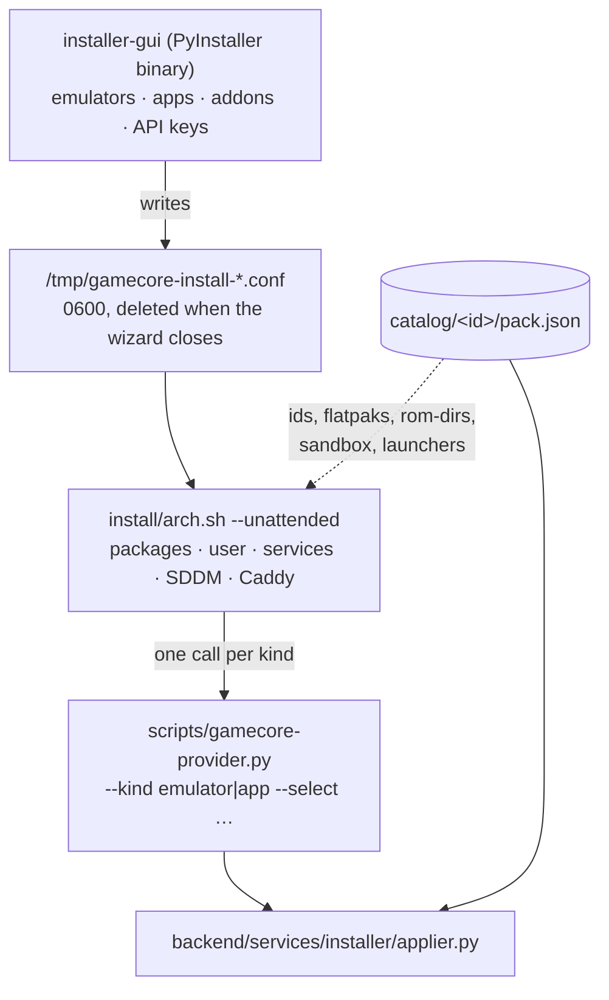

# 10 — The catalogue, and how a box gets installed

The other nine documents describe a box that is already running. This one
describes where its contents come from.

One rule holds the whole thing together:

> **One directory is one system or one application.** Everything that system
> needs — how to obtain it, how to launch it, its curated config, its logo, its
> controller bindings, its service, its post-install steps — lives in
> `catalog/<id>/`. Adding one is dropping a directory. Removing one is `rm -rf`.

Everything below is a consequence of that rule, including the parts that took a
broken install to get right.

A pack is not an install-time artefact that dies once the box is provisioned.
It is read at **four moments**, by four different readers:

1. **Build time** — `scripts/gen-catalog.py` runs in the repository (and in CI)
   and derives `install/generated/*.dist` from the packs: the tiles a fresh
   install starts from (§4).
2. **Install time** — `arch.sh` and the installer providers read the catalogue
   through `scripts/catalog-query.py` for everything they do: which Flatpaks to
   install, which ROM directories to create, which sandbox flags to grant,
   where each `seed/` lands, which services to enable (§3, §8).
3. **Update time** — the OTA ships the whole `catalog/` tree and
   `merge_file()` uses it to add tiles the box does not have yet and to fill in
   fields that did not exist when the box was installed — a box updated to
   v1.2.15 gained `roms.consoles` ratios on its existing mGBA tile this way,
   without its operator touching anything
   ([13-release-and-ota.md](13-release-and-ota.md)).
4. **Runtime** — the backend reads the pack tree on the box on every boot and
   every launch: `configgen` imports each pack's `generator.py`, `bios.py`
   answers from the `bios` block, `pergame`, `local_media` and the bezel
   cascade's declared frames all read their blocks live (§2).

So editing a pack is never "too late": the change reaches installed boxes at
the next update, through moment 3.

---

## 1. What a pack looks like on disk

```
catalog/twitch/
├── pack.json                     the declaration — the only required file
├── logo.png                      the tile (logo.svg also works)
├── files/                        what `files` and `services` refer to
│   ├── embertv.service
│   ├── embertv-config.json.tmpl
│   ├── embertv-config.demo.json
│   └── twitch-tv.user.js
└── steps/                        what `postInstall` refers to
    ├── make-cert.sh
    └── trust-cert.sh

catalog/mgba/
├── pack.json
├── logo.png
├── seed/                         curated config, copied to the emulator's config dir
│   ├── config.ini
│   └── qt.ini
├── generator.py                  writes controller bindings for this emulator
└── tests/                        this pack's own tests, run by CI with the rest
```

`seed/`, `logo.*`, `generator.py` and `tests/` are **implicit by presence**: they
are on disk or they are not, and no field in `pack.json` declares them. `files/`
and `steps/` are the opposite — nothing is copied or run unless a block names it.

---

## 2. Every block, and who reads it

`pack.json` is validated against [`catalog/_schema/pack.schema.json`](../../catalog/_schema/pack.schema.json)
by `scripts/check-catalog.py`, which CI runs before anything else. Required:
`id`, `kind`, `label`, `platform`, `color`, `launch`.

| Block | Read by | What it does |
|---|---|---|
| `id` `kind` `label` `platform` `color` | everything | identity. `kind` is `emulator` or `app` |
| `emulatorName` `family` `description` | the grid, the install wizard | display only |
| `order` | `gen-catalog.py` | where the tile sits in the grid and in the wizard's list. A curated running order, not alphabetical. **Absent means last**, never absent — that ordering used to be a list of ids inside the script, and a pack missing from it was silently dropped from both |
| `launch` | the backend, `flatpakify-systems.sh` | the command the tile runs. `preferIfPresent` picks a native binary over the Flatpak when one exists. `fullscreen` and `gamepadTrigger` cover what happens just after — see below |
| `roms` | the backend, `arch.sh` | ROM directory and extensions. `roms.consoles` declares the DISTINCT MACHINES one emulator runs (mGBA: Game Boy, Color, Advance) with per-console extensions and an optional `ratio` (what the machine draws, `3:2`) — it feeds the per-console bezel cascade, the drift-correction cache keys and the overlay slots' expected ratio; see [06-electron-and-overlays](06-electron-and-overlays.md). Declared, never derived: `.zip` says nothing and `.rvz` holds two consoles |
| `config` | `install-emu-configs.sh` | where `seed/` is deployed |
| `controllers` | `backend/services/configgen/` | which binding strategy `generator.py` implements |
| `scraper` `overlay` | covers, bezel identification | metadata |
| `bios` | `backend/services/bios.py` | which system files the OWNER must supply, so the UI can answer "absent / wrong md5 / conforming" instead of a black screen |
| `perGame` | `backend/services/pergame.py` | whether per-game settings are supported, and the strategy |
| `localMedia` | `backend/services/local_media.py` | how covers/titles are read out of the dumps themselves (PARAM.SFO, disc headers) |
| `usb` | the tile, `games.py` | non-gamepad accessories a launch should check for, and what to say when absent |
| `install` | `installer/providers.py` | how the **main artifact** is obtained |
| `sandbox` | `installer/providers.py` | Flatpak override flags. Absent = the emulator default |
| `packages` | `installer/applier.py` | extra system dependencies, *not* the main artifact |
| `sources` | `installer/applier.py` | git checkouts the app needs beside it |
| `secrets` | the install wizard, `applier.py` | keys to prompt for, and to expand in templates |
| `files` | `installer/applier.py` | files to write, verbatim or from a template |
| `services` | `installer/applier.py` | systemd **user** units |
| `postInstall` | `installer/applier.py` | ordered scripts, as the user, bounded, never fatal |

### `install` — the four providers

| `provider` | Fields | Used by |
|---|---|---|
| `flatpak` | `appIds` | every Flathub emulator, Steam, Stremio |
| `github-asset` | `repo`, `asset`, `dest`, `magic`, `version?`, `sha256?` | DuckStation (AppImage) |
| `github-archive` | `repo`, `asset`, `dest`, `entrypoint`, `requires` | Xenia (Windows zip under Wine) |
| `pacman` | `packages` | a pack that is just a distribution package |

`appIds` is an ordered list, not a string, because an upstream can vanish
overnight — Ryujinx original left Flathub with no warning. The installer takes
the first candidate the remote still offers; everything else on the box (the
`@FLATPAK_CONFIG@` and `@FLATPAK_DATA@` expansions, `verify`, the launcher)
takes the first one actually **installed**, so a box that fell back keeps its
config, its saves and its BIOS under one app id rather than three.

Anything already installed wins over what the remote prefers. Re-running the
installer on a box that fell back months ago must not drag it forward when the
primary returns: `~/.var/app/<the id it installed>/` holds the memory cards.

A launcher therefore writes `run @APPID@ …` and never an app id — `launch.args`
naming one is refused by `scripts/check-catalog.py`. A tile is written once, by
an installer or an OTA merge, and `config/` is excluded from the OTA rsync; an
id baked into it is the one thing that cannot be corrected later. The token is
resolved at launch, against what is installed. See `catalog/_ota/README.md` for
the channel that corrects a dead id across the fleet without a release.

The download path carries protections that each cost a broken install to learn:
the fixed `/releases/latest/download/` URL **before** the rate-limited API (60
requests/hour/IP, and exhausting it is why fresh installs ended up with no
PlayStation emulator), a `.part` temp file so an aborted transfer is never read
as "already installed", magic-byte checking because a 200 carrying an HTML error
page is still a failed download, and an optional `sha256`.

### `files` — `src`, `template`, `when`, `ifAbsent`

```json
{ "template": "files/embertv-config.json.tmpl",
  "dest": "/opt/Twitch-TV/config.json",
  "owner": "user", "mode": "600",
  "when": "secrets.TWITCH_CLIENT_ID" }
```

- `src` copies verbatim; `template` expands tokens. Exactly one of the two.
- **Tokens**, in `dest` and inside templates: `@HOME@`, `@USER@`,
  `@GAMECORE_PATH@`, and `@<KEY>@` for every key the pack declares under
  `secrets`.
- `when: secrets.KEY` / `!secrets.KEY` picks between entries. This is what lets
  the twitch pack ship both a real config and a demo one with no branch in the
  installer.
- `ifAbsent: true` writes only when the destination does not exist. Re-running
  the installer is documented as safe, and for a file the owner is invited to
  hand-edit, safe has to mean untouched.

### `launch.fullscreen` and `launch.gamepadTrigger`

Two things a tile may need once the app is up, both read by
`backend/routers/games.py` right after the launch succeeds:

```json
"launch": {
  "path": "bash", "args": "/opt/Stremio/stremio-tv.sh",
  "fullscreen": { "wmClass": ["stremio", "Stremio", "com.stremio.Stremio"],
                  "timeoutSec": 60 },
  "gamepadTrigger": true
}
```

- `fullscreen` — for an app with no fullscreen CLI flag, and Stremio has none.
  `fullscreen_enforcer.py` waits up to `timeoutSec` for a window whose WM_CLASS
  matches, then asks the window manager to fullscreen it over EWMH. X11 and
  XWayland only.
- `gamepadTrigger` — re-fires `udevadm trigger` after launch. A Flatpak app only
  sees the pads that existed when it started; this makes one plugged in
  afterwards appear. Needs the udevadm sudoers rule.

The pack spells them in camelCase like the rest of the schema;
`gen-catalog.py` writes the `wm_class` / `timeout_s` spelling the enforcer has
always read into the tile entry.

### `usb` — the peripherals that are not SDL gamepads

The autoconfig pipeline knows exactly one kind of device: a pad that declares
`BTN_SOUTH` on an evdev node. `gamepad_monitor` enumerates `/dev/input/event*`,
`controller_registry` hands out a player slot, a generator writes a config for
whatever took it. Anything that does not enter through that door was invisible
end to end — no player slot, no udev rule, no line anywhere on screen:

- the **GameCube adapter** Dolphin drives over raw libusb, which has no evdev
  node at all;
- a **DolphinBar** and its Wiimotes, several HID interfaces whose shape depends
  on the mode switch on the bar;
- **arcade sticks** that enumerate as a keyboard — no `BTN_SOUTH`, so
  `pads_by_key()` drops them on purpose;
- **wheels**, whose force-feedback node is separate from their buttons;
- RPCS3's **DS3 passthrough** over hidraw.

`gamepad_monitor` is right to keep dropping these: a player slot is for
something that can be player 2, and a light gun is not. The gap was that there
was no *other* list either.

```json
"usb": [
  {
    "vidPid": "057e:0337",
    "class": "adapter",
    "label": "GameCube controller adapter",
    "udevRule": "SUBSYSTEM==\"usb\", ATTRS{idVendor}==\"057e\", ATTRS{idProduct}==\"0337\", MODE=\"0666\"",
    "note": "Check the switch on the adapter is on Wii U rather than PC."
  }
]
```

`class` is one of `gamepad`, `adapter`, `wheel`, `lightgun`, `arcade`. It is
what the roster was missing — `gamepad` is the case the pipeline already
handled, the other four are the ones it could not express. A class this release
does not know is listed as *unknown* rather than raising: `config/catalog.d/` is
data the operator wrote, and the OTA tier can carry a pack from a newer
catalogue.

Declaring one does four things:

| | where |
|---|---|
| writes `/etc/udev/rules.d/99-gamecore-<pack>.rules` at install | `installer/applier.py:apply_udev` |
| lists the device present-or-absent on the controller screen | `GET /api/controllers/devices` |
| re-fires `udevadm trigger` after launch, so a device plugged in later reaches the Flatpak sandbox | `routers/games.py` |
| broadcasts `game:notice` with the pack's own note when the device is absent | `usb_devices.launch_notice` |

Two rules worth stating out loud:

- **It never refuses a launch.** A USB accessory is optional by nature — Dolphin
  plays perfectly with a DualShock 4 and no adapter — so blocking would be
  GameCore inventing a fault, the mistake `bios.required: false` exists to
  avoid. The BIOS gate blocks; this one only speaks.
- **The rule is written, never activated.** `apply_udev` runs no `udevadm`.
  Reloading per pack would re-fire the whole device tree a dozen times during
  one install, and the rules matter at the next plug event anyway;
  `install/arch.sh` reloads once, at the end. `udevRule` also never reaches the
  tile — it is install-time text needing root, and the tile is read on every
  launch.

Write the narrowest rule that works. `MODE="0666"` on a device that also
carries a keyboard interface is every keystroke on the box readable by any
local uid — `install/arch.sh` documents that trade at length around
`99-gamecore-input.rules`.

### `perGame` — and why it is **required** on every emulator pack

Whether this emulator can be configured one game at a time, and if so where that
file goes. Implemented in `backend/services/pergame.py`.

The cases it exists for are binary, not cosmetic: an RPCS3 title that sits on a
black screen until Write Color Buffers is ticked, a Dolphin game that freezes on
anything but Vulkan, a Wii U dump whose textures are garbage without its graphic
pack. The difference is not 40 fps against 60 — it is *starts* against *does not
start*, and from a sofa the only remedy was to leave GameCore, find the
emulator's own window, and hunt.

**The block is mandatory, and that is the design.** An emulator that cannot do
this must say so explicitly:

```json
"perGame": { "supported": false, "why": "…" }
```

Leaving it out fails validation, because the failure mode of an absent block is
silence: the button simply does not appear, and the player cannot tell "this
emulator has no per-game settings" from "GameCore forgot this emulator". Neither
can anyone reading the catalogue. A declared `false` with a reason is an answer;
an omission is a bug that looks like a feature.

Three properties follow from where the data lives:

- **The emulator's file is derived; `<DATA>/config/per-game/<system>/<id>.json`
  is the original.** Writing straight into `~/.var/app/…` and calling that the
  record loses everything the day somebody runs `flatpak uninstall
  --delete-data` — which people do when an emulator misbehaves, which is exactly
  when they have per-game settings. Under the data root it is also what a backup
  copies and what the OTA rsync already leaves alone.
- **Nothing maps a setting onto thirteen vocabularies.** No table translates
  "internal resolution" per emulator. That layer is what makes Batocera's
  configgen impossible to keep current — every emulator release moves an option
  and the map has to be chased. GameCore writes the section and key it is given,
  verbatim, and the button beside it opens the emulator's own settings window. A
  shipped profile names RPCS3's spelling of RPCS3's option because it *is* an
  RPCS3 profile.
- **`own-keys` merging makes removal honest.** Every write records what it
  displaced — the previous value, or a marker saying the key was absent — and
  removal puts that back key by key, deleting the file only when GameCore
  created it. "Undo" cannot mean "delete the file": the file may hold the
  player's own settings alongside ours. Without that record, "the player can
  remove it" is a button that lies.

And because it is **data**, the day shadPS4 grows per-title configs is a
`pack.json` pushed down the signed catalogue channel — not a release, not a
frontend build, not a box reboot. That is the whole reason the block is here and
not in a table in `backend/services/`.

---

## 3. The install pipeline



`arch.sh` holds **no list of emulators or apps**. It asks the catalogue what
exists, filters by what the operator selected, and hands the rest to the
provider. The two passes are one call each:

```bash
gamecore-provider.py install --kind emulator --select "$EMULATORS" …
gamecore-provider.py install --kind app      --select "$APP_SEL"   …
```

The provider prints one line per event, and `arch.sh` colours them:

| Prefix | Meaning |
|---|---|
| `PACK <id>` | starting this pack — drives the progress bar |
| `OK <msg>` | done |
| `SAME <msg>` | already there, nothing changed |
| `FAIL <msg>` | this tile will be missing; the run continues |
| `UNIT <name>` | a user unit to daemon-reload and restart now |

### The order inside a pack, and why it is fixed

```
packages → install → sources → files → services → postInstall
```

A file written into a checkout needs the checkout. A unit needs its `ExecStart`
to exist. A post-install step needs all three. EmberTV is the case that pins it:
`sources` clones `/opt/Twitch-TV`, `files` writes `config.json` into it and the
Firefox `user.js` (which creates the profile directory), `services` installs
`embertv.service`, and only then can `steps/make-cert.sh` generate a certificate
and `steps/trust-cert.sh` import it into that profile's NSS database.

### What is deliberately *not* in a pack

`gamepad-tv-bridge` is cloned by `arch.sh`, not by a pack. It translates gamepad
buttons into keystrokes for the Firefox kiosks, so it serves both EmberTV and
YouTube and belongs to neither. Same for linger, the user-unit restart, and the
`~/.config/systemd` ownership fix: user-session infrastructure, not app content.

---

## 4. Generated artefacts — run `gen-catalog.py`

Three committed files are **derived** from the packs:

| Generated | Why it exists |
|---|---|
| `install/installer-gui/catalog_data.py` | the wizard's tick-box list. It is a PyInstaller binary that runs **before** the repository is on the machine, so the list is baked in at build time |
| `install/generated/apps.json.dist` | the pristine app-tile catalogue `arch.sh` copies into `config/` |
| `install/generated/systems.json.dist` | same, for systems |

```bash
python3 scripts/gen-catalog.py          # regenerate
python3 scripts/gen-catalog.py --check  # CI: fail if the committed copies are stale
```

Forget it and your pack exists, validates, and appears in **no** tick box —
therefore is never selected, therefore is never installed, and no tile is drawn.
CI's `--check` step is what stops that reaching a release.

---

## 5. Shipped packs and local packs

`backend/services/catalog/loader.py` loads two locations and merges them, local
winning entirely:

| | `catalog/` | `config/catalog.d/` |
|---|---|---|
| origin | shipped with the release | dropped on the box |
| reviewed, in CI | yes | no |
| may carry `generator.py` | yes | ignored |
| `postInstall` `services` `sources` `packages` | honoured | **stripped**, with a warning at every load |
| survives an OTA | replaced by the release | untouched |

The rule is code vs data. A directory dropped into `config/catalog.d/` is data
only, because honouring its privileged blocks would make "drop a directory"
equivalent to arbitrary code execution as root — and the install CLI would make
that reachable from the UI. `GAMECORE_TRUST_LOCAL_PACKS=1` lifts it, and is
logged on every load rather than once.

### Three tiers, and the signed remote one

There are in fact **three** sources, and their precedence is deliberate:

```
catalog/                 shipped   the release
<DATA>/catalog-ota/      remote    signed corrections, override shipped
config/catalog.d/        local     the operator, overrides everything
```

**The operator is last on purpose.** A box whose owner pinned a pack by hand must
not have that undone by an endpoint, or the update channel is also a way to
overrule the person holding the machine.

The middle tier (`backend/services/catalog/ota.py`, key material in
`catalog/_ota/`) exists for one concrete objective: an app id dies on Flathub and
every box is corrected within a day, without cutting a release. Today that
correction *is* a release — `release.yml` fires on every push to `main`, so
fixing one string in one `pack.json` rebuilds the frontend, rebuilds the
PyInstaller wizard, publishes three assets and ships the whole application to
every box.

Three properties are load-bearing:

- **A bundle is Ed25519-signed, and a box with no trust anchor refuses every
  bundle before fetching it.** An unauthenticated remote catalogue is a remote
  code execution primitive with a pleasant API: it names the application the box
  installs and the one it launches, so whoever holds the endpoint, the DNS or the
  TLS terminator holds the fleet. The private key never enters this repository,
  never enters CI and never reaches a box; `.gitignore` and a test refuse the
  obvious filenames, but those are accident nets, not the control. The control is
  that the key lives elsewhere.
- **`CATALOG_VERSION` must be strictly greater than the applied one.** Not
  tidiness: yesterday's bundle stays validly signed for ever, and replaying it is
  how somebody puts back the app id today's bundle fixes. **A signature cannot
  express freshness; only the version can.**
- **Data only, with no opt-in.** Stricter than `config/catalog.d/`, where the
  operator can say "I put that directory there myself". Nobody can say that about
  bytes off the network. `postInstall`, `services`, `sources`, `packages`, `files`
  and `secrets` are dropped on arrival, and a bundle being a single JSON document
  has no way to express a `generator.py`, a symlink or a file mode in the first
  place.

Rotating the key means cutting a release: a box trusts exactly the public key its
installed version shipped. Full procedure in
[`../../catalog/_ota/README.md`](../../catalog/_ota/README.md).

> **The channel is off until `catalog/_ota/catalog-signing.pub` is committed**,
> and `catalog/CATALOG_VERSION` is still `1`. Turning it on is a deliberate act
> by whoever will hold the key.

Two more rules the applier enforces:

- **A pack may only read its own directory.** `src`, `template`, `unit` and
  `run` are resolved against the pack directory and refused if they land outside
  it. Otherwise "drop a directory" becomes "read the rest of the disk".
- **Secrets never touch `argv`.** `sudo -u <user> env KEY=value …` would be
  shorter and puts every value in `/proc/<pid>/cmdline`, which is world-readable;
  one of those values is a Twitch client secret. `--preserve-env` names the
  variables and lets sudo carry them from an environment instead.

---

## 6. Adding an emulator

```bash
mkdir -p catalog/myemu
$EDITOR catalog/myemu/pack.json     # id, kind, label, platform, color, launch
cp …/logo.png catalog/myemu/
python3 scripts/check-catalog.py    # schema
python3 scripts/gen-catalog.py      # the three derived files
git add catalog/myemu install/
```

Minimum viable pack:

```json
{
  "id": "myemu",
  "kind": "emulator",
  "label": "Some Console",
  "emulatorName": "MyEmu",
  "platform": "SOMECONSOLE",
  "family": "Sega",
  "color": "#1e90ff",
  "install": { "provider": "flatpak", "appIds": ["org.example.MyEmu"] },
  "launch": { "path": "flatpak", "args": "run @APPID@ --fullscreen" },
  "roms": { "dir": "emu/myemu", "extensions": ["*.bin", "*.zip"] },
  "perGame": { "supported": false, "why": "Not verified on a real install yet." }
}
```

Optional, and none of it needs a line anywhere else: `seed/` for a curated
config (`config.dest` says where it lands), `generator.py` + `controllers` for
gamepad bindings, `sandbox` if the emulator needs different Flatpak permissions,
`packages` for a system dependency, `overlay` and `scraper` for bezels and
covers.

Not comfortable writing the JSON by hand? §10 carries ready-to-paste prompts
that let **any** AI chatbot — including free-tier ones — draft it, with
`check-catalog.py` as the safety net.

## 7. Adding an application

Same shape with `"kind": "app"`, plus whatever the app needs beside it:

```json
{
  "id": "myapp", "kind": "app", "label": "My App",
  "platform": "Web", "color": "#8a5fff",
  "packages": { "pacman": ["firefox"] },
  "sources": [{ "git": "https://…/myapp.git", "dest": "/opt/MyApp", "owner": "user" }],
  "files":   [{ "src": "files/myapp.conf", "dest": "@HOME@/.config/myapp.conf",
                "owner": "user", "mode": "644" }],
  "services":[{ "unit": "files/myapp.service", "scope": "user", "enable": true }],
  "postInstall": [{ "run": "steps/setup.sh", "label": "first-run setup",
                    "timeoutSec": 60 }],
  "launch":  { "path": "bash", "args": "/opt/MyApp/start.sh" }
}
```

Every path in `files`, `services` and `postInstall` is **relative to the pack**,
and the pack must actually carry it. `backend/tests/test_installer_applier.py`
fails the build if it does not — which is the check the repository did not have
when a refactor deleted `install/firefox-profiles/` while `arch.sh` still read
it. That install died at 66 %, on a fresh machine, months later.

---

## 8. Querying the catalogue from a script

`scripts/catalog-query.py` is the shell-side reader. It is why `arch.sh`,
`flatpakify-systems.sh` and `install-emu-configs.sh` contain no lists:

```bash
catalog-query.py ids --kind emulator          # one id per line
catalog-query.py flatpaks --kind emulator     # id<TAB>the resolved appId
catalog-query.py app-ids --select steam       # the Flatpak id of one app
catalog-query.py rom-dirs                     # every roms.dir
catalog-query.py config-dest --select mgba    # where seed/ goes
catalog-query.py sandbox --gamecore-path /opt/GameCore
catalog-query.py packages --select duckstation
catalog-query.py launchers
```

## 9. Verifying an install

`scripts/check-install.sh` runs on the box afterwards and changes nothing. It
checks the files, the catalogue, the launchers (a tile naming a Flatpak nobody
installed is a dead tile), the services, the auto-login session — read back from
`/var/lib/gamecore/manifest.env`, because what the kiosk session *is* varies by
box — and that the API answers.

`"the install finished without an error"` and `"the box works"` are different
statements. `arch.sh` warns and carries on for a dozen recoverable failures, and
each one is a tile that is quietly absent.

---

## 10. Drafting a pack with a free AI chatbot

A pack is a single JSON file, and everything that can go wrong in it is caught
**locally** by `scripts/check-catalog.py` — schema, logo, ROM-dir collisions,
app-id collisions, seed hygiene, `@APPID@` discipline (§2). That division of
labour is what makes this workflow safe with *any* model, however small: the
chatbot only has to produce a plausible draft, and the validator — not the
model — is what guarantees correctness. No paid model required.

The loop:

```bash
mkdir -p catalog/<id>            # 1. paste the chatbot's JSON as pack.json
cp …/logo.png catalog/<id>/      # 2. a logo is required (logo.svg also works)
python3 scripts/check-catalog.py <id>   # 3. errors? → paste them into prompt B
python3 scripts/gen-catalog.py   # 4. clean → derive the .dist files
```

Repeat 3 until silent. Two or three rounds is normal with a small model.

### Prompt A — interview, then draft

Paste this into any chatbot, as is. It is self-contained on purpose: a
free-tier model cannot open this repository, so everything it needs is in the
prompt — and it is told to interview the human first, because the human knows
the emulator and the model does not.

````text
You are helping me write a `pack.json` file for GameCore, an emulation box.
A pack describes ONE emulator. The file will be machine-validated, so follow
the rules below exactly.

STEP 1 — Ask me these questions, ONE numbered list, then WAIT for my answers:
1. Emulator name, and the console(s) it emulates?
2. Is it on Flathub? If yes, the exact application id (like org.example.Emu).
3. The command line that launches it fullscreen with a game file, if you
   know it (otherwise I will test later).
4. Which file extensions do the game dumps use? (like .gba, .iso, .zip)
5. Does one emulator run SEVERAL distinct machines (like Game Boy AND
   Game Boy Advance)? If yes: each machine's name, its own extensions, and
   the aspect ratio it draws if known (like 3:2 or 10:9).
6. Does it need BIOS/firmware files the user must supply? Which filenames?
7. A hex color for the tile (or tell me the console's brand color).
8. A short platform code, uppercase (like GBA, PS2, SWITCH).

STEP 2 — After my answers, output ONLY a JSON code block, no prose.
Start from this template and keep ONLY the keys you have answers for.
NEVER invent a key that is not shown here. NEVER guess a value: if I did
not answer something, leave that key out entirely.

{
  "id": "myemu",
  "kind": "emulator",
  "label": "Some Console",
  "emulatorName": "MyEmu",
  "platform": "SOMECONSOLE",
  "color": "#1e90ff",
  "install": { "provider": "flatpak", "appIds": ["org.example.MyEmu"] },
  "launch": { "path": "flatpak", "args": "run @APPID@ --fullscreen" },
  "perGame": { "supported": false,
               "why": "One sentence: what stops per-game settings here." },
  "roms": {
    "dir": "emu/myemu",
    "extensions": ["*.gb", "*.gba", "*.zip"],
    "consoles": [
      { "id": "gb", "label": "Game Boy", "ratio": "10:9",
        "extensions": ["*.gb"] },
      { "id": "gba", "label": "Game Boy Advance", "ratio": "3:2",
        "extensions": ["*.gba"] }
    ]
  },
  "bios": { "dir": "emu/myemu/bios",
            "files": [ { "file": "bios.bin", "required": true,
                         "note": "Where the user gets it, in one sentence." } ] }
}

HARD RULES:
- "id": lowercase letters/digits only; it names the pack's directory.
- "launch.args" for a Flatpak MUST write @APPID@, never the real app id.
- Extensions always look like "*.ext", lowercase.
- "consoles" means DISTINCT MACHINES one emulator runs — it is NOT a list
  of extensions. One machine = one entry, and the block only exists to
  tell several machines apart: it needs AT LEAST TWO entries. If the
  emulator runs a single machine, leave "consoles" out entirely.
- "ratio" is "W:H" with plain integers, like "4:3" or "10:9". If you are
  not certain of a machine's ratio, leave "ratio" out — wrong is worse
  than absent.
- "color" is "#" + 6 hex digits.
- "perGame" is REQUIRED on an emulator. Unless I tell you this emulator
  supports one-game-at-a-time settings, keep `"supported": false` and put
  a real reason in "why" — never the words "not implemented".
- Every console's extensions MUST also appear in "roms.extensions" —
  the outer list is everything the pack scans, the console lists split it.
- Leave out "bios" entirely if the emulator needs no user-supplied files.
  If present, every entry needs all three keys: "file" (exact filename),
  "required" (true/false), "note" (one sentence: where the user gets it).
- Output must be valid JSON: double quotes, no comments, no trailing commas.
````

### Prompt B — the fix loop

When `check-catalog.py` prints errors, paste this — with the errors and the
current JSON — into the same chat:

````text
The validator rejected the pack.json you produced. Here is its output,
then the current file. Fix ONLY what the errors name, change nothing else,
and reply with the complete corrected JSON code block, no prose.

VALIDATOR OUTPUT:
<paste the check-catalog.py lines here>

CURRENT FILE:
<paste pack.json here>
````

### When the pack needs an advanced block

The template above covers the common case: a Flathub emulator with ROMs.
For anything beyond it — `seed/` + `config`, `controllers` + `generator.py`,
`sandbox` flags, `perGame`, `localMedia`, `usb`, or an app-kind pack with
`services` and `postInstall` — do not ask the chatbot to invent the shape.
Open the shipped pack that already does the same thing (§2 names which block
each pack exercises; `catalog/mgba` for multi-console + seed, `catalog/rpcs3`
for bios + perGame, `catalog/twitch` for an app with services) and paste that
whole `pack.json` into the chat as a model, with one line: *"same shape as
this, adapted to <emulator>"*. A small model copies a working example far
more reliably than it follows an abstract description — and whatever it gets
wrong, `check-catalog.py` names it, and prompt B closes the loop.

What no chatbot can do is the part that was always manual: `logo.png` on
disk, dropping real BIOS files, and pressing the buttons to confirm the
launch line actually reaches fullscreen. The pack only *declares*; the box
verifies (§9).
