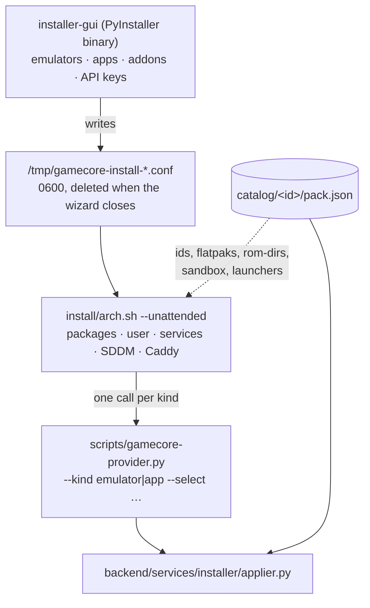

# 10 — The catalogue, and how a box gets installed

The other nine documents describe a box that is already running. This one
describes where its contents come from.

One rule holds the whole thing together:

> **One directory is one system or one application.** Everything that system
> needs — how to obtain it, how to launch it, its curated config, its logo, its
> controller bindings, its service, its post-install steps — lives in
> `catalog/<id>/`. Adding one is dropping a directory. Removing one is `rm -rf`.

Everything below is a consequence of that rule, including the parts that took a
broken install to get right.

---

## 1. What a pack looks like on disk

```
catalog/twitch/
├── pack.json                     the declaration — the only required file
├── logo.png                      the tile (logo.svg also works)
├── files/                        what `files` and `services` refer to
│   ├── embertv.service
│   ├── embertv-config.json.tmpl
│   ├── embertv-config.demo.json
│   └── twitch-tv.user.js
└── steps/                        what `postInstall` refers to
    ├── make-cert.sh
    └── trust-cert.sh

catalog/mgba/
├── pack.json
├── logo.png
├── seed/                         curated config, copied to the emulator's config dir
│   ├── config.ini
│   └── qt.ini
├── generator.py                  writes controller bindings for this emulator
└── tests/                        this pack's own tests, run by CI with the rest
```

`seed/`, `logo.*`, `generator.py` and `tests/` are **implicit by presence**: they
are on disk or they are not, and no field in `pack.json` declares them. `files/`
and `steps/` are the opposite — nothing is copied or run unless a block names it.

---

## 2. Every block, and who reads it

`pack.json` is validated against [`catalog/_schema/pack.schema.json`](../../catalog/_schema/pack.schema.json)
by `scripts/check-catalog.py`, which CI runs before anything else. Required:
`id`, `kind`, `label`, `platform`, `color`, `launch`.

| Block | Read by | What it does |
|---|---|---|
| `id` `kind` `label` `platform` `color` | everything | identity. `kind` is `emulator` or `app` |
| `emulatorName` `family` `description` | the grid, the install wizard | display only |
| `launch` | the backend, `flatpakify-systems.sh` | the command the tile runs. `preferIfPresent` picks a native binary over the Flatpak when one exists |
| `roms` | the backend, `arch.sh` | ROM directory and extensions |
| `config` | `install-emu-configs.sh` | where `seed/` is deployed |
| `controllers` | `backend/services/configgen/` | which binding strategy `generator.py` implements |
| `scraper` `overlay` | covers, bezel identification | metadata |
| `install` | `installer/providers.py` | how the **main artifact** is obtained |
| `sandbox` | `installer/providers.py` | Flatpak override flags. Absent = the emulator default |
| `packages` | `installer/applier.py` | extra system dependencies, *not* the main artifact |
| `sources` | `installer/applier.py` | git checkouts the app needs beside it |
| `secrets` | the install wizard, `applier.py` | keys to prompt for, and to expand in templates |
| `files` | `installer/applier.py` | files to write, verbatim or from a template |
| `services` | `installer/applier.py` | systemd **user** units |
| `postInstall` | `installer/applier.py` | ordered scripts, as the user, bounded, never fatal |

### `install` — the four providers

| `provider` | Fields | Used by |
|---|---|---|
| `flatpak` | `appId` | every Flathub emulator, Steam, Stremio |
| `github-asset` | `repo`, `asset`, `dest`, `magic`, `version?`, `sha256?` | DuckStation (AppImage) |
| `github-archive` | `repo`, `asset`, `dest`, `entrypoint`, `requires` | Xenia (Windows zip under Wine) |
| `pacman` | `packages` | a pack that is just a distribution package |

The download path carries protections that each cost a broken install to learn:
the fixed `/releases/latest/download/` URL **before** the rate-limited API (60
requests/hour/IP, and exhausting it is why fresh installs ended up with no
PlayStation emulator), a `.part` temp file so an aborted transfer is never read
as "already installed", magic-byte checking because a 200 carrying an HTML error
page is still a failed download, and an optional `sha256`.

### `files` — `src`, `template`, `when`, `ifAbsent`

```json
{ "template": "files/embertv-config.json.tmpl",
  "dest": "/opt/Twitch-TV/config.json",
  "owner": "user", "mode": "600",
  "when": "secrets.TWITCH_CLIENT_ID" }
```

- `src` copies verbatim; `template` expands tokens. Exactly one of the two.
- **Tokens**, in `dest` and inside templates: `@HOME@`, `@USER@`,
  `@GAMECORE_PATH@`, and `@<KEY>@` for every key the pack declares under
  `secrets`.
- `when: secrets.KEY` / `!secrets.KEY` picks between entries. This is what lets
  the twitch pack ship both a real config and a demo one with no branch in the
  installer.
- `ifAbsent: true` writes only when the destination does not exist. Re-running
  the installer is documented as safe, and for a file the owner is invited to
  hand-edit, safe has to mean untouched.

---

## 3. The install pipeline



`arch.sh` holds **no list of emulators or apps**. It asks the catalogue what
exists, filters by what the operator selected, and hands the rest to the
provider. The two passes are one call each:

```bash
gamecore-provider.py install --kind emulator --select "$EMULATORS" …
gamecore-provider.py install --kind app      --select "$APP_SEL"   …
```

The provider prints one line per event, and `arch.sh` colours them:

| Prefix | Meaning |
|---|---|
| `PACK <id>` | starting this pack — drives the progress bar |
| `OK <msg>` | done |
| `SAME <msg>` | already there, nothing changed |
| `FAIL <msg>` | this tile will be missing; the run continues |
| `UNIT <name>` | a user unit to daemon-reload and restart now |

### The order inside a pack, and why it is fixed

```
packages → install → sources → files → services → postInstall
```

A file written into a checkout needs the checkout. A unit needs its `ExecStart`
to exist. A post-install step needs all three. EmberTV is the case that pins it:
`sources` clones `/opt/Twitch-TV`, `files` writes `config.json` into it and the
Firefox `user.js` (which creates the profile directory), `services` installs
`embertv.service`, and only then can `steps/make-cert.sh` generate a certificate
and `steps/trust-cert.sh` import it into that profile's NSS database.

### What is deliberately *not* in a pack

`gamepad-tv-bridge` is cloned by `arch.sh`, not by a pack. It translates gamepad
buttons into keystrokes for the Firefox kiosks, so it serves both EmberTV and
YouTube and belongs to neither. Same for linger, the user-unit restart, and the
`~/.config/systemd` ownership fix: user-session infrastructure, not app content.

---

## 4. Generated artefacts — run `gen-catalog.py`

Three committed files are **derived** from the packs:

| Generated | Why it exists |
|---|---|
| `install/installer-gui/catalog_data.py` | the wizard's tick-box list. It is a PyInstaller binary that runs **before** the repository is on the machine, so the list is baked in at build time |
| `install/apps.json.dist` | the pristine app-tile catalogue `arch.sh` copies into `config/` |
| `install/systems.json.dist` | same, for systems |

```bash
python3 scripts/gen-catalog.py          # regenerate
python3 scripts/gen-catalog.py --check  # CI: fail if the committed copies are stale
```

Forget it and your pack exists, validates, and appears in **no** tick box —
therefore is never selected, therefore is never installed, and no tile is drawn.
CI's `--check` step is what stops that reaching a release.

---

## 5. Shipped packs and local packs

`backend/services/catalog/loader.py` loads two locations and merges them, local
winning entirely:

| | `catalog/` | `config/catalog.d/` |
|---|---|---|
| origin | shipped with the release | dropped on the box |
| reviewed, in CI | yes | no |
| may carry `generator.py` | yes | ignored |
| `postInstall` `services` `sources` `packages` | honoured | **stripped**, with a warning at every load |
| survives an OTA | replaced by the release | untouched |

The rule is code vs data. A directory dropped into `config/catalog.d/` is data
only, because honouring its privileged blocks would make "drop a directory"
equivalent to arbitrary code execution as root — and the install CLI would make
that reachable from the UI. `GAMECORE_TRUST_LOCAL_PACKS=1` lifts it, and is
logged on every load rather than once.

Two more rules the applier enforces:

- **A pack may only read its own directory.** `src`, `template`, `unit` and
  `run` are resolved against the pack directory and refused if they land outside
  it. Otherwise "drop a directory" becomes "read the rest of the disk".
- **Secrets never touch `argv`.** `sudo -u <user> env KEY=value …` would be
  shorter and puts every value in `/proc/<pid>/cmdline`, which is world-readable;
  one of those values is a Twitch client secret. `--preserve-env` names the
  variables and lets sudo carry them from an environment instead.

---

## 6. Adding an emulator

```bash
mkdir -p catalog/myemu
$EDITOR catalog/myemu/pack.json     # id, kind, label, platform, color, launch
cp …/logo.png catalog/myemu/
python3 scripts/check-catalog.py    # schema
python3 scripts/gen-catalog.py      # the three derived files
git add catalog/myemu install/
```

Minimum viable pack:

```json
{
  "id": "myemu",
  "kind": "emulator",
  "label": "Some Console",
  "emulatorName": "MyEmu",
  "platform": "SOMECONSOLE",
  "family": "Sega",
  "color": "#1e90ff",
  "install": { "provider": "flatpak", "appId": "org.example.MyEmu" },
  "launch": { "path": "flatpak", "args": "run org.example.MyEmu --fullscreen" },
  "roms": { "dir": "emu/myemu", "extensions": ["*.bin", "*.zip"] }
}
```

Optional, and none of it needs a line anywhere else: `seed/` for a curated
config (`config.dest` says where it lands), `generator.py` + `controllers` for
gamepad bindings, `sandbox` if the emulator needs different Flatpak permissions,
`packages` for a system dependency, `overlay` and `scraper` for bezels and
covers.

## 7. Adding an application

Same shape with `"kind": "app"`, plus whatever the app needs beside it:

```json
{
  "id": "myapp", "kind": "app", "label": "My App",
  "platform": "Web", "color": "#8a5fff",
  "packages": { "pacman": ["firefox"] },
  "sources": [{ "git": "https://…/myapp.git", "dest": "/opt/MyApp", "owner": "user" }],
  "files":   [{ "src": "files/myapp.conf", "dest": "@HOME@/.config/myapp.conf",
                "owner": "user", "mode": "644" }],
  "services":[{ "unit": "files/myapp.service", "scope": "user", "enable": true }],
  "postInstall": [{ "run": "steps/setup.sh", "label": "first-run setup",
                    "timeoutSec": 60 }],
  "launch":  { "path": "bash", "args": "/opt/MyApp/start.sh" }
}
```

Every path in `files`, `services` and `postInstall` is **relative to the pack**,
and the pack must actually carry it. `backend/tests/test_installer_applier.py`
fails the build if it does not — which is the check the repository did not have
when a refactor deleted `install/firefox-profiles/` while `arch.sh` still read
it. That install died at 66 %, on a fresh machine, months later.

---

## 8. Querying the catalogue from a script

`scripts/catalog-query.py` is the shell-side reader. It is why `arch.sh`,
`flatpakify-systems.sh` and `install-emu-configs.sh` contain no lists:

```bash
catalog-query.py ids --kind emulator          # one id per line
catalog-query.py flatpaks --kind emulator     # id<TAB>appId
catalog-query.py app-ids --select steam       # the Flatpak id of one app
catalog-query.py rom-dirs                     # every roms.dir
catalog-query.py config-dest --select mgba    # where seed/ goes
catalog-query.py sandbox --gamecore-path /opt/GameCore
catalog-query.py packages --select duckstation
catalog-query.py launchers
```

## 9. Verifying an install

`scripts/check-install.sh` runs on the box afterwards and changes nothing. It
checks the files, the catalogue, the launchers (a tile naming a Flatpak nobody
installed is a dead tile), the services, the auto-login session — read back from
`/var/lib/gamecore/manifest.env`, because what the kiosk session *is* varies by
box — and that the API answers.

`"the install finished without an error"` and `"the box works"` are different
statements. `arch.sh` warns and carries on for a dozen recoverable failures, and
each one is a tile that is quietly absent.
