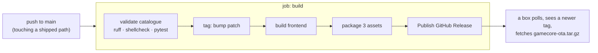

# 13 — Release and OTA

What a push to `main` sets in motion, what reaches a box, and how to go back.

Nobody should have to read `.github/workflows/release.yml` to know this — but
that file and `update/linux.sh` are the authorities, and this page is a map of
them.

> **A merge to `main` is a delivery, not a git operation.** There is no staging
> environment and no manual approval between the merge and a production box
> fetching the result. Read [The gate](#the-gate-before-you-merge) before merging.

## What triggers a release

`release.yml` fires on a push to `main` **only when it touches something that
ships**:

```
backend/**  frontend/**  electron/**  update/**  install/**
config/**   assets/**    catalog/**   scripts/**
.github/workflows/release.yml
```

A documentation-only push does **not** cut a release — that filter exists so
README edits do not spam every box with a fake update. Note what *is* in the
list: `scripts/**` and `catalog/**` are there, so a change that feels like
housekeeping still ships.

Also on `v*.*.*` tags and on `workflow_dispatch`.

> **Never dispatch `release.yml` from a branch.** The `Publish GitHub Release`
> step has no `if:` guard and its `tag_name` falls back to `github.ref_name`, so
> it would publish a release named after your branch — which every box would then
> take for the latest.

## The two jobs



`build` runs the same checks as the local baseline before it tags anything, so a
red suite never becomes a release. The version is a **patch bump per merge** —
more than 150 releases in a few days is normal for this repo, and it is why an
AUR package is not viable (see `distribution/packaging/README.md`).

## The three assets

| Asset | What it is | Who takes it |
|---|---|---|
| `gamecore-ota.tar.gz` | ~2.7 MB. `backend/ frontend/ config/ electron/ update/ install/ catalog/ scripts/` + `VERSION` | every installed box, automatically |
| `gamecore-full.tar.gz` | ~14 MB, adds the built frontend for a fresh install | `gamecore-setup`, the AUR PKGBUILD |
| `gamecore-installer` | ~75 MB PyInstaller binary | a human installing onto an existing Arch |

Two things the packaging step gets right on purpose, both of which cost a real
bug to learn:

- **`frontend/` whole, sources included** — not just `dist/`. A box left with
  sources older than the build it runs will silently roll its UI back the moment
  anything rebuilds there (the updater's own fallback, a hand-run `npm run
  build`). The "Scan mapping" button shipped in v1.0.62 was missing from a box
  running v1.0.66 while its backend route answered the whole time.
- **`VERSION` carries the tag, not the tracked file.** The tracked one still says
  `v1.0.0` — it is only ever written on a box — so shipping it would make every
  fresh install report itself out of date.

`node_modules/` and `__pycache__` are stripped, which is why `gamecore-setup` is
needed after a full-archive install: the box has files, not a working venv.

## What the updater does — `update/linux.sh`

In order, and the order is the interesting part:

1. **Check free space first.** It asks for twice the payload. An rsync that runs
   out of space part-way leaves `GAMECORE_PATH` half old and half new, and the
   updater cannot install a specific tag — there is no way back from that except
   by hand.
2. **Snapshot to `${GAMECORE_PATH}.prev`** — see below.
3. **rsync the release in**, with the excludes below.
4. **Install/update themes** by comparing `version` in `theme.json`.
5. **Update Python dependencies**, then run the existing bounded privileged
   migration. Besides refreshing the session helpers, that migration installs
   the exact system prerequisites declared by the release (currently `p7zip`).
6. **Merge `systems.json`**, keeping the previous file as
   `systems.json.bak-merge`.
7. **Start `gamecore-restart.service` with `--no-block`** and exit.

That last step matters: `update/linux.sh` runs *inside the backend's cgroup*, so
a direct `systemctl restart` would kill the script mid-update. The restart
happens in its own unit, about two seconds after the script exits.

### What the rsync excludes, and why

```
--exclude='.venv/'  --exclude='emu/'  --exclude='config/'
--exclude='store/'
--exclude='assets/overlays/'  --exclude='assets/logos/'
```

- `emu/` — the ROM library. **Dropping this exclude deletes it on the first
  update.**
- `config/` — excluded *wholesale*, which is what preserves `config/catalog.d/`
  (the operator's own packs) and all the box state across every update.
- `store/` — job-owned downloads and transformation work. A `.part` may be
  several gigabytes and is being written while the updater is taking its
  snapshot; it is data, never release content.
- `assets/overlays/`, `assets/logos/` — uploaded by the player/operator.
- `.venv/` — rebuilt separately.

**`catalog/` is deliberately NOT excluded**, and that is the whole point of the
pack migration. Its predecessor `emu-configs/` was excluded once and it cost: a
corrected `GCPadNew.ini` reached GitHub, a test locked the fix in, and the box
kept its keyboard D-pad for good. Shipping `catalog/` does not touch a running
emulator's config — deploying that stays a deliberate act
(`install/steps/install-emu-configs.sh`).

When `GAMECORE_DATA` is set to something outside the install, the script says so
in the log and notes the excludes are now redundant but harmless.

### How a new system prerequisite reaches an old box

`pip install` is not a system-package mechanism. Before the Store, that was an
unwritten limitation; with archive inspection it became a fleet-wide failure:
`7z l` is the first operation for ingestion classes A, B and C, while `p7zip`
was installed only by a fresh `install/arch.sh`.

The updater still does **not** run `pacman`, and it receives no general root
package permission. It uses the privileged path that already exists:
`check-session-prerequisites.sh` first proves that the root-owned
`gamecore-session-migrate.service` and its argument-free sudo rule exist; after
the release is copied, that unit runs `setup-gamecore-session.sh`, which calls
`install-ota-prerequisites.sh`. The latter owns a reviewed array of exact
package names and runs only:

```
pacman -Qq <exact-name>
pacman -S --noconfirm --needed <missing-exact-names>
```

There is deliberately no `-Syu`, repository choice, package argument from the
caller, or generic sudoers rule. A release may add a prerequisite, but cannot
turn a feature dependency into authority to roll the whole distribution under
a remote box. Packages GameCore actually adds are appended to
`/var/lib/gamecore/pacman-installed`, so the existing opt-in uninstall path can
remove them; a failed install records nothing.

This makes the Store's message true: an OTA installs `p7zip` on an already
prepared box. A box too old to have the bounded migration entry point is stopped
by the read-only preflight before any running code is replaced and receives the
existing one-time preparation command. Merely printing a `pacman` suggestion
after installing the Store was rejected: the Settings log is not a reliable
way to deliver a mandatory fleet migration, and it would leave all archive
ingestion present but dead.

### Where the updater finds the data root

Launched from the Settings button it inherits the backend's environment and
knows. Typed at a shell it does not — a shell has no `GAMECORE_DATA` — so since
v1.2.13 it reads the variable **from the backend's systemd unit**
(`_data_root_from_backend_unit`, same shape as `install/bin/gamecore-addon`,
duplicated on purpose: the updater must not depend on the CLI's presence or
version). Without this, a hand-typed update on a migrated box merged the
catalogue into the abandoned `config/` under the install — green log, dead
grid. The catalogue merge itself is handed **both roots** (`merge_file(...,
data_root=...)`): the catalogue and `lib/` are code and come from
`GAMECORE_PATH`; `systems.json`, `catalog.d/` and `catalog-removed.json` are
the player's and come from `GAMECORE_DATA`. Themes install under the data root
for the same reason.

The updater also reports, with the exact command, when a root-owned copy it
cannot replace has gone stale: `/usr/local/bin/gamecore-addon` (only
`install/arch.sh` writes it), `/etc/caddy/Caddyfile`, and a backend unit whose
merged definition (drop-ins included — it checks `systemctl cat`, not the file)
lacks the X-display `ExecStartPre`.

## Going back — `${GAMECORE_PATH}.prev`

Before overwriting anything, the updater snapshots the install with
`rsync --link-dest`, so it is **hardlinks: directory entries, no data**.

To restore, exactly what the script prints:

```bash
sudo rsync -a /opt/GameCore.prev/ /opt/GameCore/
sudo systemctl restart gamecore-backend gamecore-ui
```

**No `--delete`.** The snapshot excludes `.venv/`, `node_modules/`, `emu/`,
`config/`, `store/` and `VERSION`, and those must not be removed from the live
install.

Two properties that are easy to get wrong:

- **The snapshot's scope is not arbitrary.** A hardlinked snapshot shares inodes
  with the live tree, so anything writing *in place* changes both copies at once.
  `rsync` is safe (temp file, then rename — a new inode); `pip install` into
  `.venv`, `npm install` into `node_modules`, and the `echo > VERSION` at the end
  of the script are **not**. They are excluded for that reason, not for size —
  they are rebuilt from the release anyway.
- **It is deliberately never restored automatically.** A trap that rolls back on
  any failure has to be right about a machine whose state it does not know, and
  that path cannot be exercised in CI. An automatic restore that goes wrong turns
  a recoverable update into an unbootable box. Shipping the snapshot plus the
  exact command is the part that is safe to ship untested.

There is **one** snapshot: the next update overwrites it. It gets you back one
release, not to an arbitrary one.

### What a Store rollback does and does not restore

The snapshot restores code. It does not restore any Store state:

- `config/systems.json`, `config/playtime.db` (including `store_jobs`) and the
  two provider files `store-prowlarr.json` / `store-realdebrid.json` remain the
  live data because `config/` is excluded wholesale;
- `<GAMECORE_DATA>/store/jobs` remains live data too. When data is inside the
  install, the explicit `store/` exclusion also keeps active `.part` files out
  of the hardlinked snapshot. A graceful OTA restart cancels the transfer,
  removes its job-owned work directory and marks the row `failed` with the
  `interrupted` reason. After a hard stop, `resume_after_restart()` performs the
  same cleanup and state transition. Queued rows remain queued.

Database widening is additive and has no inverse. The rollback case was
exercised by creating the current table, then running the first persistent
Store queue's original `INSERT`, projected `SELECT` and `UPDATE` statements
against it: all succeed, because later columns have defaults and the old code
names only its own columns. Code from before the Store simply ignores the extra
table.

The advanced catalogue looks dangerous but the documented restore command has
an important second effect. `catalog/` is part of the code snapshot, yet the
restore has no `--delete`: old pack files overwrite matching ones, while pack
directories introduced by the newer release remain. This was measured on
temporary trees using the real pre-expansion state (13 systems) and the current
state (31 systems, 35 shipped packs). After update and rollback, the old loader
reported all 35 packs, none of the 18 system ids added to `systems.json` lacked
a pack, and listing games for one of them returned an empty list rather than an
error, dead tile or empty screen. No catalogue repair is therefore needed.

Do not add `--delete` to the restore command. Besides risking excluded live
state, it would remove those forward-added pack directories while leaving the
advanced `systems.json` in place, creating exactly the split-brain catalogue
the measured rollback avoids.

Themes follow the same single-snapshot rule at
`config/themes/.prev/<id>/`, for the same reason — a bundled theme with a bug
must be fixable by a release, and the version the box had is kept rather than
discarded.

If the snapshot could not be taken, the script says so loudly and the restore
hint becomes a no-op. That message is the only warning you get.

## The gate before you merge

Because there is nothing between a merge and a living-room box:

- the six baseline commands green (see [`../TESTING.md`](../TESTING.md));
- the test count has not **dropped**;
- no **new** `skip` or `xfail`;
- `git diff main..HEAD -- 'catalog/*/tests/fixtures/*'` empty, unless you added
  the scenarios yourself and can name them.

One point failing means do not merge. An unmerged branch merges tomorrow; a
broken release has already left.

And if the temptation is to pass the gate by deleting a test, adding a `skip` or
regenerating a fixture — that is the moment to stop. **The gate is the
thermometer, not the objective.**

Record the SHA of `main` before merging. It is the way back, and without it there
is not one.
