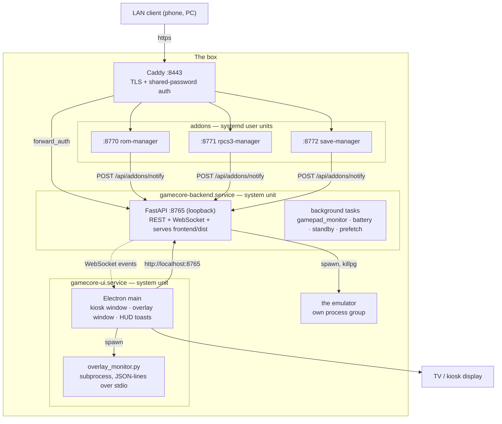

# GameCore — architecture documentation

Reference for anyone (or anything) that has to change this codebase. It is
written to be read **without** opening the source first: every file is named,
every function that matters is listed with what it does, and the flows are
drawn.

`../../README.md` is the user manual. This is the map of the machine.

## Read in this order

| # | Document | What you get |
|---|---|---|
| 1 | [Runtime topology](01-runtime-topology.md) | The four processes, ports, units, boot sequence, who talks to whom |
| 2 | [Request flows](02-request-flows.md) | Sequence diagrams: launch, kill, covers, OTA, standby, auth, overlays |
| 3 | [Backend — routers](03-backend-routers.md) | Every HTTP endpoint, every function, file by file |
| 4 | [Backend — services](04-backend-services.md) | Every service module, every function, file by file |
| 5 | [Frontend](05-frontend.md) | Components, hooks, store, the gamepad event bus |
| 6 | [Electron & overlays](06-electron-and-overlays.md) | Windows, IPC bridge, the overlay monitor subprocess protocol |
| 7 | [Config & data](07-config-and-data.md) | Every config file schema, the SQLite schema, the caches |
| 8 | [Controller pipeline](08-controller-pipeline.md) | SDL, GUIDs, per-emulator config writers, "Scan mapping" |
| 9 | [Gotchas](09-gotchas.md) | The invariants that are easy to break, and why they exist |

Looking for something specific:

- *"Where does a game actually get launched?"* → [2](02-request-flows.md#1-launching-a-game) then [`process_manager`](04-backend-services.md#process_managerpy)
- *"Why is my controller not mapped in melonDS?"* → [8](08-controller-pipeline.md)
- *"What writes `config/addons.json`?"* → [7](07-config-and-data.md#configaddonsjson)
- *"Why did my UI change disappear after an update?"* → [9](09-gotchas.md#the-ota-rebuild-trap)
- *"What events can the UI listen to?"* → [5](05-frontend.md#the-websocket-event-table)
- *"How do I run the tests?"* → [`../TESTING.md`](../TESTING.md)
- *"What is exposed to the LAN, and what protects the rest?"* → [`../SECURITY.md`](../SECURITY.md)

Outside this folder: [`../SECURITY.md`](../SECURITY.md) (the threat model and
what enforces it), [`../TESTING.md`](../TESTING.md) (the suite, the `network`
marker, `conftest.py`), [`../CONTROLLER_MODELS.md`](../CONTROLLER_MODELS.md)
(why each emulator is profiled the way it is).

## The system in one picture

Everything except Caddy binds `127.0.0.1`. The TV reaches the backend over
loopback with no authentication — physical access is the trust boundary. The
LAN only ever sees Caddy. Details in [1](01-runtime-topology.md) and
[9](09-gotchas.md).

## Conventions in this codebase

- **`routers/` parse and validate, `services/` decide and act.** A router that
  grows logic belongs in a service. No FastAPI import exists below
  `services/`.
- **Every path derives from `GAMECORE_ROOT`** (`backend/config.py`). Nothing
  hardcodes `/opt/GameCore`.
- **`config/` is the box's identity** — never in git, never touched by OTA.
- **The frontend has no CSS files.** Styling is inline objects, colocated with
  the component.
- **Gamepad input is an event bus, not props.** `onGp('gp:confirm', fn)`
  anywhere in the tree.

## Keeping this accurate

The function inventories in [3](03-backend-routers.md) and
[4](04-backend-services.md) were generated from the AST and then annotated by
hand. If you add or rename a function, update the table in the same commit —
a stale map is worse than no map.
