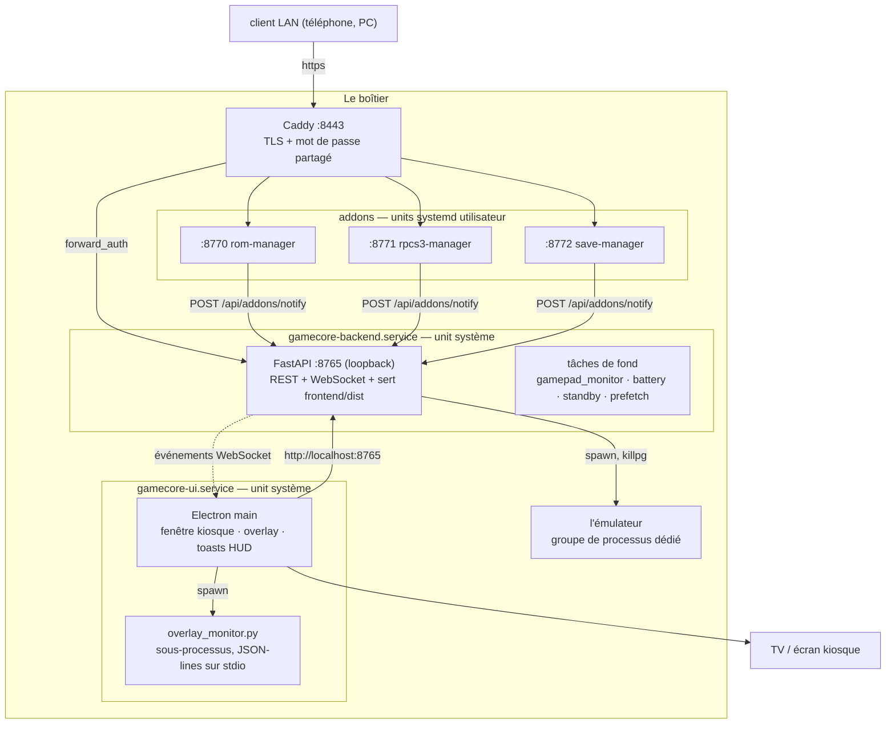

# GameCore — documentation d'architecture

Référence pour quiconque (ou quoi que ce soit) doit modifier ce code. Elle est
écrite pour être lue **sans** ouvrir les sources d'abord : chaque fichier est
nommé, chaque fonction qui compte est listée avec ce qu'elle fait, et les flux
sont dessinés.

`../../README.md` est le manuel utilisateur. Ceci est le plan de la machine.

## Ordre de lecture

| # | Document | Ce que vous y trouvez |
|---|---|---|
| 1 | [Topologie d'exécution](01-topologie-execution.md) | Les quatre processus, ports, units, séquence de démarrage, qui parle à qui |
| 2 | [Flux détaillés](02-flux-detailles.md) | Diagrammes de séquence : lancement, arrêt, jaquettes, OTA, veille, auth, overlays |
| 3 | [Backend — routers](03-backend-routers.md) | Chaque endpoint HTTP, chaque fonction, fichier par fichier |
| 4 | [Backend — services](04-backend-services.md) | Chaque module de service, chaque fonction |
| 5 | [Frontend](05-frontend.md) | Composants, hooks, store, le bus d'événements manette |
| 6 | [Electron & overlays](06-electron-et-overlays.md) | Fenêtres, pont IPC, protocole du sous-processus overlay |
| 7 | [Config & données](07-config-et-donnees.md) | Le schéma de chaque fichier de config, le schéma SQLite, les caches |
| 8 | [Chaîne manettes](08-chaine-manettes.md) | SDL, GUID, écriture des configs par émulateur, « Scan mapping » |
| 9 | [Pièges](09-pieges.md) | Les invariants faciles à casser, et la raison de leur existence |

Vous cherchez quelque chose de précis :

- *« Où un jeu est-il réellement lancé ? »* → [2](02-flux-detailles.md#1-lancer-un-jeu) puis [`process_manager`](04-backend-services.md#process_managerpy)
- *« Pourquoi ma manette n'est-elle pas mappée dans melonDS ? »* → [8](08-chaine-manettes.md)
- *« Qui écrit `config/addons.json` ? »* → [7](07-config-et-donnees.md#configaddonsjson)
- *« Pourquoi ma modif d'UI a disparu après une mise à jour ? »* → [9](09-pieges.md#le-piège-du-rebuild-ota)
- *« Quels événements l'UI peut-elle écouter ? »* → [5](05-frontend.md#table-des-événements-websocket)

## Le système en une image

Tout sauf Caddy écoute sur `127.0.0.1`. La TV joint le backend en loopback sans
aucune authentification — **l'accès physique est la frontière de confiance**. Le
LAN ne voit jamais que Caddy. Détails en [1](01-topologie-execution.md) et
[9](09-pieges.md).

## Conventions de ce code

- **`routers/` analyse et valide, `services/` décide et agit.** Un router qui
  prend de la logique doit devenir un service. Aucun import FastAPI n'existe
  sous `services/`.
- **Tout chemin dérive de `GAMECORE_ROOT`** (`backend/config.py`). Rien ne
  code en dur `/opt/GameCore`.
- **`config/` est l'identité du boîtier** — jamais dans git, jamais touché par
  l'OTA.
- **Le frontend n'a aucun fichier CSS.** Le style est en objets inline, à côté
  du composant.
- **L'entrée manette est un bus d'événements, pas des props.**
  `onGp('gp:confirm', fn)` depuis n'importe où dans l'arbre.

## Garder ceci exact

Les inventaires de fonctions de [3](03-backend-routers.md) et
[4](04-backend-services.md) ont été générés depuis l'AST puis annotés à la
main. Si vous ajoutez ou renommez une fonction, mettez le tableau à jour dans
le même commit — une carte périmée est pire que pas de carte.
