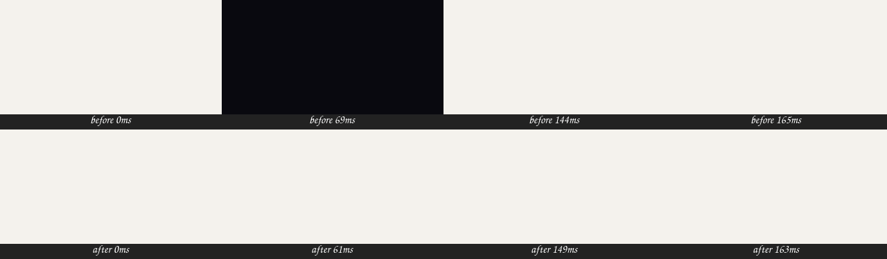

# Boot ground in index.html — 2026-09-27

A dark frame showed between Shelf's paper boot window and its paper splash.

## Cause

`frontend/index.html` painted `html, body, #root` with a hardcoded `#09090f`.
That page paints before any module runs, so between the window's own colour
(the theme's `boot.background`, set by `electron/main.js`) and the host's cover
(`bootBackground()` in `frontend/src/lib/boot.ts`) there was one frame of the
default dark. Every theme had it; on Shelf's paper it is the one you see.

## Proof

Headless Chromium on the read-only dev server, with the Electron window colour
emulated (`Emulation.setDefaultBackgroundColorOverride`) and the preload's
`window.gamecore.bootBackground` injected. Mean colour of each frame:

| Theme | Before, frames 0-2 | After |
|---|---|---|
| Shelf `#F4F2ED` | `F4F2ED 09090F F4F2ED` | `F4F2ED` throughout |
| Orbit `#080f1d` | `080F1D 09090F 080F1D` | `080F1D` throughout |
| Summer `#0B1436` | `0B1436 09090F 0B1436` | `0B1436` until its sky |
| Default `#09090f` | unchanged | unchanged |

## Fix

`index.html` paints only `html` (still `#09090f` by default), and a classic
inline script in `<head>` sets it to `window.gamecore.bootBackground` before the
first paint. CSSOM drops an invalid value, so a bad one keeps the default. The
bezel page keeps its `overlay-mode` `!important` transparency; its window gets
no boot colour from the preload.
