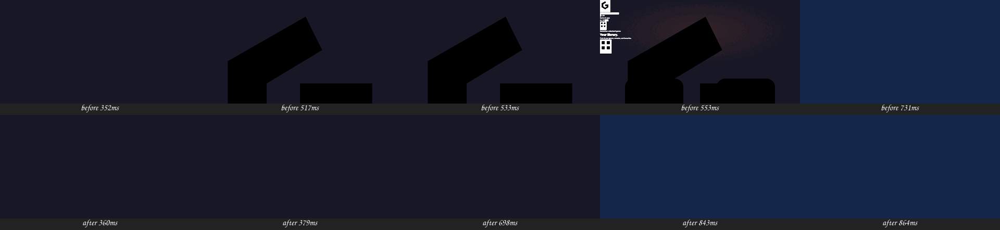

# Boot logo flash — 2026-09-27

A full-screen "G" flashed for one frame at every start on Orbit.

## Cause

`applyStyles()` in `frontend/src/lib/themeLoader.ts` appended the theme's
`<link>` and returned; `loadTheme()` handed the surfaces back at once, so the
splash rendered before `theme.css` and its `@import`s had loaded. Unstyled,
Orbit's boot mark (`config/themes/orbit/views/splash.js`, the hexagon "G") is an
`<svg>` with no size: 1920×1920 px at opacity 1. When `css/gallery.css` arrived
its `orbit-boot-reveal … both` animation set it to opacity 0: the "G" appeared
and vanished. Shelf had the same gap (3 frames of raw console art).

Not Electron: the window is `show: false` until `ready-to-show` and painted with
the theme's `boot.background`; `electron/boot/boot.html` is empty and transparent.

## Proof

Headless Chromium on the read-only dev server, CDP screencast plus a per-frame
probe of the splash mark. Orbit, before: mark 1920×1920, opacity 1, from 449 ms to
579 ms. After: first splash frame has the mark at 96×96, opacity 0.

| Theme | Unstyled splash frames before | After |
|---|---|---|
| Orbit | ~8 (130 ms, giant "G") | 0 |
| Shelf | 3 (raw console art) | 0 |
| Summer | 0 seen | 0 |
| Default UI | n/a (inline styles) | unchanged |

## Fix

`applyStyles()` returns a promise settled on the link's `load` or `error`, and
removes the previous theme's sheet only then; `loadTheme()` awaits it.

Review follow-ups: only the latest call's sheet survives when two loads settle
in reverse order (L1+R1, theme picker), and a sheet that never answers is given
up on after 3 s with a warning, so a stalled request cannot keep the interface
off screen. The normal path is still the `load` event. Orbit and Shelf
re-captured after both: 0 unstyled splash frames.
