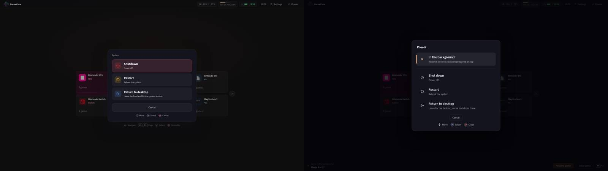
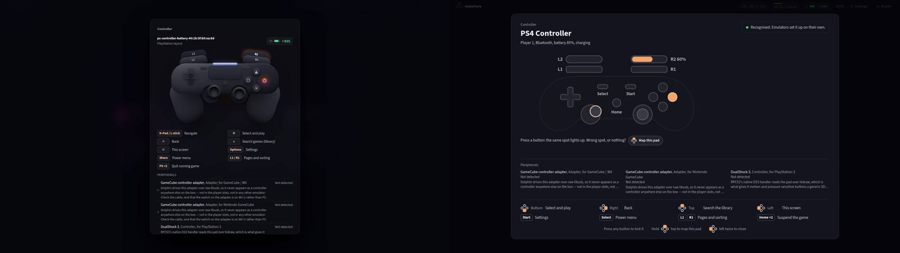
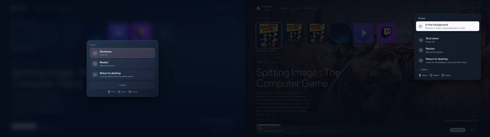
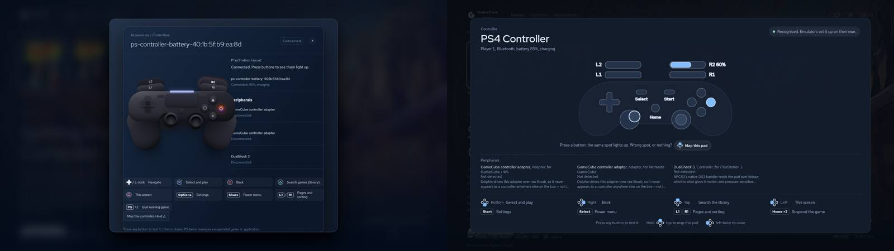
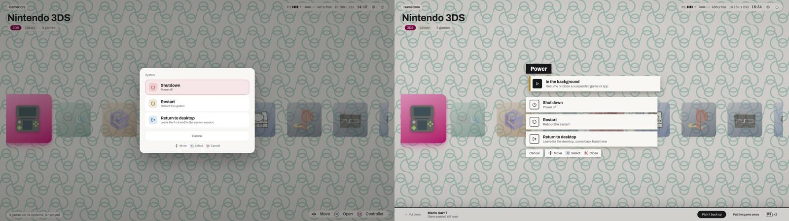
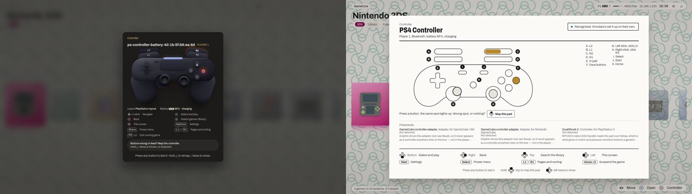
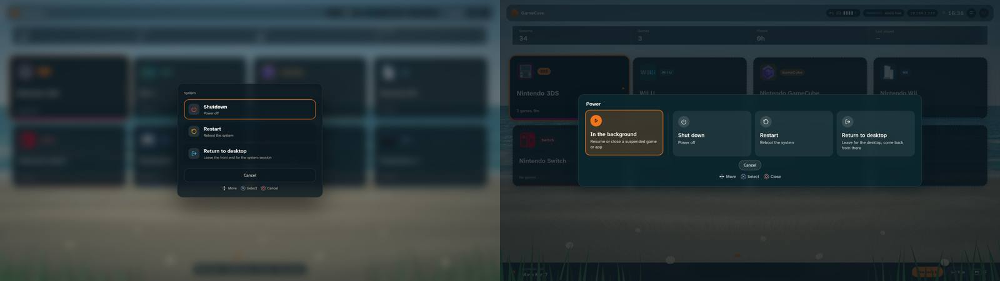
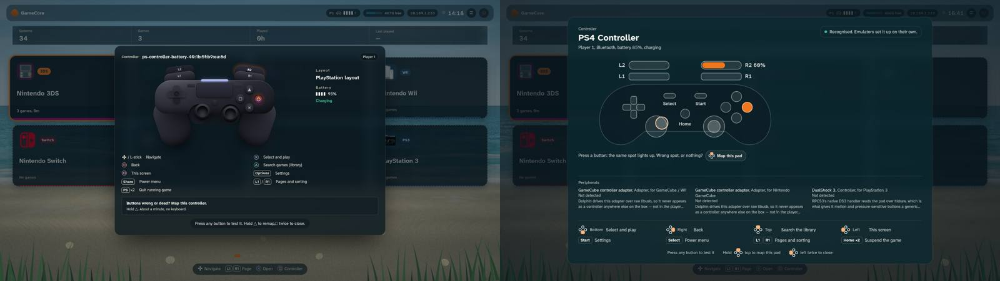

# Power menu and controller screen, per theme — 2026-09-27

Both screens looked the same on every theme, and the controller screen drew a
PS4 pad for every controller.

## What was wrong (captured on main)

| Where | Fault |
|---|---|
| every theme | the pad's name was its sysfs battery directory (`ps-controller-battery-40:1b:…`) |
| every theme | an arcade stick read "Standard layout" under a PS4 drawing; an Xbox pad got the same drawing |
| every theme | a wired pad with no battery was not listed at all (`sysinfo.controllers` is batteries) |
| Orbit | the drawing overlapped the "Peripherals" text; caps with tracking on the badge |
| default | the peripherals list ran off the bottom of the card |
| every theme | "Press again to shutdown" |

The front end never read `Gamepad.mapping`, so a pad the browser reports raw
drove the UI with raw indices and looked "standard" on this screen.

## What the screen does now

It draws the standard layout by position (`PadDiagram.tsx`, fed by
`frontend/src/lib/padLayout.ts`) and names what it knows from
`GET /api/controllers/pads` (`backend/services/controller_roster.py`):

| Pad | Shown |
|---|---|
| DualShock 4, Xbox pad | full layout, analog triggers with their travel |
| Switch Pro | full layout by position (Nintendo A lights the east dot), triggers drawn as buttons when SDL binds them to buttons |
| arcade stick with its own SDL line | sticks dashed, "Not on this pad: left stick, right stick." |
| arcade stick posing as a DS4 | full layout, sticks never move: nothing in the browser or SDL tells them apart |
| unknown pad, raw in the browser | diagram dimmed and unlit, its own buttons B1…Bn lit as pressed, a "Map this pad" block |

The pad read is the bus's active pad: □ pressed on pad 2 opens the screen on
pad 2, and touching another pad switches to it.

## Review

Captures on the read-only dev server with `fake-pads.js` (Gamepad API, roster
and a suspended game faked), 13 states × 4 themes, `--crops` for 2x. Five
rounds on the build; two of them by a separate reviewer given only the
request, the DESIGN.md files and the images.

| Round | Found | Fixed |
|---|---|---|
| 1 | three absent peripherals' notes pushed the legend and hints off 1080p; a raw pad lit L1 by its raw index; scenario held △ past the wizard's 1 s hold | peripherals in a bounded band, raw pad unlit with its own numbering |
| 2 | Summer has no `--font-display`: the pad name fell back to 14 px | shared CSS falls back to `--font-body` |
| 3 (separate) | Shelf sheet over the page title; Summer sheet moving between states; inline ✕ ○ off the baseline; "Map this pad" orphaned; "or click here" on a pad-only TV; strikethrough in the Shelf key | all fixed |
| 4 | Orbit's global `svg { stroke; width: 24px }` outlined the d-pad hub and shrank the legend icons; the left d-pad arm sat 11 px off the hub; home text through Orbit's glass | fixed |
| 5 | nothing blocking | — |

Legibility: 0 `FAIL` on all 52 captures of the final round.

Before (main) on the left, after on the right:

| Theme | Power menu | Controller screen |
|---|---|---|
| Default |  |  |
| Orbit |  |  |
| Shelf |  |  |
| Summer |  |  |

Not checked: the TV itself, a real Switch Pro, 8BitDo or arcade stick (the
box has a DualShock 4 and an Xbox pad), and a pad the browser reports raw.
